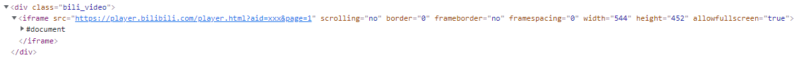

# bilibili

## 1.构建思路

​	参考[插件：hexo-tag-bilibili](https://github.com/Z4Tech/hexo-tag-bilibili/blob/master/index.js)，嵌入B站页面，以`hexo-tag-bilibili`说明插件构建思路

​	引用`bilibili-embed-convert`组件，根据av_id和page获取到相应的视频信息，通过iframe的形式将视频嵌入到博客页面



> 参数说明

​	b站视频提供了一个嵌入代码的按钮，可通过该url获取到关联的av_id和page信息。其中av_id定位视频源，而page则是针对一个视频源由多个视频组成的则可通过page来获取相应的视频内容


```cmd
# 嵌入形式参考
<iframe src="//player.bilibili.com/player.html?aid=xxxx&bvid=xxx&cid=xxx&page=1" scrolling="no" border="0" frameborder="no" framespacing="0" allowfullscreen="true"> </iframe>
```

| 参数   | 说明                                                    |
| ------ | ------------------------------------------------------- |
| av_id  | 对应上述url的aid，指定视频源                            |
| page   | 对应上述url的page，指定该视频源的第几个子视频           |
| width  | 嵌入宽度（可对应hexo.config.bilibili.width，自由调整）  |
| height | 嵌入长度（可对应hexo.config.bilibili.height，自由调整） |

​	如果是由逗号进行拼接，将不同参数当成字符串处理，通过逗号拼接的内容用切割进行处理进而转化为多个参数配置，例如此处可调整为``进而对参数进行分类


## 2.构建说明

### index.js

​	该方式直接在index.js中构建即可正常引入

```js
var bili_convert = require('bilibili-embed-convert');

// 插件注册
hexo.extend.tag.register('bilibili', function(args){
  var av_id = parseInt(args[0]);
  var page = parseInt(args[1]) || 1;
  var config = hexo.config.bilibili || {};
  config.width = config.width || 452;
  config.height = config.height || 544;
  var bili_video = new bili_convert(av_id, page);
  return '<div class="bili_video">'
         + bili_video.embedAddr(config.width, config.height)
         + '</div>';
});)
```


### 3.使用说明

> 语法规则

```markdown



# 在原有插件下调整参数配置，直接可通过使用时指定进行配置，暂无需额外配置hexo参数
 // 如果不指定则使用默认参数
```

> 样式控制

​	可自定义样式，通过`bili_video`进行控制

> 样例测试

```markdown
<iframe src="//player.bilibili.com/player.html?aid=207171828&bvid=BV1fh411q7wo&cid=385459904&page=1" scrolling="no" border="0" frameborder="no" framespacing="0" allowfullscreen="true"> </iframe>
```

```


```

