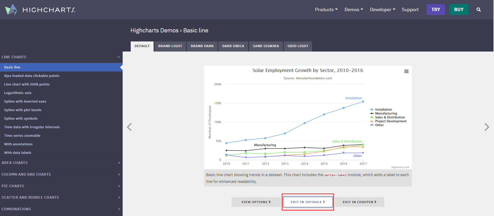
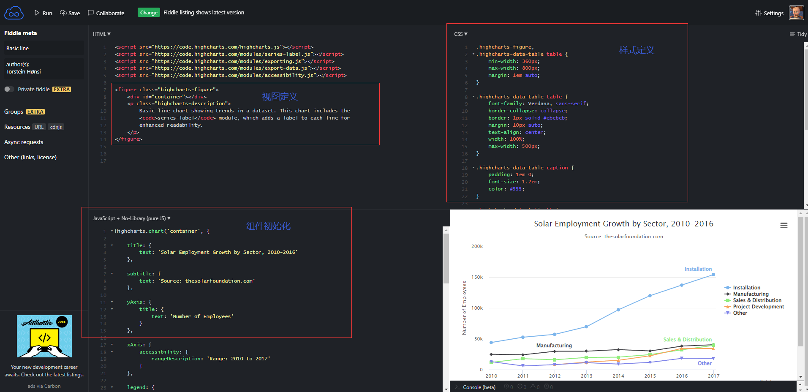

# highcharts

> 变更记录

| 开发 | 内容 |
| ---- | ---- |
|      |      |


## 1.构建思路

​	图表构建：[highcharts](https://www.highcharts.com/blog/HighCharts/)，插件构建参考：[hexo-highcharts](https://github.com/lilunze/hexo-highcharts/blob/master/index.js)


> 构建思路分析

​	此前接触echarts的应用比较多，但大多数的图表应用其实思路都是差不多的，图表构建主要是基于图表组件的应用，可通过官方渠道了解图表的应用场景和规则，再按照既定的内容封装代码即可，以highcharts为例，可以从[highcharts官网](https://www.highcharts.com/demo)中获取一个demo进行测试，可在线进行编辑查看代码结构



​	可通过jsfiddle在线查看代码：



​	其最主要的引用思路无非就是两个层面的控制：

```properties
<1>html：视图控制
- 定义存放highcharts图表的容器（通过在html中引入即可:相关css、js嵌入）

<2>JS控制：功能控制
- 封装数据至option参数配置，封装完成最后调用highcharts提供的方法装载图表信息
```


## 2.构建说明

```properties
|-- lib/scripts/tags  
		|_ highcharts.js
|-- index.js
```


## 3.使用说明

> 使用规则

```markdown

	// highcharts options here

```

> 样例测试

- [highcharts中文官网](https://www.highcharts.com.cn/)

```

{
	title: {
		text: '2010 ~ 2016 年太阳能行业就业人员发展情况'
	},
	subtitle: {
		text: '数据来源：thesolarfoundation.com'
	},
	yAxis: {
		title: {
			text: '就业人数'
		}
	},
	legend: {
		layout: 'vertical',
		align: 'right',
		verticalAlign: 'middle'
	},
	plotOptions: {
		series: {
			label: {
				connectorAllowed: false
			},
			pointStart: 2010
		}
	},
	series: [{
		name: '安装，实施人员',
		data: [43934, 52503, 57177, 69658, 97031, 119931, 137133, 154175]
	}, {
		name: '工人',
		data: [24916, 24064, 29742, 29851, 32490, 30282, 38121, 40434]
	}, {
		name: '销售',
		data: [11744, 17722, 16005, 19771, 20185, 24377, 32147, 39387]
	}, {
		name: '项目开发',
		data: [null, null, 7988, 12169, 15112, 22452, 34400, 34227]
	}, {
		name: '其他',
		data: [12908, 5948, 8105, 11248, 8989, 11816, 18274, 18111]
	}],
	responsive: {
		rules: [{
			condition: {
				maxWidth: 500
			},
			chartOptions: {
				legend: {
					layout: 'horizontal',
					align: 'center',
					verticalAlign: 'bottom'
				}
			}
		}]
	}
}

```

