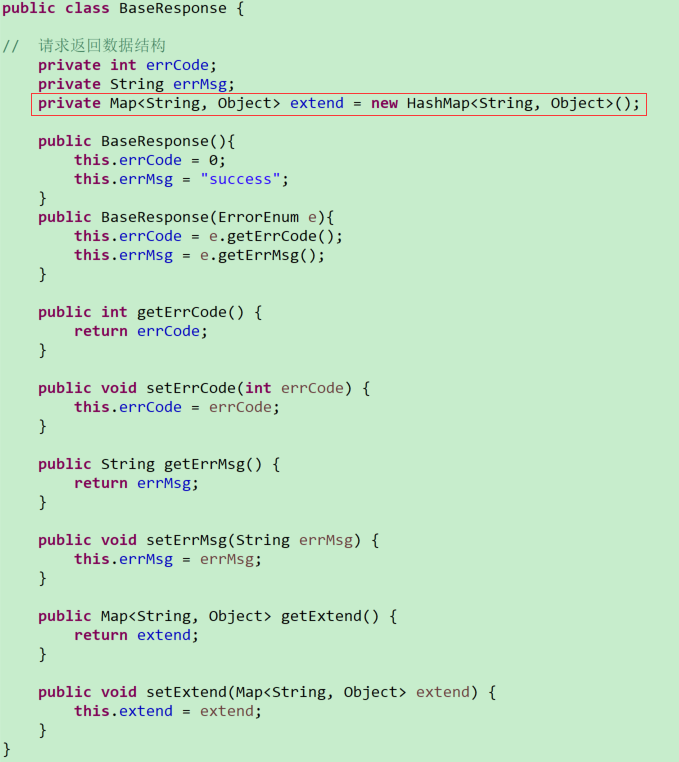
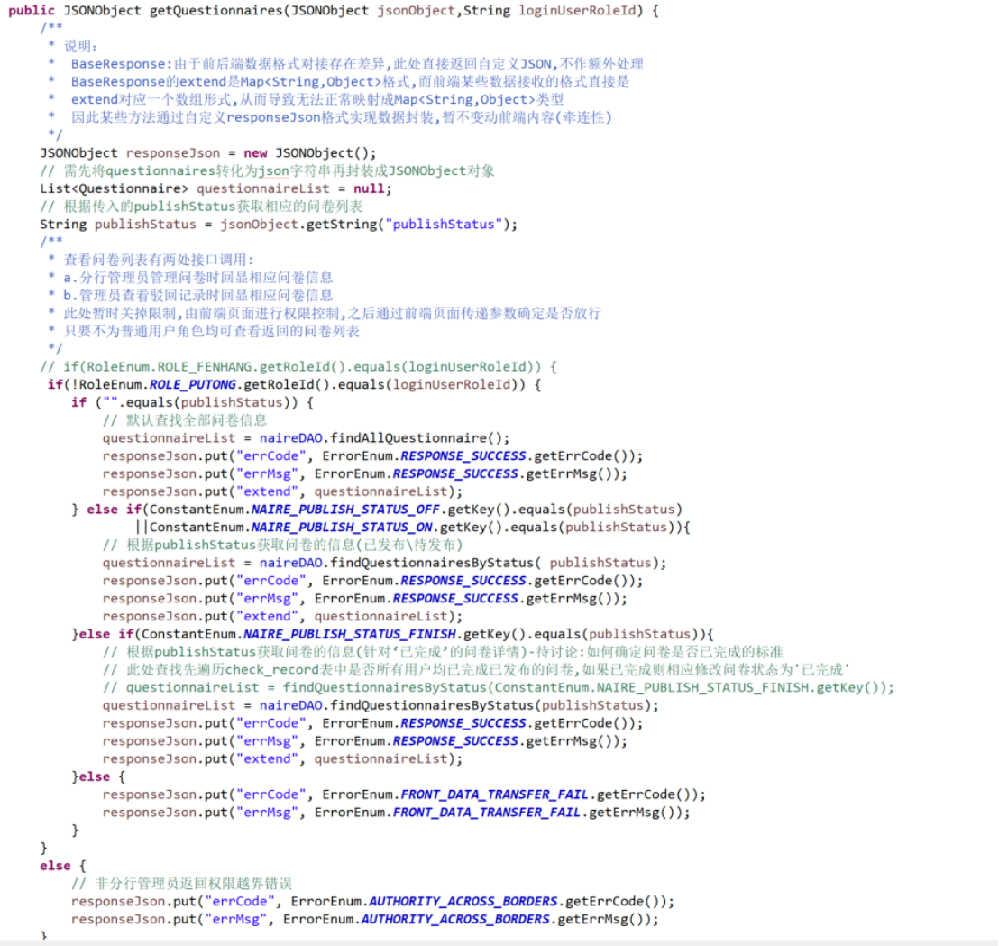
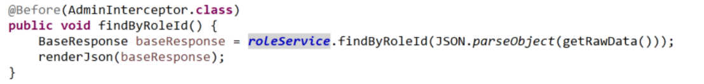
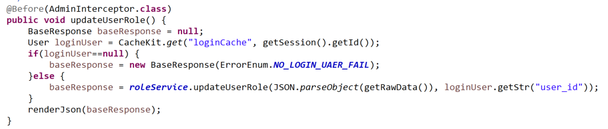
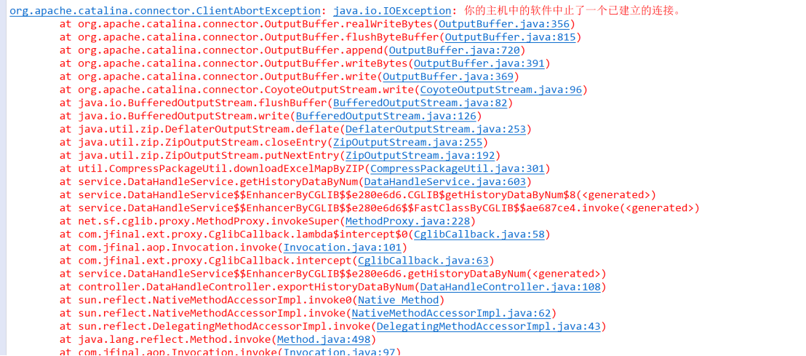

## 后端开发

### <1>代码规范

#### a.前后端交互数据定义

响应数据参考实体：

自定义封装（借助JSONObject实现）参考：

#### b.数据库事务处理

other.异常情况如何处理：

 数据会回滚？？

 例如添加问卷，代码中实现的是先添加问卷基本信息后添加问题列表数据，但实际上如果中途出现异常是否会进行监控回滚数据？？

 

1.问卷管理模块：查看已完成的问卷时除却状态已为“已完成”的问卷信息，

  还可能存在用户已经全部完成，但问卷状态还没有调整的数据，考虑需要在筛选前先确认状态，随后再筛选数据

参考思路：用数据库的触发器实现，用户每完成一个问卷相应变动check_record表的时候触发操作：验证当前指定问卷是否所有用户均已完成

 

删除数据判断删除成功返回的依据是什么

（如果删除不存在的数据返回值？？？）需要考虑这两种情况？？？

此处设置：“如果用户删除不存在的数据则抛出异常？？？”

删除失败（Db.delete(sql)>0;）返回0；正常执行删除操作返回大于0的数据

 

 

如果删除不成功相应抛出错误提示？？？

还是默认语句执行即可？？

 

如果抛出提示则针对一些网络中断导致数据异常的情况没办法及时清理。。

例如删除关联信息，则始终无法通过？？？

删除数据暂定默认只要执行了语句即认为操作成功 (一般先找后删除？？？)

 

 

存疑问题？

之后清理数据会将问卷相关的信息删除吗？

后台数据分步处理，如果中间出现异常状态是否会进行数据回滚？？

#### c.Java属性赋值

相同属性复制：

BeanUtils.copyProperties(source, target);

映射方式实现

### <2>常见异常

#### a.空指针异常

##### 1>常见JFinal配置相关空指针异常

​	在使用 model.find(....) 这类方法时碰到 NullPointerException 异常，通常是由于该 model 没有使用 ActionRecordPlugin.addMapping(....) 进行过映射

​	对象注入空指针异常：常见xxxService未初始化报空指针异常，此时需要检查注入的注解是否正确，是否配置？其次检查对象是否进行初始化操作

​	配置文件加载，sql模板、实体映射配置问题

​	文件上传空指针异常：通过判断验证进行不同情况的处理

​	文件下载空指针异常：下载文件不能为null，要进行空指针验证

##### 2>数据未初始化导致空指针异常

​	常见的例如登录用户，后台处理逻辑可能需要调用到登录用户相关信息，因此可能涉及通过某些缓存机制或者是其他方式实现用户信息保存，然而当相关缓存失效或者是用户人为退出登录等操作，则需要后台加以判断进行额外验证

​	常见用户登录空指针异常可通过拦截器控制（验证用户登录状态，抛出相应异常提示）

​	亦或是通过后台判断进行空指针验证处理

​	此外，针对一些后台查找数据返回值为空（null）或集合处理异常，造成判断语句出错，亦可通过设置断点，判断验证一一排除

#### b.代码编写细节问题

##### 1>String字符串判断（区分==与equal的用法）

​	内存的五片区域 ：寄存器，栈内存，堆内存，方法区，本地方法区

​	栈内存：存储的都是局部变量，一旦使用完毕，立即释放

​	堆内存：存储的是实体(对象)

​	Java程序中有两种方式是两个变量是否相等。一种是利用==判断，另外一种是使用equals方法来判断。

​	当使用==进行判断的时候，如果两个变量都是基本类型的变量，并且都是数值类型，则只要两个变量的值相同时，便返回true。但如果两个变量的类型是引用类型，则只有两个变量均指向相同的对象（内存地址）才返回true。

​	使用equals方法进行判断时则以具体equals方法中实际比较的项目为准（使用equals判断两个字符串是否相等），可通过重写equals方法实现自定义的比较方式

##### 2>break、continute、return的用法

> break：完全跳出循环

​	break用于完全结束一个循环，跳出循环体。不管是哪种循环，一旦在循环体中遇到break，系统将完全结束循环，开始执行循环之后的代码。 break不仅可以结束其所在的循环，还可结束其外层循环。此时需要在break后紧跟一个标签，这个标签用于标识一个外层循环。Java中的标签就是一个紧跟着英文冒号（:）的标识符，且它必须放在循环语句之前才有作用

> continute：终止本次循环

​	continue的功能和break有点类似，区别是continue只是中止本次循环，接着开始下一次循环。而break则是完全中止循环。

> return：结束整个方法体

​	return关键字并不是专门用于跳出循环的，return的功能是结束一个方法。 一旦在循环体内执行到一个return语句，return语句将会结束该方法，循环自然也随之结束。与continue和break不同的是，return直接结束整个方法，不管这个return处于多少层循环之内

在循环遍历的时候要根据实际需求场景选择合适的语句进行操作，当存在问题是通过设置断点分析循环次数和理想情况是否一致，如果不一致则思考过程中是否存在因素限制，一一进行排查

##### 3>文件下载异常

文件下载时候遇到的问题：

