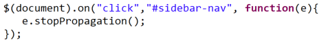
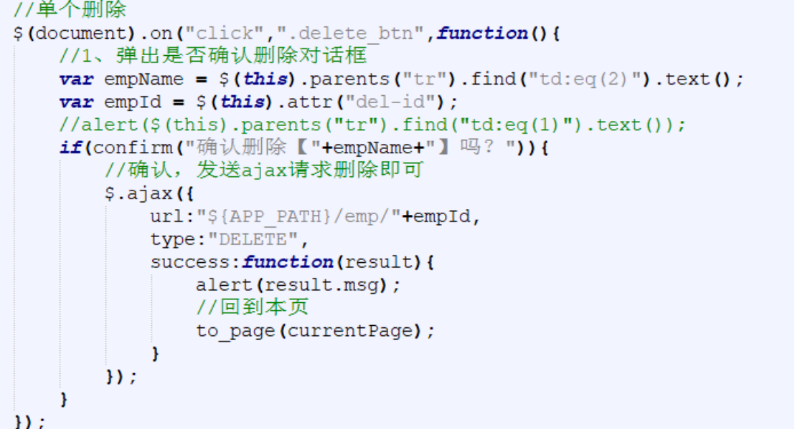
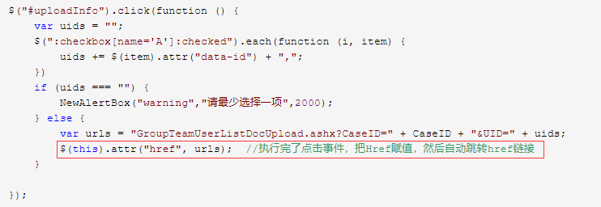
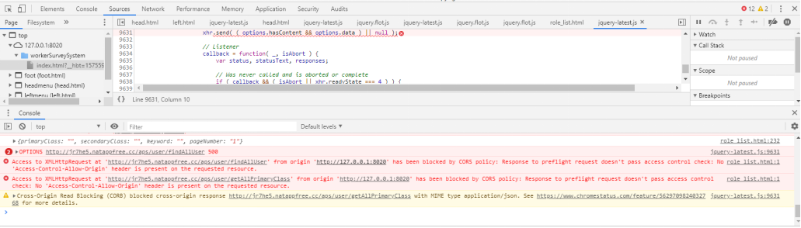
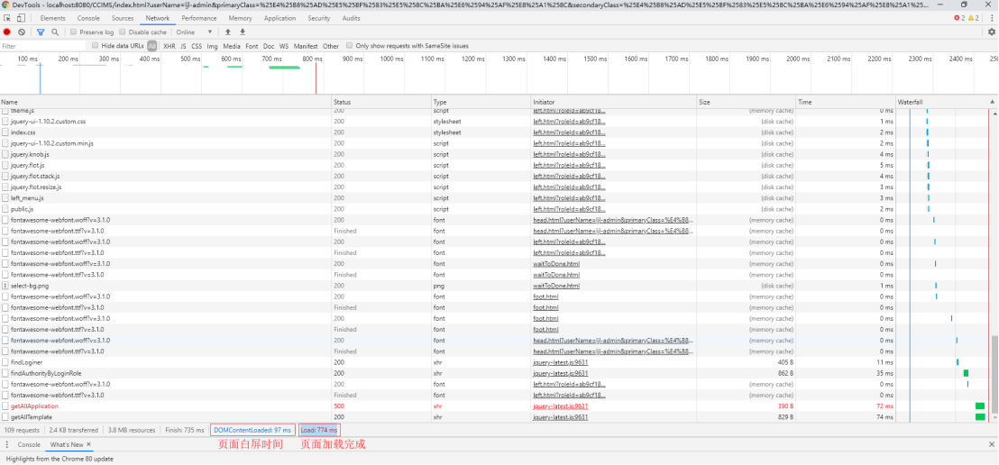

## 前端开发

### <1>注意事项

前端页面：

组件id不能够重复，否则加载的时候默认只加载第一个查找的数据

注意前后端返回、处理数据要保持一致性

 

dataTable  

注意js引入顺序（或者是js冲突导致，一般先引入jquery相关随后）

 

 

数据获取：

按钮触发的时候再去获取数据，否则页面加载的时候就获取一次，之后填写的内容无法同步更新数据，按钮触发的时候获取相关的数据


### <2>常见前端开发问题

#### a.动态生成的dom点击事件失效

​	**问题描述**：动态生成的dom点击按钮事件失效，在动态生成多级菜单的时候，菜单点击按钮事件失效

​	参考学习链接：https://www.jb51.net/article/89969.htm

​	**问题分析**：检查前端引用的框架js，可以发现有些框架在绑定某些标签的时候沿用的是click方法，因此前端页面在初始化渲染的时候还未等数据加载完成便渲染了表单，从而导致click方法失效（js、css失效），因此考虑更新click事件，采用“组件绑定”的思路动态绑定click事件，参考代码如下：

​	原有click事件js参考代码：


> 方式1：调整后click事件js参考代码：（可用）

​	替换原有的click事件，转换成以下形式，或者通过html原生的onclick事件触发

​	一步步注释js，找到对应的js文件，修改原有的click方法（旧版本click方法无法监听动态加载的数据）（JS排查错误）



```js
//返回按钮
$(document).on("click", "#returnButton", function(){
	window.location.href = "adminQuestion.html";
});
```

​	参考代码：




> 方式2：在标签中引用onclick属性定位要调用的方法


​	此外，a标签的href也是可以执行脚本的，点击事件也会执行脚本，点击事件优先，然后在执行href链接。下载一般都是把A标签的Href给个一般处理程序的链接（参数就用？传值）。但有些时候可能需要在前台根据用户选择的来进行传递参数，因此需要动态生成Href的链接，参考代码如下：

```html
<a href="javascript:void(0)" id="test" onclick="test()"></a>
```



#### b.JSON跨域请求：前后端分离（对接）

​	**问题描述**：在通过ip或者是代理服务器请求数据的时候出现错误，前端传入的数据在后台接受为null，如果是正常放在同一个项目测试的前后端代码则能够通过链接正常访问数据。前端相应报错：`Access to XMLHttpRequest at '*' from origin '*' has been blocked by CORS policy: Response to preflight request doesn't pass access control check: No 'Access-Control-Allow-Origin' header is present on the requested resource.` （从源'本地路径'访问 '目标路径(请求链接)'文本传输请求已被CORS策略阻塞:对预置请求的响应未通过访问控制检查:请求的资源上不存在'Access- control - allow - origin '报头）



​	[JAVA跨域资源访问CORSFilter](https://www.cnblogs.com/SummerinShire/p/7219789.html)：当一个资源从与该资源本身所在的服务器不同的域或端口不同的域或不同的端口请求一个资源时，资源会发起一个跨域 HTTP 请求。出于安全考虑，浏览器会限制从脚本内发起的跨域HTTP请求。跨域资源共享机制允许 Web 应用服务器进行跨域访问控制，从而使跨域数据传输得以安全进行。浏览器支持在 API 容器中使用 CORS，以降低跨域 HTTP 请求所带来的风险。

​	针对于JAVA开发而言，为了更好的做业务分层，经常会将前后端代码分离开来，发布在不同的服务器上，此时，便会遇到跨域的问题。

​	**问题分析**：本地路径和目标路径不是同一个域名下引起的跨域问题

​	**解决方式**：

> 方式1：后端使用JFinal进行相关配置，允许跨域请求，获取数据

　参考学习链接：https://www.cnblogs.com/SummerinShire/p/7219789.html

```
1>引入CORS相关jar
2>web.xml中配置过滤器实现“跨域资源访问”
3>重启服务测试
```


> 方式2：或是前端请求的ajax调整成jsonp，但可能存在限制

​	参考学习链接：http://www.webkaka.com/blog/archives/getJSON-get-JSON-data-from-cross-domain.html


#### c.浏览器兼容性问题

##### 1>动态加载菜单项时部分浏览器中前端js报错

​	动态加载左侧菜单时，部分浏览器其加载不出，F12查看发现js报错，提示为：找不到节点信息的append方法，将append方法调整为appendChild，或者是考虑将动态节点操作调整为拼接

​	如果是其他的js报错问题，则相应参考最新js结合浏览器兼容进行处理即可


##### 2>前端加载页面缓慢

​	部分浏览器中页面加载延迟，可能是在引用框架的时候部分前端js或css加载不出来从而导致页面渲染停滞，组件始终刷新不出来，用户体验感极差。这种情况与每个浏览器默认设置等待超时时间也相关，通过F12查看数据加载情况，如果是js、css引用异常导致页面加载堵塞则清理无用的js、css文件

​	调试：chrome：ctrl+shift+i进入开发者模式（F12），选择“Network”查看页面加载数据



​	在最下面的数据反应了该页面的整体加载情况。比如总共有109个请求，3.8M的数据，以及三个时间点，finish、DOMContentLoaded和load。

```java
finish：
    页面最后一个请求截止的时间，如果页面加载完后，触发了ajax请求，那么该时间会变更。
DOMContentLoaded：
    dom内容加载并解析完成的时间
load：
    页面所有的资源（图片，音频，视频等）加载完成的时间
dom内容加载完毕：
    当输入一个URL，页面的展示首先是空白的，然后过一会，页面会展示出内容，但是页面的有些资源比如说图片资源还无法看到，此时页面是可以正常的交互，过一段时间后，图片才完成显示在页面。从页面空白到展示出页面内容，会触发DOMContentLoaded事件，而这段时间就是HTML文档被加载和解析完成。此处DOMContentLoaded所计算的时间概念可以理解如下，当文档中没有脚本时，浏览器解析完文档便能触发 DOMContentLoaded 事件；如果文档中包含脚本，则脚本会阻塞文档的解析，而脚本需要等位于脚本前面的css加载完才能执行。在任何情况下，DOMContentLoaded的触发不需要等待图片等其他资源加载完成。
load：
    页面上所有的资源（图片，音频，视频等）被加载以后才会触发load事件，简单来说，页面的load事件会在DOMContentLoaded被触发之后才触发。
综上，DOMContentLoaded是页面白屏的时间，load是通常所说的页面加载完成时间
```

###### - 影响页面加载的因素

> js性能太差，阻塞页面

​	浏览器解析过程中，遇到`<script>`标签的时候，便会停止解析过程，转而去处理脚本，如果脚本是内联的，浏览器会先去执行这段内联的脚本，如果是外链的，那么先会去加载脚本，然后执行。在处理完脚本之后，浏览器便继续解析HTML文档。遇到js阻塞的情况，就需要具体去看代码的具体逻辑。


> 某个请求慢阻塞页面的加载

​	一般遇到页面卡顿，首先都是会想到去network里面去查看，可以一眼便能看出页面具体的加载时间，以及每一个请求的详细耗时。对比渲染完成的时间和浏览器最终加载完成的时间，查看请求是否阻塞，例如可以观察network里的请求，status为200的毫无疑问是正常的，如果发现其中有存在一直pending状态的，这个状态的请求其实为异常情况，浏览器会一直等待这请求返回，直至超时或failed，才会触发load事件，从而整个页面最终加载延迟


> 同域名下的请求数过多导致Queueing

​	参考学习链接：https://www.jianshu.com/p/24b93b13e5a9


##### 3>方法传参指定默认值

​	在方法名处直接设置默认值，部分浏览器检测出错，报异常符号“=”unexpected 符号

```js
function init(param1="",param2="")
```

​	考虑到部分浏览器不兼容的情况，需要调整为在调用方法的时候指定默认值即可


##### 4>左侧菜单

​	参考学习链接：https://blog.csdn.net/weixin_30302609/article/details/98321630

​	静态页面实现：参考bootstrap相关，借助原有模板实现页面加载

​	iframe方法实现：通过点击事件触发框架页面内容变更


#### d.响应式布局

Bootstrap栅栏模式

内联框架高度iframe自适应问题：

https://blog.csdn.net/qq_30604453/article/details/52735400?depth_1-utm_source=distribute.pc_relevant.none-task&utm_source=distribute.pc_relevant.none-task


