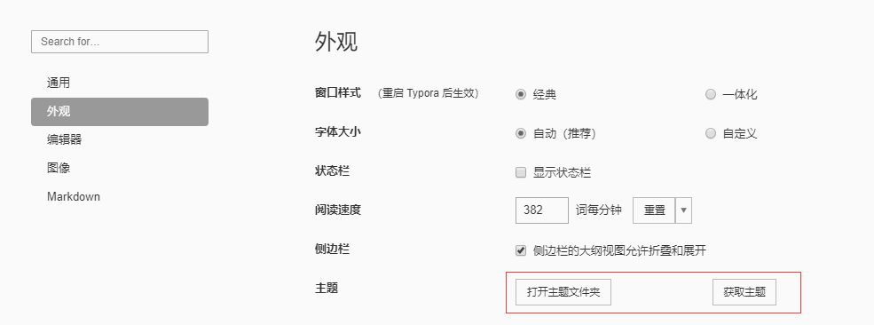

# Typora

Typora自定义主题样式：

​	在app数据缓存目录中查看样式信息，C:\Users\用户名\AppData\Roaming\Typora\themes

​	在[官方样式库](https://theme.typora.io/)中搜索自己需要的样式：或者通过偏好设置点击进入

​	将下载好的css样式和相应的文件夹放入指定目录，随后重启选择相应的主题生效即可

1. Download ava-diana.css and ava-diana folder.(下载ava-diana.css和ava-diana文件夹。)
2. Open Theme Folder from Preference Panel → Appearance section.(在Typora的Preference菜单中打开Appearance。)
3. Copy ava-diana.css and ava-diana folder into the newly opened folder.(把下载的ava-diana.css和ava-diana文件夹复制到新打开的文件夹内。)
4. Restart typora, then select ava-diana theme from Themes menu.(重启Typora，选择主题。)