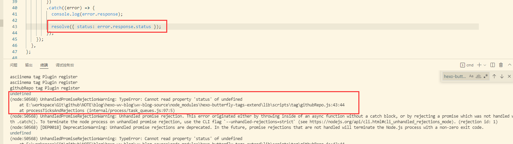
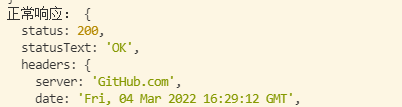
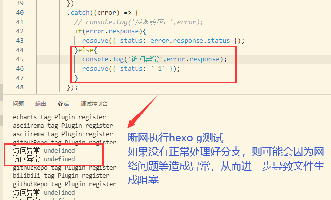

# githubRepo

> 变更记录

| 开发 | 内容 |
| ---- | ---- |
|      |      |


## 1.构建思路

​	本插件改造基于[hexo-github-repo-tag](https://github.com/JoJoJotarou/hexo-github-repo-tag)，用于构建展示github仓库信息，插件依赖于`"axios": "^0.21.1"`

​	原有构建方式是将js和css都直接通过`hexo.extend.tag.register`的方式注入渲染好的数据，但这种情况下很有可能会导致css内容重复装载的问题，且原有css样式中的svg控制在与其他控件同时使用的时候会造成冲突问题需要相应调整。此处将css和js的定义进行剥离，将实现拆分为两个步骤：

> 原有实现参考

```js
// 函数实现
githubRepoRender(args,content) {
	return '
		<style>...css样式定义...</style>
		<div class="gr-card">...卡片容器定义...</div>
	';
}
hexo.extend.tag.register('githubRepo', githubRepoRender, { ends: false })
```


> 改造后参考

```js
// 函数实现（将css文件剥离）
githubRepoRender(args,content) {
	return '
		<div class="gr-card">...卡片容器定义...</div>
	';
}
// 注册分为两步，一步是注册标签渲染函数，一步是注册全局css样式
hexo.extend.tag.register('githubRepo', githubRepoRender, { ends: false })

// 全局css样式注册(可对css进行分类管理，但为了统一也可直接在一个css中定义所有标签的样式，后续则只需要考虑在该css文件中迭代，不需重复定义)
const css_text = `<link rel="stylesheet" href='' media="defer" onload="this.media='all'">`
hexo.extend.injector.register('head_end', css_text, "default");
```

​	<font color=red>针对执行hexo g的时候总会出现响应提示，考虑是本地访问代理异常无法调用github的api，响应异常因而没有响应结果，因而status无法获取，需要相应调整代码校验逻辑，对调用响应结果进行相应的校验</font>



- 正常响应的结构体



- 当响应正常返回结果404等错误相应结构不同，且当出现网络不通的情况是无法获取到error.response参数的



​	相应解决思路：要么对代码逻辑进行强化校验，要么调整函数触发的时机（例如尽量避免在generate这一步调用，而是让其在某种条件下触发），但实际上不管基于何种思路，均需要相应处理该问题，可以直接访问github的api进行测试

```json
https://api.github.com/repos/username/reponame
# 正常响应则返回github仓库的信息
{
  "id": xxx,
  "node_id": "xxx",
  "name": "username",
  "full_name": "username/reponame",
  "private": false,
  "owner": {
  }
  ......
}

# 指定仓库不存在，则相应返回如下信息
{
  "message": "Not Found",
  "documentation_url": "https://docs.github.com/rest/reference/repos#get-a-repository"
}

# 而当网络连通异常导致结果无法响应则需额外进行处理
```


## 2.构建说明

```properties
|-- lib/scripts/tags
	|_ githubRepo.js
|-- index.js
```


## 3.使用说明

> 使用规则

```


```

> 样例测试

```markdown
# 存在

# 404

```

