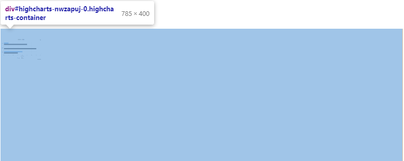
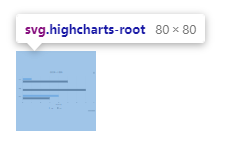
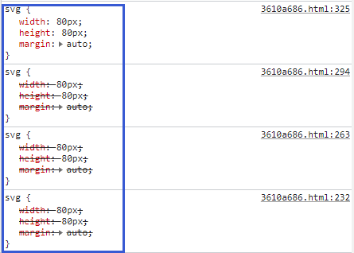

# 问题描述

​	在引入相关图表的时候，图表正常加载但样式却存在问题，例如在一个文章中同时引入githubRepo和highcharts标签的时候，发现显示的图表很小。

# 问题分析

​	通过排查，一开始考虑是引用时参数指定问题，但检查元素发现数据指定正常，装载的容器大小装载正常，随后继续向下检查嵌套元素发现图表的内容被封装在svg标签中，而svg样式在githubRepo中存在定义，从而覆盖了相应的引用，因此需要调整策略，对svg的css进行相应的控制，或者是针对highcharts中相关元素自定义样式。

# 解决方案

1.避免在同一文章中同时使用这两个githubRepo、highcharts外置标签（但理论上无法控制且不科学）

2.调整样式控制：对githubRepo标签中的css样式定义进行控制，或者是自定义css样式调整highcharts

# 问题扩展

​	在分析上述问题的时候发现，当在同一个页面中引入多个githubRepo的时候，css被重复加载，从而会出现下述的情况。这与hexo装载插件有关，原githubRepo在定义的时候返回的是一个完整的组件代码片段（包括了html、js、css），当同一个页面装载了多个githubRepo组件的时候，其css也相应被重复加载，只不过一些同名的样式控制会按照定义顺序进行装载，由下图可看到后装载的内容生效覆盖了前面的定义

​	在实际的处理中应该要将通用的css文件摘取出来，在公共配置中引入一次即可，无需每次加载组件都重复引入，从而导致一些未知的样式冲突、覆盖等问题

