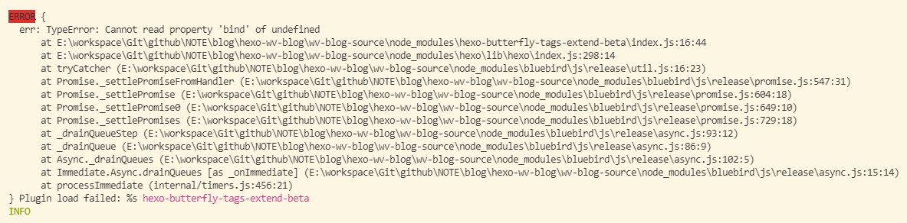

# 问题描述

```
const urlFor = require('hexo-util').url_for.bind(hexo)
```



# 问题分析

​		在引入mtime插件的时候报错，是由于对参数进行解析的时候用到了hexo-util工具类，重复导入导致依赖失效报错

```
const urlFor = require('hexo-util').url_for.bind(hexo)
```


# 解决方案

​	清理依赖缓存，在插件中不重复引入`hexo-util`组件，清理缓存并重启项目尝试


# 问题扩展