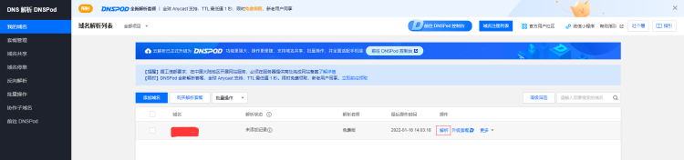
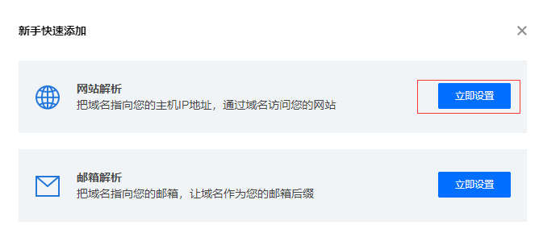
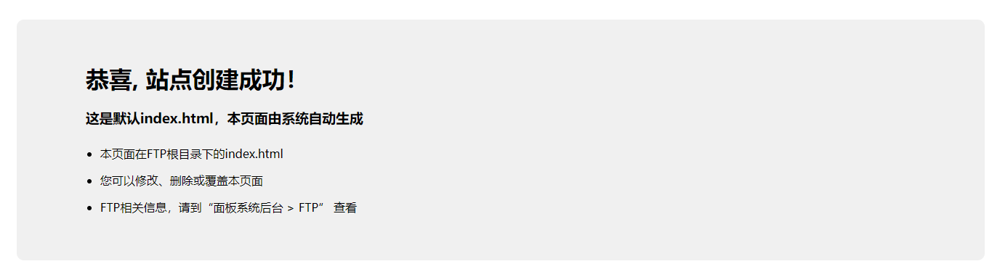
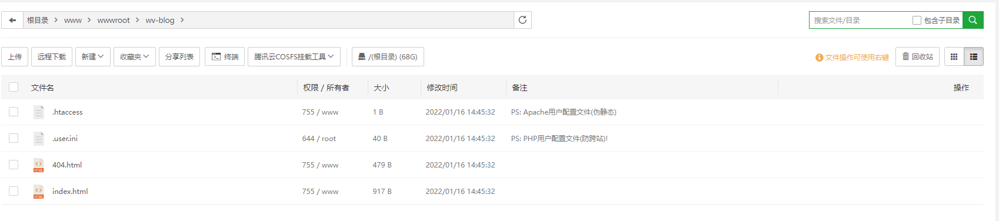

个人网站构建：

参考腾讯云官方文档：https://cloud.tencent.com/document/product/242/8584

域名注册

选定域名注册（com、cn等选择），信息模板填写验证（邮箱、手机号、实名注册验证），信息模板填充完成则等待审核，审核通过之后下单购买域名

域名注册完成则相应进行域名实名认证

云服务器构建：

域名备案：

1. 登录 [腾讯云控制台](https://console.cloud.tencent.com/) ：https://console.cloud.tencent.com/
2. 备案申请并完成域名备案：
   选择**云产品 > 域名与网站 > 网站备案**，进入**备案管理**页面，对购买成功的域名进行备案申请并完成域名备案。具体操作可参照 [备案流程](https://cloud.tencent.com/document/product/243/18909)。

“首次备案”、“接入备案” 具体参考腾讯云官方文档

​	个人网站首次备案输入身份信息验证、网站域名、云资源（对应云端的资源服务器）,此处域名备案需在域名注册3天后方允许进行域名备案

> 网站搭建：

参考网络资源构建静态或者动态资源网站

> 域名解析：

​	通过域名解析从而实现通过域名访问网站，可用腾讯云DNSPod进行解析

​	参考文档，快速添加网站解析：https://cloud.tencent.com/document/product/302/3446

​	点击“快速添加网站/邮箱解析”，随后设置网站解析（对应为腾讯云服务器公网IP地址），确认后会自动生成两条 A 记录，主机记录分别 www 和 @，若需要设置其他解析记录可手动添加配置

​	随后返回“我的域名”菜单项查看指定域名的解析状态是否为“正常解析”

> 网站发布配置：

​	网站->添加服务器（nginx）

​	ftp->安装Pure-Ftpd

​	在网站->添加站点

​	通过域名访问站点检查站点是否构建成功

> 检查文件内容：

> 更新文件信息

​	一种是参考云服务器部署的方式构建git仓库通过钩子文件自动发布（404访问错误待排查：宝塔）

​	一种是直接通过ftp将public发布的文件部署到指定的目录即可

​	还有一种方式最简单的方式则是借助githubpage构建hexo 随后通过github配置域名，随后则可直接通过域名访问