# [JAVA]-JavaWeb知识点

[TOC]


## 1.JavaWeb基础

### <1>Web基础概念

#### web相关基础

##### 1>简述html,css,javascript在网页开发中的定位?

<font color=blue>HTML（Hyper Text Markup Language）</font>：超文本标记语言，用于定义网页的结构

<font color=blue>CSS（Cascading Style Sheets）</font>：层叠样式表，用于美化页面（解决内容和表现分离的问题）

<font color=blue>JavaScript</font>：被设计用来向html页面添加交互行为，主要用来验证表单，做动态交互(其中ajax)


##### 2>什么是web？

​	WEB（网页）用于<font color=red>表示Internet主机上供外界访问的资源</font>

> WEB资源分类

​	<font color=red>静态web资源（html）</font>：web页面中供人们浏览的数据始终是不变

​	<font color=red>动态web资源（jsp/servlet、aps、php）</font>：web页面中供人们浏览的数据是由程序产生的，不同时间点访问web页面看到的内容各不相同


##### 3>讲一下http get和post请求的区别?

​	GET和POST请求都是http的请求方式，用户通过不同的http的请求方式完成对资源（url）的不同操作。GET，POST，PUT，DELETE就对应着对这个资源的查 ，改 ，增 ，删 4个操作,具体点来讲GET一般用于获取/查询资源信息，而POST一般用于更新资源信息

> <font color=red>Get请求提交的数据会在地址栏显示出来，而post请求不会再地址栏显示出来</font>

GET提交，请求的数据会附在URL之后（就是把数据放置在HTTP协议头中），以?分割URL和传输数据，多个参数用&连接；POST提交：把提交的数据放置在是HTTP包的包体中。 因此，GET提交的数据会在地址栏中显示出来，而POST提交，地址栏不会改变

> <font color=red>传输数据的大小</font>

http Get请求由于浏览器对地址长度的限制而导致传输的数据有限制。而POST请求不会因为地址长度限制而导致传输数据限制。

> <font color=red>安全性</font>

POST的安全性要比GET的安全性高。由于数据是会在地址中呈现，所以可以通过历史记录找到密码等关键信息。


##### 4>Web应用程序概念？

​	Web应用程序是对Web或者是应用服务器的动态扩展。有两种类型的Web应用：面向表现的和面向服务的。面向表现的Web应用程序会产生包含了很多种标记语言和动态内容的交互的web页面作为对请求的响应。而面向服务的Web应用实现了Web服务的端点(endpoint)。一般来说，一个Web应用可以看成是一组安装在服务器URL名称空间的特定子集下面的Servlet的集合


##### 5>HTTP响应的结构是怎么样的？

> <font color=red>HTTP响应由三个部分组成：</font>

​	状态码(Status Code)：描述了响应的状态。可以用来检查是否成功的完成了请求。请求失败的情况下，状态码可用来找出失败的原因。如果Servlet没有返回状态码，默认会返回成功的状态码HttpServletResponse.SC_OK。

​	HTTP头部(HTTP Header)：它们包含了更多关于响应的信息。比如：头部可以指定认为响应过期的过期日期，或者是指定用来给用户安全的传输实体内容的编码格式。如何在Serlet中检索HTTP的头部看这里。

​	主体(Body)：它包含了响应的内容。它可以包含HTML代码，图片，等等。主体是由传输在HTTP消息中紧跟在头部后面的数据字节组成的。


##### 6>常见的HTTP状态码（Status Code）

| 状态码 | 类别                          | 说明                               |
| ------ | ----------------------------- | ---------------------------------- |
| 1xx    | Informational（信息性状态码） | 接受的请求正在处理                 |
| 2xx    | Success（成功状态码）         | 请求正常处理完毕                   |
| 3xx    | Redirection（重定向）         | 需要进行附加操作以完成请求         |
| 4xx    | Client error（客户端错误）    | 客户端请求出错，服务器无法处理请求 |
| 5xx    | Server Error（服务器错误）    | 服务器处理请求出错                 |

> 各类别常见状态码：

<font color=red>2xx</font>

​	200 OK：表示从客户端发送给服务器的请求被正常处理并返回；

​	204 No Content：表示客户端发送给客户端的请求得到了成功处理，但在返回的响应报文中不含实体的主体部分（没有资源可以返回）；

​	206 Patial Content：表示客户端进行了范围请求，并且服务器成功执行了这部分的GET请求，响应报文中包含由Content-Range指定范围的实体内容；

<font color=red>3xx</font>

301 Moved Permanently：永久性重定向，表示请求的资源被分配了新的URL，之后应使用更改的URL；

302 Found：临时性重定向，表示请求的资源被分配了新的URL，希望本次访问使用新的URL；

<font color=blue>301与302的区别：前者是永久移动，后者是临时移动（之后可能还会更改URL）</font> 

303 See Other：表示请求的资源被分配了新的URL，应使用GET方法定向获取请求的资源；

<font color=blue>302与303的区别：后者明确表示客户端应当采用GET方式获取资源</font>

304 Not Modified：表示客户端发送附带条件（是指采用GET方法的请求报文中包含if-Match、If-Modified-Since、If-None-Match、If-Range、If-Unmodified-Since中任一首部）的请求时，服务器端允许访问资源，但是请求为满足条件的情况下返回改状态码；

307 Temporary Redirect：临时重定向，与303有着相同的含义，307会遵照浏览器标准不会从POST变成GET；（不同浏览器可能会出现不同的情况）；

<font color=red>4xx</font>

400 Bad Request：表示请求报文中存在语法错误；

401 Unauthorized：未经许可，需要通过HTTP认证；

403 Forbidden：服务器拒绝该次访问（访问权限出现问题）

404 Not Found：表示服务器上无法找到请求的资源，此外也可以在服务器拒绝请求但不想给拒绝原因时使用；

405 Method Not Allowd：客户端试图使用一个本资源不支持的HTTP方法。（例如：一个资源只支持GET方法，但是客户端使用PUT方法访问，响应报头：Allow报头列出本资源支持哪些HTTP方法，例如：Allow：GET，POST）


<font color=red>5xx</font>

500 Inter Server Error：表示服务器在执行请求时发生了错误，或者是web应用存在的bug或某些临时的错误时；

503 Server Unavailable：表示服务器暂时处于超负载或正在进行停机维护，无法处理请求；


#### J2EE概念

##### 1>J2EE基础概念

​	J2EE本身是一个标准，一个为企业分布式应用的开发提供的标准平台

​	J2EE也是一个框架，包括JDBC、JNDI、RMI、JMS、EJB、JTA等技术


​	J2EE 是Sun公司提出的多层(multi-diered),分布式(distributed),基于组件(component-base)的企业级应用模型 (enterpriese application model).在这样的一个应用系统中，可按照功能划分为不同的组件，这些组件又可在不同计算机上，并且处于相应的层次(tier)中。所属层次包括客户层(clietn tier)组件,web层和组件,Business层和组件,企业信息系统(EIS)层


> <font color=red>常用名词解释</font>

​	web 容器：给处于其中的应用程序组件（JSP，SERVLET）提供一个环境，使JSP,SERVLET直接更容器中的环境变量接口交互，不必关注其它系统问题。主要有WEB服务器来实现。例如：TOMCAT,WEBLOGIC,WEBSPHERE等。该容器提供的接口严格遵守J2EE规范中的WEB APPLICATION 标准。我们把遵守以上标准的WEB服务器就叫做J2EE中的WEB容器
​	EJB容器（Enterprise java bean 容器）：更具有行业领域特色。他提供给运行在其中的组件EJB各种管理功能。只要满足J2EE规范的EJB放入该容器，马上就会被容器进行高效率的管理。并且可以通过现成的接口来获得系统级别的服务。例如邮件服务、事务管理
​	JNDI（Java Naming & Directory Interface）：JAVA命名目录服务。主要提供的功能是：提供一个目录系统，让其它各地的应用程序在其上面留下自己的索引，从而满足快速查找和定位分布式应用程序的功能
​	JMS（Java Message Service-JAVA消息服务）：主要实现各个应用程序之间的通讯。包括点对点和广播
​	JTA（Java Transaction API-JAVA事务服务）：提供各种分布式事务服务，应用程序只需调用其提供的接口
​	JAF（Java Action FrameWork-JAVA安全认证框架）：提供一些安全控制方面的框架，让开发者通过各种部署和自定义实现自己的个性安全控制策略
​	RMI/IIOP（Remote Method Invocation /internet对象请求中介协议）: 主要用于通过远程调用服务。例如，远程有一台计算机上运行一个程序，它提供股票分析服务，我们可以在本地计算机上实现对其直接调用。当然这是要通过一定的规范才能在异构的系统之间进行通信。RMI是JAVA特有的


##### 2>名词解释（dto、jdo、......）

​	JDO 是Java对象持久化的新的规范，为java data object的简称,也是一个用于存取某种数据仓库中的对象的标准化API。JDO提供了透明的对象存储，因此对开发人员来说，存储数据对象完全不需要额外的代码（如JDBC API的使用）。这些繁琐的例行工作已经转移到JDO产品提供商身上，使开发人员解脱出来，从而集中时间和精力在业务逻辑上。另外，JDO很灵活，因为它可以在任何数据底层上运行。JDBC只是面向关系数据库（RDBMS）JDO更通用，提供到任何数据底层的存储功能，比如关系数据库、文件、XML以及对象数据库（ODBMS）等等，使得应用可移植性更强。


##### 3>j2ee中的几种常用模式?对设计模式的看法

Session Facade Pattern：使用SessionBean访问EntityBean

Message Facade Pattern：实现异步调用

EJB Command Pattern：使用Command JavaBeans取代SessionBean，实现轻量级访问

Data Transfer Object Factory：通过DTO Factory简化EntityBean数据提供特性

Generic Attribute Access：通过AttibuteAccess接口简化EntityBean数据提供特性

Business Interface：通过远程（本地）接口和Bean类实现相同接口规范业务逻辑一致性

EJB架构的设计好坏将直接影响系统的性能、可扩展性、可维护性、组件可重用性及开发效率。项目越复杂，项目队伍越庞大则越能体现良好设计的重要性


##### 4>BS与CS的联系与区别

​	C/S是Client/Server的缩写。服务器通常采用高性能的PC、工作站或小型机，并采用大型数据库系统，如Oracle、Sybase、Informix或 SQL Server。客户端需要安装专用的客户端软件
　B/Ｓ是Brower/Server的缩写，客户机上只要安装一个浏览器（Browser），如Netscape Navigator或Internet Explorer，服务器安装Oracle、Sybase、Informix或 SQL Server等数据库。在这种结构下，用户界面完全通过WWW浏览器实现，一部分事务逻辑在前端实现，但是主要事务逻辑在服务器端实现。浏览器通过Ｗeb Server 同数据库进行数据交互
C/S 与 B/S 区别： 

> 硬件环境不同: 

　　C/S 一般建立在专用的网络上, 小范围里的网络环境, 局域网之间再通过专门服务器提供连接和数据交换服务.
　　B/S 建立在广域网之上的, 不必是专门的网络硬件环境,例与电话上网, 租用设备. 信息自己管理. 有比C/S更强的适应范围, 一般只要有操作系统和浏览器就行 

> 对安全要求不同 

　　C/S 一般面向相对固定的用户群, 对信息安全的控制能力很强. 一般高度机密的信息系统采用C/S 结构适宜. 可以通过B/S发布部分可公开信息.
　　B/S 建立在广域网之上, 对安全的控制能力相对弱, 可能面向不可知的用户。

> 对程序架构不同 

　　C/S 程序可以更加注重流程, 可以对权限多层次校验, 对系统运行速度可以较少考虑.
　　B/S 对安全以及访问速度的多重的考虑, 建立在需要更加优化的基础之上. 比C/S有更高的要求 B/S结构的程序架构是发展的趋势, 从MS的.Net系列的BizTalk 2000 Exchange 2000等, 全面支持网络的构件搭建的系统. SUN 和IBM推的JavaBean 构件技术等,使 B/S更加成熟. 

> 软件重用不同 

　　C/S 程序可以不可避免的整体性考虑, 构件的重用性不如在B/S要求下的构件的重用性好.
　　B/S 对的多重结构,要求构件相对独立的功能. 能够相对较好的重用.就入买来的餐桌可以再利用,而不是做在墙上的石头桌子 

> 系统维护不同 

　　C/S 程序由于整体性, 必须整体考察, 处理出现的问题以及系统升级. 升级难. 可能是再做一个全新的系统
　　B/S 构件组成,方面构件个别的更换,实现系统的无缝升级. 系统维护开销减到最小.用户从网上自己下载安装就可以实现升级. 

> 处理问题不同 

　　C/S 程序可以处理用户面固定, 并且在相同区域, 安全要求高需求, 与操作系统相关. 应该都是相同的系统
　　B/S 建立在广域网上, 面向不同的用户群, 分散地域, 这是C/S无法作到的. 与操作系统平台关系最小. 

> 用户接口不同 

　　C/S 多是建立的Window平台上,表现方法有限,对程序员普遍要求较高
　　B/S 建立在浏览器上, 有更加丰富和生动的表现方式与用户交流. 并且大部分难度减低,减低开发成本. 

> 信息流不同 

　　C/S 程序一般是典型的中央集权的机械式处理, 交互性相对低
　　B/S 信息流向可变化, B-B B-C B-G等信息、流向的变化, 更像交易中心。


##### 5>CORBA是什么?用途是什么? 

​	CORBA 标准是公共对象请求代理结构(Common Object Request Broker Architecture)，由对象管理组织 (Object Management Group，缩写为 OMG)标准化。它的组成是接口定义语言(IDL), 语言绑定(binding:也译为联编)和允许应用程序间互操作的协议。其目的为：用不同的程序设计语言书写在不同的进程中运行，为不同的操作系统开发


### <2>Servlet相关

#### servlet基础

##### 1>对servlet的理解？servlet是什么？

​	<font color=red>Servlet是sun公司提供的一门用于开发动态web资源的技术</font>

​	Servlet（Server Applet），全称Java Servlet， 是用Java编写的服务器端程序

> <font color=red>快速入门：开发一个动态web资源</font>

	- 编写java类，实现servlet接口（交互式地浏览和修改数据，生成动态Web内容）
	- 将开发好的程序部署到web服务器中

​	HttpServlet重写doGet和doPost方法，也可重写service方法完成对get和post请求的响应


##### 2>Servlet体系结构

​	所有的Servlet都必须要实现的核心的接口是javax.servlet.Servlet。每一个Servlet都必须要直接或者是间接实现这个接口，或者是继承javax.servlet.GenericServlet或者javax.servlet.http.HTTPServlet。最后，Servlet使用多线程可以并行的为多个请求服务


##### 3>简述servlet的生命周期?

​	Servlet的的声明周期分为三个阶段（对应`javax.servlet.Servlet`不同的方法在不同的阶段进行调用）：

​	<font color=blue>1.初始化阶段（init）、2.响应客户阶段（service）、3.终止阶段（destory）</font>

> <font color=blue>1.servlet的初始化阶段</font>
>
> <font color=red>init方法只会在第一次初始化servlet的时候执行</font>

​	在以下时刻servlet进行初始化  servlet初始化包含以下三种情况，这三种情况都会执行init方法

- servlet容器启动后，自动加载某些配置信息。需要配置`<load-on-startup></load-on-startup>`
- 在servlet容器启动后，客户端第一次向servlet发起请求
- servlet的文件被更改后，重新加载servlet

```xml
<servlet>
    <servlet-name>servletName</servlet-name>
    <servlet-class>com.sz.packageName.className</servlet-class>
    <!-- 服务器启动的时候自动初始化这个servlet -->
    <load-on-startup>1</load-on-startup>
</servlet>
```

> <font color=blue>2.servlet响应客户端阶段</font>

​	servlet当接受到客户端请求后，servlet会根据这个请求创建两个对象`HttpServletRequest`对象（接受请求）和`HttpServletResponse`对象（响应请求），然后调用service方法。service方法会根据`HttpRequest`对象从请求中获取相关的数据，然后处理请求（doGet、doPost），最后通过`HttpResponse`对象把数据写出到客户端


><font color=blue>3.servlet终止阶段</font>

- 当web应用被终止，或者servlet容器终止运行

- servlet容器被重新加载

- 当前终止的时候回调用destroy方法进行终止


> <font color=red>扩展说明</font>

​	servlet生存期的定义，包括加载和实例化、初始化、处理请求以及服务结束

```properties
a.加载servlet的class
b.实例化servlet
c.初始化（init）
d.响应请求（service）
e.Servlet容器关闭时(destory)
```

​	servlet启动时，开始加载servlet生命周期开始。Servlet被服务器实例化后，容器运行其init方法，请求到达时运行其service方法，service方法自动派遣运行与请求对应的doXXX方法（doGet，doPost）等，当服务器决定将实例销毁的时候(服务器关闭)调用其destroy方法


##### 4>servlet相关的对象

> <font color=red>ServletConfig对象</font>

​	在servlet的配置文件中，可以使用一个或多个`<init-param>`标签为servlet配置初始化参数

​	当servlet配置了初始化参数后，web容器在创建servlet实例对象时，会自动将这些初始化参数封装到ServletConfig对象中，并在调用servlet的init方法时，将ServletConfig对象传递给servlet。随后通过ServletConfig对象就可以得到当前servlet的初始化参数信息

- 阅读ServletConfig API，了解ServletConfig对象的作用：

```properties
获得字符集编码
获得数据库连接信息
获得配置文件(web.xml配置的参数:可以通过ServletConfig对象获取)
```


> <font color=red>ServletContext对象</font>

​	WEB容器在启动时，它会为每个WEB应用程序都创建一个对应的ServletContext对象，它代表当前web应用

​	ServletConfig对象中维护了ServletContext对象的引用，由`ServletConfig.getServletContext`方法获得ServletContext对象

​	<font color=red>由于一个WEB应用中的所有Servlet共享同一个ServletContext对象</font>，因此Servlet对象之间可以通过ServletContext对象来实现通讯。<font color=red>ServletContext对象通常也被称之为context域对象</font>

- 阅读ServletContext API文档，了解ServletContext对象的作用

```properties
a.多个servlet共享数据
b.获取全局的web初始化参数
c.实现servlet直接的转发
d.读取资源文件
```


##### 5>Applet和Servlet有什么区别？

​	Applet是运行在客户端主机的浏览器上的客户端Java程序。而Servlet是运行在web服务器上的服务端的组件。applet可以使用用户界面类，而Servlet没有用户界面，相反，Servlet是等待客户端的HTTP请求，然后为请求产生响应


##### 6>GenericServlet和HttpServlet有什么区别？

​	GenericServlet是一个通用的协议无关的Servlet，它实现了Servlet和ServletConfig接口。继承自GenericServlet的Servlet应该要覆盖service()方法。最后，为了开发一个能用在网页上服务于使用HTTP协议请求的Servlet，你的Servlet必须要继承自HttpServlet。这里有Servlet的例子


##### 7>servlet API中forward() 与redirect()的区别？

forward是服务器端的转向而redirect是客户端的跳转

使用forward浏览器的地址不会发生改变，而redirect会发生改变

forward是一次请求中完成，而redirect是重新发起请求

forward是在服务器端完成，而不用客户端重新发起请求，效率较高


##### 8>doGet()方法和doPost()方法有什么区别？

​	doGet：GET方法会把名值对追加在请求的URL后面。因为URL对字符数目有限制，进而限制了用在客户端请求的参数值的数目。并且请求中的参数值是可见的，因此，敏感信息不能用这种方式传递。

​	doPOST：POST方法通过把请求参数值放在请求体中来克服GET方法的限制，因此，可以发送的参数的数目是没有限制的。最后，通过POST请求传递的敏感信息对外部客户端是不可见的。


##### 9>Servlet链(Servlet Chaining)？

​	Servlet链是把一个Servlet的输出发送给另一个Servlet的方法。第二个Servlet的输出可以发送给第三个Servlet，依次类推。链条上最后一个Servlet负责把响应发送给客户端


##### 10>服务端包含(Server Side Include)？

​	服务端包含(SSI)是一种简单的解释型服务端脚本语言，大多数时候仅用在Web上，用servlet标签嵌入进来。SSI最常用的场景把一个或多个文件包含到Web服务器的一个Web页面中。当浏览器访问Web页面的时候，Web服务器会用对应的servlet产生的文本来替换Web页面中的servlet标签


#### HttpServletRequest与HttpServletResponse

##### 1>request对象和response对象

​	web服务器收到客户端的http请求，会针对每一次请求，分别创建一个request对象（代表请求：理解为客户机提交的数据）和response对象（代表响应：理解为向客户机输出的数据）

> <font color=red>request对象和response对象的应用</font>

- <font color=blue>HttpServletRequest对象</font>

```properties
a.通过request对象常用方法
  - 获取客户端请求数据:例如IP(getRemoteAddr)、主机名(getRemoteHost)等
b.通过request对象获取表单项输入数据
c.通过request对象解决请求参数中文乱码问题
```

- <font color=blue>HttpServletResponse对象</font>

```properties
a.通过response对象输出中文到客户端
b.通过response对象完成文件的下载
c.通过response对象生成随机图片（验证码）
```


##### 2>请求转发和重定向概念

<font color=blue>一个web资源接收到客户端请求后，通知浏览器去调用另外一个web资源进行处理，称之为请求转发</font>

<font color=blue>一个web资源接收到客户端请求后，通知浏览器去访问另外一个web资源，称之请求重定向</font>

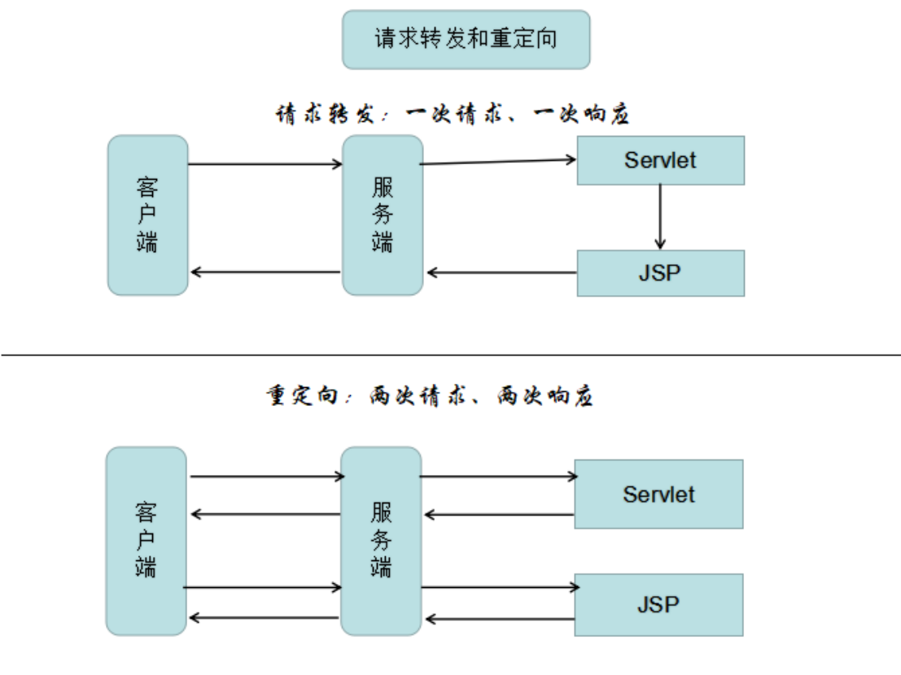

> <font color=red>从不同方面进行区分</font>

- <font color=blue>范围的不同</font>

​	`RequestDispatcher.forward`方法只能将请求转发给同一个WEB应用中的组件；

​	`HttpServletResponse.sendRedirect`方法还可重定向到同一个站点上的其他应用程序中的资源，甚至是使用绝对URL重定向到其他站点的资源

- <font color=blue>“/”的含义</font>

​	创建`RequestDispatcher`对象时指定的相对URL以“/”开头表示相对于当前WEB应用程序的根目录 

​	传递给`HttpServletResponse.sendRedirect` 方法的相对URL以“/”开头表示相对于整个WEB站点的根目录

- <font color=blue>浏览器地址栏的URL地址是否变化</font>

​	调用`RequestDispatcher.forward`方法的请求转发过程结束后，浏览器地址栏保持初始的URL地址不变

​	调用`HttpServletResponse.sendRedirect`方法重定向的访问过程结束后，浏览器地址栏中显示的URL会发生改变，由初始的URL地址变成重定向的目标URL

- <font color=blue>请求次数和响应次数</font> 

​	`RequestDispatcher.forward`方法的调用者与被调用者之间共享相同的request对象和response对象，它们属于<font color=red>同一个访问请求和响应过程</font>

​	`HttpServletResponse.sendRedirect`方法调用者与被调用者使用各自的request对象和response对象，它们属于两个独立的访问请求和响应过程

- <font color=blue>响应处理说明</font>

​	`RequestDispatcher.forward`方法在服务器端内部将请求转发给另外一个资源，浏览器只知道发出了请求并得到了响应结果，并不知道在服务器程序内部发生了转发行为

​	`HttpServletResponse.sendRedirect`方法对浏览器的请求直接作出响应，响应的结果就是告诉浏览器去重新发出对另外一个URL的访问请求


##### 3>项目乱码日常问题解决

​	如果是提交方式是post 如果不想乱码，只需要设置request.setCharacterEncoding("UTF-8");  和页面的编码集一致 <meta charset="UTF-8">

​	如果提交表单的方式是get，设置request是无效的，如果想获取的参数显示不是乱码，需要重新封装获取的数据再进行输出，参考示例如下：

```java
String username=request.getParameter("username");
username=new String(username.getBytes("ISO-8859-1"),"UTF-8");
System.out.println(username);
```

​	get方式乱码，还可以通过设置服务器的配置实现，可以在tomcat安装目录下更改conf/server.xml

```xml
<Connector connectionTimeout="20000" port="8080" protocal="HTTP/1.1" redirectPort="8443" URIEncoding="UTF-8"/>
```


##### 4>Request对象的主要方法

| 方法                             | 说明                                                         |
| -------------------------------- | ------------------------------------------------------------ |
| setAttribute(String name,Object) | 设置名字为name的request的参数值                              |
| getAttribute(String name)        | 返回由name指定的属性值                                       |
| getAttributeNames()              | 返回request对象所有属性的名字集合，结果是一个枚举的实例      |
| getCookies()                     | 返回客户端的所有Cookie对象，结果是一个Cookie数组             |
| getCharacterEncoding()           | 返回请求中的字符编码方式                                     |
| getContentLength()               | 返回请求的Body的长度                                         |
| getHeader(String name)           | 获得HTTP协议定义的文件头信息                                 |
| getHeaders(String name)          | 返回指定名字的request Header的所有值，结果是一个枚举的实例   |
| getHeaderNames()                 | 返回所以request Header的名字，结果是一个枚举的实例           |
| getInputStream()                 | 返回请求的输入流，用于获得请求中的数据                       |
| getMethod()                      | 获得客户端向服务器端传送数据的方法                           |
| getParameter(String name)        | 获得客户端传送给服务器端的有name指定的参数值                 |
| getParameterNames()              | 获得客户端传送给服务器端的所有参数的名字，结果是一个枚举的实例 |
| getParameterValues(String name)  | 获得有name指定的参数的所有值                                 |
| getProtocol()                    | 获取客户端向服务器端传送数据所依据的协议名称                 |
| getQueryString()                 | 获得查询字符串                                               |
| getRequestURI()                  | 获取发出请求字符串的客户端地址                               |
| getRemoteAddr()                  | 获取客户端的IP地址                                           |
| getRemoteHost()                  | 获取客户端的名字                                             |
| getSession([Boolean create])     | 返回和请求相关Session                                        |
| getServerName()                  | 获取服务器的名字                                             |
| getServletPath()                 | 获取客户端所请求的脚本文件的路径                             |
| getServerPort()                  | 获取服务器的端口号                                           |
| removeAttribute(String name)     | 删除请求中的一个属性                                         |
|                                  |                                                              |


### <3>JSP相关

#### jsp基础

##### 1>什么是jsp？

​	<font color=red>jsp（Java Server Pages）， 用于开发动态资源页面的技术</font>

​	其特点在于写jsp就像在写html，但html只能为用户提供静态数据，而jsp技术允许在页面中嵌套java代码，为用户提供动态数据


##### 2>jsp的原理分析

分析底层源码，掌握4个问题，剖析jsp原理

- web服务器是如何调用并执行一个jsp页面的？

- jsp页面中的html排版标签是如何被发送到客户端的？

- jsp页面中的java代码服务器是如何执行的？

- web服务器在调用jsp时，会给jsp提供一些什么java对象？

> <font color=red>1.web服务器是如何调用并执行一个jsp页面的？</font>

​	<font color=blue>web服务器最终把jsp翻译为一个java类</font>，可在tomcat发布项目的目录下对应的文件目录中查找到相应的jsp信息，分析如下（xx_jsp.class、xx_jsp.java），查看源码可分析该xx_jsp.java

```java
public final class xx_jsp extends org.apache.jasper.runtime.HttpJspBase implements org.apache.jasper.runtime.JspSourceDependent,
	org.apache.jasper.runtime.JspSourceImports{
    ......
}
```

```java
HttpJspBase.java
public abstract class HttpJspBase extends HttpServlet implements HttpJspPage{
	......
}
```

​	<font color=red>经过查看源码可知HttpJspBase是一个Servlet，所以web服务器调用一个jsp的页面的过程就是调用一个servlet（init、 service、 detory）的过程 </font>


> <font color=red>2.jsp页面中的html排版标签是如何被发送到客户端的？</font>

​	经过查看源码，发现html代码通过out对象直接输出到客户端

```jsp
out.write("\r\n");
out.write("<html>\r\n");
out.write("......");
```


> <font color=red>3.jsp页面中的java代码服务器是如何执行的？</font>

​	通过查看源码发现，Java代码是没有任何改变，其本身还是一个java类，可以直接执行

```java
// 举例分析：输出当前系统时间
Date date = new Date();
out.write("当前系统时间"+date.toLocaleString());
```


> <font color=red>4.web服务器在调用jsp时，会给jsp提供一些什么java对象？</font>

​	通过查看源码发现，Web服务器在调用jsp时，给jsp提供了下述对象，并且这些对象可以直接在jsp中直接使用

> <font color=red>jsp的九大内置对象（隐含对象）和四大域对象 </font>

| 内置对象    | 类型                | 说明                                           |
| ----------- | ------------------- | ---------------------------------------------- |
| request     | HttpServletRequest  | 用户端请求，此请求会包含来自GET/POST请求的参数 |
| response    | HttpServletResponse | 网页传回用户端的回应                           |
| pageContext | PageContext         | 网页的属性是在这里管理                         |
| session     | HttpSession         | 与请求有关的会话期                             |
| application | ServletContext      | servlet正在执行的内容                          |
| out         | JspWriter           | 用来传送回应的输出                             |
| config      | ServletConfig       | servlet的构架部件                              |
| page        | Object(this)        | JSP网页本身                                    |
| exception   | Throwable           | 针对错误网页，未捕捉的例外                     |
|             |                     |                                                |

| 域对象      | 类型              | 域作用范围                                                   |
| ----------- | ----------------- | ------------------------------------------------------------ |
| application | ServletContext    | context域（<font color=red>整个web应用</font>：当Web应用被加载进容器时创建代表整个web应用的ServletContext对象，当服务器关闭或Web应用被移除时，ServletContext对象跟着销毁） |
| request     | HttpServletRequet | request域（<font color=red>一次请求</font>：作用范围是整个请求链（请求转发也存在）；生命周期是在service方法调用前由服务器创建，传入service方法。整个请求结束，request生命结束） |
| session     | HttpSession       | session域（<font color=red>一次会话</font>：作用范围是一次会话。生命周期是在第一次调用request.getSession()方法时，服务器会检查是否已经有对应的session,如果没有就在内存中创建一个session并返回。当一段时间内session没有被使用（默认为30分钟），则服务器会销毁该session。如果服务器非正常关闭（强行关闭），没有到期的session也会跟着销毁。如果调用session提供的invalidate（） ，可以立即销毁session) |
| pageContext | PageContext       | page域（<font color=red>jsp页面</font>：生命周期是当对JSP的请求时开始，当响应结束时销毁） |


##### 3>jsp和servlet有哪些相同点和不同点?

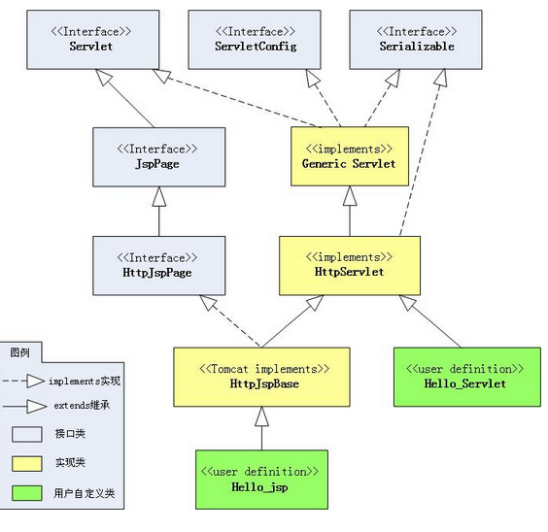

​	JSP是Servlet技术的扩展，所有的jsp文件都会被翻译为一个继承HttpServlet的类。也就是jsp最终也是一个Servlet.这个Servlet对外提供服务

​	Servlet和JSP最主要的不同点在于JSP侧重于视图，Servlet主要用于控制逻辑。

​	Servlet如果要实现html的功能，必须使用Writer输出对应的html,比较麻烦。而JSP的情况是Java和HTML可以组合成一个扩展名为.jsp的文件,做界面展示比较方便而嵌入逻辑比较复杂。


##### 4>XML文档定义有几种形式？它们之间有何本质区别？解析XML文档有哪几种方式？ 

​	两种形式 dtd  schema

​	本质区别:schema本身是xml的，可以被XML解析器解析(这也是从DTD上发展schema的根本目的)，c:有DOM,SAX,STAX等 

​    DOM:处理大型文件时其性能下降的非常厉害。这个问题是由DOM的树结构所造成的，这种结构占用的内存较多，而且DOM必须在解析文件之前把整个文档装入内存,适合对XML的随机访问
SAX:不现于DOM,SAX是事件驱动型的XML解析方式。它顺序读取XML文件，不需要一次全部装载整个文件。当遇到像文件开头，文档结束，或者标签开头与标签结束时，它会触发一个事件，用户通过在其回调事件中写入处理代码来处理XML文件，适合对XML的顺序访问 
​    STAX:Streaming API for XML (StAX)


#### jsp应用

##### 1>jsp标签概念

​	JSP标签也称之为`Jsp Action`(JSP动作)元素，它用于在Jsp页面中提供业务逻辑功能，避免在JSP页面中直接编写java代码，造成jsp页面难以维护

​	`<jsp:include>`标签  、`<jsp:forward>`标签  、`<jsp:param>`标签 

> <font color=red>jsp:include标签</font>

​	`<jsp:include>`标签用于把另外一个资源的输出内容插入进当前JSP页面的输出内容之中，这种在JSP页面执行时的引入方式称之为动态引入

​	语法：

```jsp
<jsp:include page="relativeURL | <%=expression%>" flush="true|false" />
```

​	page属性用于指定被引入资源的相对路径，它也可以通过执行一个表达式来获得

​	flush属性指定在插入其他资源的输出内容时，是否先将当前JSP页面的已输出的内容刷新到客户端 

- <font color=blue>`<jsp:include>`与`include`指令的比较</font>

​	`<jsp:include>`标签是动态引入， 其涉及到的2个JSP页面会被翻译成2个servlet，这2个servlet的内容在<font color=red>执行时</font>进行合并

​	`include`指令是静态引入，其涉及到的2个JSP页面会被翻译成一个servlet，其内容是在<font color=red>源文件级别</font>进行合并

​	不管是`<jsp:include>`标签，还是`include`指令，它们都会把两个JSP页面内容合并输出，所以这两个页面不要出现重复的HTML全局架构标签，否则输出给客户端的内容将会是一个格式混乱的HTML文档


> <font color=red>jsp:forward标签</font>

​	`<jsp:forward>`标签用于把请求转发给另外一个资源

​	语法：

```jsp
<jsp:forward page="relativeURL | <%=expression%>" /> 
```

​	page属性用于指定请求转发到的资源的相对路径，它也可以通过执行一个表达式来获得


> <font color=red>jsp:param标签</font>

​	当使用`<jsp:include>`和`<jsp:forward>`标签引入或将请求转发给其它资源时，可以使用`<jsp:param>`标签向这个资源传递参数

​	语法1：

```jsp
<jsp:include page="relativeURL | <%=expression%>">
	<jsp:param name="parameterName" value="parameterValue|<%= expression %>" />
</jsp:include>
```

​	语法2：

```jsp
<jsp:forward page="relativeURL | <%=expression%>">
	<jsp:param name="parameterName" value="parameterValue|<%= expression %>" />
</jsp:include>
```

​	`<jsp:param>`标签的name属性用于指定参数名，value属性用于指定参数值。在`<jsp:include>`和`<jsp:forward>`标签中可以使用多个`<jsp:param>`标签来传递多个参数


##### 2>JavaBean概念

​	JavaBean是一个遵循特定写法的Java类，它通常具有如下特点：

```properties
a.该Java类必须具有一个无参的构造函数
b.属性必须私有化
c.私有化的属性必须通过public类型的方法暴露给其它程序，并且方法的命名也必须遵守一定的命名规范
```

​	JavaBean在J2EE开发中，通常用于封装数据，对于遵循以上写法的JavaBean组件，其它程序可以通过反射技术实例化JavaBean对象，并且通过反射那些遵守命名规范的方法，从而获知JavaBean的属性，进而调用其属性保存数据

​	JavaBean的属性可以是任意类型，并且一个JavaBean可以有多个属性。每个属性通常都需要具有相应的setter、 getter方法，setter方法称为属性修改器，getter方法称为属性访问器


##### 3>jsp中使用JavaBean

JSP技术提供了三个关于JavaBean组件的动作元素，即JSP标签，它们分别为：

 `<jsp:useBean>`标签：用于在JSP页面中查找或实例化一个JavaBean组件

`<jsp:setProperty>`标签：用于在JSP页面中设置一个JavaBean组件的属性

`<jsp:getProperty>`标签：用于在JSP页面中获取一个JavaBean组件的属性

> <font color=red>参考示例：</font>

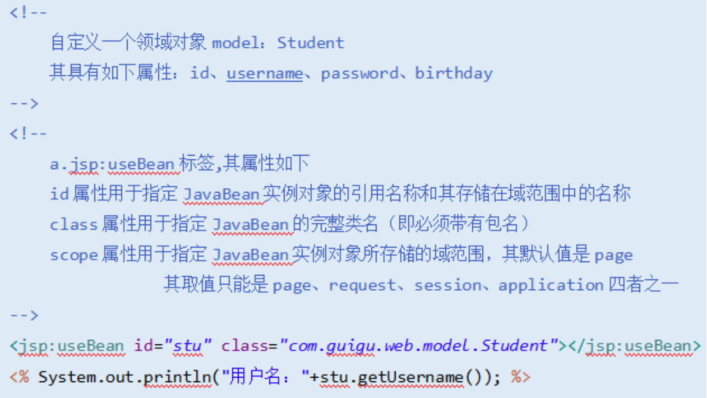

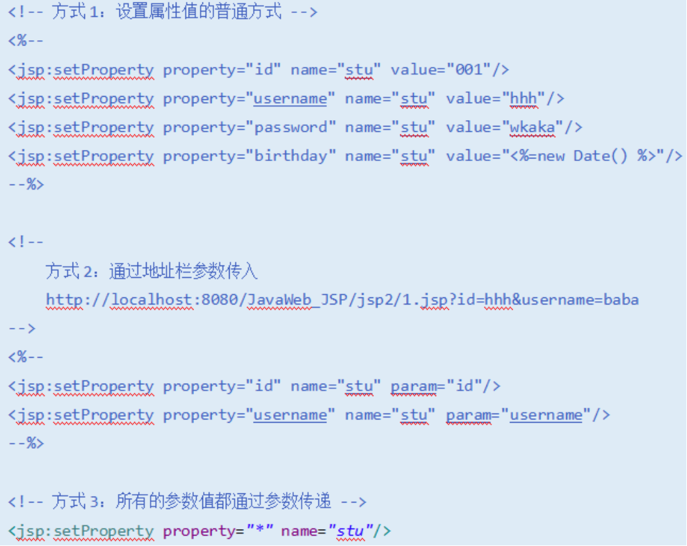

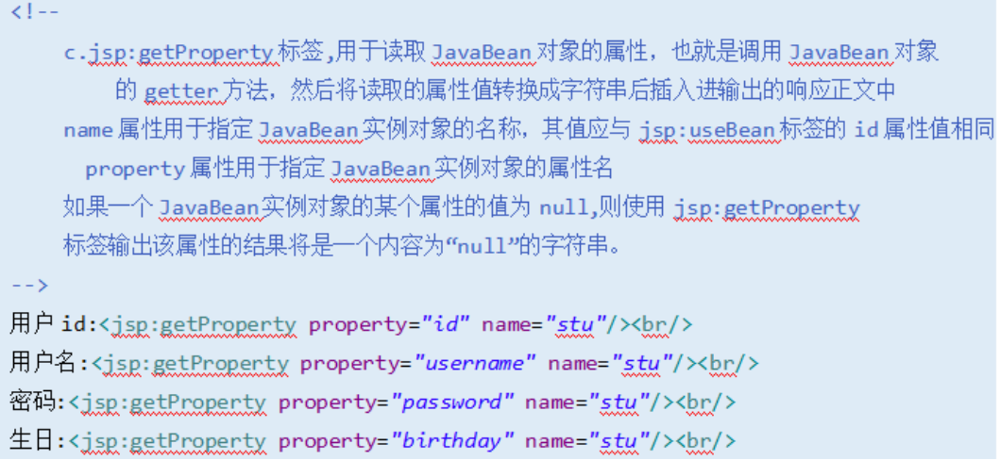


##### 4>jsp的开发模式

​	SUN公司推出JSP技术后，同时也推荐了两种web应用程序的开发模式，一种是`JSP+JavaBean`模式，一种是`Servlet+JSP+JavaBean`模式

​	`JSP+JavaBean`模式适合开发业务逻辑不太复杂的web应用程序，这种模式下，JavaBean用于封装业务数据，JSP即负责处理用户请求，又显示数据

​	`Servlet+JSP+JavaBean(MVC)`模式适合开发复杂的web应用，在这种模式下，servlet负责处理用户请求，jsp负责数据显示，javabean负责封装数据。 Servlet+JSP、JavaBean模式程序各个模块之间层次清晰，web开发推荐采用此种模式


#### el表达式

##### 1>el表达式基础

​	<font color=red>EL(Expression Language)</font>，其主要作用说明如下

> <font color=blue>获取数据：</font>

​	EL表达式主要用于替换JSP页面中的脚本表达式，以从各种类型的web域中检索java对象、获取数据。(某个web域 中的对象，访问javabean的属性、访问list集合、访问map集合、访问数组)

> <font color=blue>执行运算：</font>

​	利用EL表达式可以在JSP页面中执行一些基本的关系运算、逻辑运算和算术运算，以在JSP页面中完成一些简单的逻辑运算。${user==null}

> <font color=blue>获取web开发常用对象：</font>

​	EL表达式定义了一些隐式对象，利用这些隐式对象，web开发人员可以很轻松获得对web常用对象的引用，从而获得这些对象中的数据

> <font color=blue>调用Java方法：</font>

​	EL表达式允许用户开发自定义EL函数，以在JSP页面中通过EL表达式调用Java类的方法


### <4>会话管理相关

#### 会话管理概念

##### 1>cookie与session的概念

> <font color=blue>cookie</font>

​	cookie是客户端技术，程序把每个用户的数据以cookie的形式写给用户各自的浏览器。当用户使用浏览器再去访问服务器中的web资源时，就会带着各自的数据去。这样，web资源处理的就是用户各自的数据了

```properties
应用场景介绍
显示用户上次访问的时间
显示用户的书籍浏览记录
Cookie相关细节问题
```


> <font color=blue>session</font>

​	session是服务器端技术，利用这个技术，服务器在运行时可以为每一个用户的浏览器创建一个其独享的session对象，由于session为用户浏览器独享，所以用户在访问服务器的web资源时，可以把各自的数据放在各自的session中，当用户再去访问服务器中的其它web资源时，其它web资源再从用户各自的session中取出数据为用户服务

```properties
应用场景介绍
利用session实现数据存取
模拟实现购物车
模拟实现用户登录操作
```


> <font color=red>cookie与session主要区别</font>

​	cookie是把用户的数据写给用户的浏览器

​	session技术把用户的数据写到用户独占的session中


##### 2>说一下session和cookie的区别？你在项目中都有哪些地方使用了？

​	session和cookie都是会话(Seesion)跟踪技术。Cookie通过在客户端记录信息确定用户身份，Session通过在服务器端记录信息确定用户身份。但是Session的实现依赖于Cookie,sessionId(session的唯一标识需要存放在客户端)

> cookie 和session 的区别：

（从数据的存放位置、安全性、服务器性能、数据保存最大上限、实际应用场景上加以区分）

​	cookie数据存放在客户的浏览器上，session数据放在服务器上。

​	cookie不是很安全，别人可以分析存放在本地的COOKIE并进行COOKIE欺骗，考虑到安全应当使用session

​	session会在一定时间内保存在服务器上。当访问增多，会比较占用你服务器的性能,考虑到减轻服务器性能方面，应当使用COOKIE

​	单个cookie保存的数据不能超过4K，很多浏览器都限制一个站点最多保存20个cookie

> 应用场景

​	将登陆信息等重要信息存放为SESSION，其他信息如果需要保留，可以放在COOKIE中，比如购物车

​	购物车最好使用cookie，但是cookie是可以在客户端禁用的，要使用cookie+数据库的方式实现，当从cookie中不能取出数据时，就从数据库获取


##### 3>四种会话跟踪技术

> 会话作用域ServletsJSP 页面描述

​	page否是代表与一个页面相关的对象和属性。一个页面由一个编译好的 Java servlet 类（可以带有任何的 include 指令，但是没有 include 动作）表示。这既包括 servlet 又包括被编译成 servlet 的 JSP 页面

​	request是是代表与 Web 客户机发出的一个请求相关的对象和属性。一个请求可能跨越多个页面，涉及多个 Web 组件（由于 forward 指令和 include 动作的关系）

​	session是是代表与用于某个 Web 客户机的一个用户体验相关的对象和属性。一个 Web 会话可以也经常会跨越多个客户机请求

​	application是是代表与整个 Web 应用程序相关的对象和属性。这实质上是跨越整个 Web 应用程序，包括多个页面、请求和会话的一个全局作用域


### <5>过滤器概念

#### 过滤器基础知识

##### 1>过滤器基础概念

​	<font color=blue>Filter也称之为过滤器，WEB开发人员通过Filter技术，对web服务器管理的所有web资源：例如Jsp, Servlet, 静态图片文件或静态html 文件等进行拦截，从而实现一些特殊的功能。例如实现URL级别的权限访问控制、过滤敏感词汇、压缩响应信息等一些高级功能</font>

​	Servlet API中提供了一个Filter接口，开发web应用时，如果编写的Java类实现了这个接口，则把这个java类称之为过滤器Filter。通过Filter技术，开发人员可以实现用户在访问某个目标资源之前，对访问的请求和响应进行拦截，如下所示：

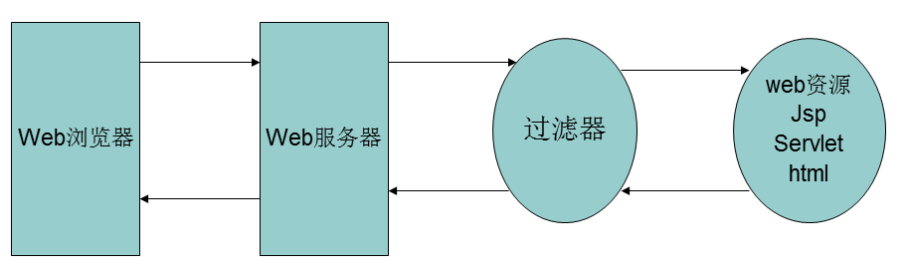


​	Filter接口中有一个doFilter方法，当开发人员编写好Filter，并配置对哪个web资源进行拦截后，WEB服务器每次在调用web资源的service方法之前，都会先调用一下filter的doFilter方法，因此，在该方法内编写代码可达到如下目的：

​	调用目标资源之前，让一段代码执行

​	是否调用目标资源（即是否让用户访问web资源）：web服务器在调用doFilter方法时，会传递一个filterChain对象进来，filterChain对象是filter接口中最重要的一个对象，它也提供了一个doFilter方法，开发人员可以根据需求决定是否调用此方法，调用该方法，则web服务器就会调用web资源的service方法，即web资源就会被访问，否则web资源不会被访问

​	调用目标资源之后，让一段代码执行

<font color=red>filterChain可以决定是否放行到目标资源</font>

> Filter开发分为二个步骤：

​	编写java类实现Filter接口（`javax.servlet`），并实现其doFilter方法

​	在 web.xml 文件中使用`<filter>`和`<filter-mapping>`元素对编写的filter类进行注册，并设置它所能拦截的资源

```xml
<!-- 注册过滤器 -->
<filter>
    <filter-name>过滤器名称</filter-name>
    <filter-class>类全名</filter-class>
</filter>
<!-- 配置过滤器拦截映射 -->
<filter-mapping>
	<filter-name>过滤器名称</filter-name>
    <url-pattern>/*</url-pattern>
</filter-mapping>
```


> <font color=blue>Filter链</font>

​	<font color=red>在一个web应用中，可以开发编写多个Filter，这些Filter组合起来称之为一个Filter链</font>

​	web服务器根据Filter在web.xml文件中的注册顺序，决定先调用哪个Filter，当第一个Filter的doFilter方法被调用时，web服务器会创建一个代表Filter链的FilterChain对象传递给该方法。在doFilter方法中，开发人员如果调用了FilterChain对象的doFilter方法，则web服务器会检查FilterChain对象中是否还有filter，如果有，则调用第2个filter，如果没有，则调用目标资源

​	Filter链实验（查看filterChain API文档）

​	<font color=red>如果有多个过滤器，进入的顺序和出来的顺序是相反的</font>

> <font color=blue>过滤器经典案例</font>

```properties
a.解决全站乱码问题
b.防盗链Filter
c.脏话过滤器
d.HTML转义
```


## 2.前端开发技术相关

### <1>前后端交互

#### 数据交互说明

##### 1>同步和异步的概念

举个例子：普通B/S模式同步、AJAX技术(异步)

同步：提交请求-->等待服务器处理-->处理完毕返回  这个过程客户浏览器不能做任何事

异步：请求通过事件触发-->服务器处理-->(这个时候浏览器可以做别的)->处理完毕

同步是指：发送数据后，等到接收方发回响应后才发下一个数据包的通讯方式

异步是指：发送方发送数据后，不等待收方发回响应，接着发送下个数据包


### <2>Ajax相关

#### Ajax基础概念

##### 1>简单介绍一下ajax?

<font color=red>ajax（Asynchronous JavaScript and XML：异步的javascript和xml）：一种不用刷新整个页面便可与服务器通信的办法（通过ajax与服务器进行数据交换，使网页实现局部更新）</font>

> <font color=red>使用ajax前后</font>

​	在ajax之前，Web站点强制用户进入提交/等待/重新显示范例，用户的动作总是与服务器的“思考时间”同步

​	ajax提供与服务器异步通信的能力，从而使用户从请求/响应的循环中解脱出来。借助于ajax，可以在用户单击按钮时，使用JavaScript、HTML立即更新UI，并向服务器发出异步请求，以执行更新或查询数据库。当请求返回时，就可以使用JavaScript和CSS来相应地更新UI，而不是刷新整个页面，使得Web站点看起来是即时响应的


##### 2>ajax原理

​	<font color=blue>ajax的核心是JavaScript对象：XmlHttpRequest（使用该对象异步向服务器发送请求，获取响应数据，完成局部更新）</font>

​	Open send responseText/responseXML-局部响应

> <font color=red>ajax工作原理分析</font>

```properties
a.创建XmlHttpRequest对象
b.打开和服务器的链接
c.发送请求到服务器端
d.响应客户端请求
	- 判断服务器的状态是否交互完毕 
	- 判断数据是否成功返回到客户端
	- 处理服务器端响应的数据
```

​	

> <font color=red>使用场景</font> 

内存中的数据编辑、页面导航、数据校验

登陆失败时不跳转页面、注册时提示用户名是否存在、二级联动等使用场景


#### jQuery基础概念

##### 1>什么是jQuery？

​	jQuery由美国人John Resig创建，至今已吸引了来自世界各地的众多javascript高手加入其team

​	jQuery是继prototype之后又一个优秀的Javascript框架。其宗旨：WRITE LESS,DO MORE,写更少的代码,做更多的事情

​	它是轻量级的js库(压缩后只有21k) ，这是其它的js库所不及的，它兼容CSS3，还兼容各种浏览器 （IE 6.0+, FF 1.5+, Safari 2.0+, Opera 9.0+）

​	<font color=red>jQuery是一个快速的，简洁的javaScript库，使用户能更方便地处理HTML documents、events、实现动画效果，并且方便地为网站提供AJAX交互(通过jquery完成异步调用)</font>

​	jQuery还有一个比较大的优势是，它的文档说明很全，而且各种应用也说得很详细，同时还有许多成熟的插件可供选择

​	jQuery能够使用户的html页保持代码和html内容分离，也就是说，不用再在html里面插入一堆js来调用命令了，只需定义id即可

​	在使用jquery之前需要导入相关内容：jquery-1.8.2.min.js

​	

##### 2>js和jQuery的关系?

jQuery是一个js框架，封装了js的属性和方法。让用户使用起来更加便利，并且增强了js的功能.

使用原生js是要处理很多兼容性的问题(注册事件等)，由jQuery封装了底层，就不用处理兼容性问题。

原生的js的dom和事件绑定和Ajax等操作非常麻烦，jQuery封装以后操作非常方便。


##### 3>jQuery的常用选择器？

ID选择器：通过ID获取一个元素

Class选择器：通过类(css)获取元素

标签选择器：通过标签获取元素

通用选择器(*) ：获取所有的元素

div.myCls 获取有myCls这个类的div

层次选择器：

   儿子选择器 > 获取下面的子元素

   后代选择器 空格 获取下面后代，包括儿子、孙子等后代

属性选择器：

```
Tag[attrName=’test’] 获取有属性名为xxxx并且属性的值为test的所有xxx标签
<input type="checkbox" name="hobby"/> 吃饭<br/>
<input type="checkbox" name="hobby"/> 睡觉<br/>
```

 Input[name=’hobby’],表示获取属性名为name并且name属性值为hobby的的所有input标签元素 


##### 4>jQuery的页面加载完毕事件？

​	很多时候我们需要获取元素，但是必须等到该元素被加载完成后才能获取。我们可以把js代码放到该元素的后面，但是这样就会造成js在我们的body中存在不好管理。所有页面加载完毕后所有的元素当然已经加载完毕。一般获取元素做操作都要在页面加载完毕后操作。

第一种:

```javascript
$(document).ready(function(){

});
```

$(document)把原生的document这个dom对象转换为jQuery对象，转换完成后才能调用ready方法

ready(fn),表示的是页面结构被加载完毕后执行传入函数fn


第二种:

```javascript
$(function(){

});
```

当页面加载完毕后执行里面的函数,这一种相对简单，用得最多

> window.onload的区别

​	jQuery中的页面加载完毕事件，表示的是页面结构被加载完毕

​	window.onload 表示的是页面被加载完毕

  `` onload必须等等页面中的图片、声音、图像等远程资源被加载完毕后才调用而jQuery中只需要页面结构被加载完毕


##### 5>Jquery的Ajax和原生Js实现Ajax有什么关系？

​	jQuery中的Ajax也是通过原生的js封装的。封装完成后让我们使用起来更加便利，不用考虑底层实现或兼容性等处理

​	如果采用原生js实现Ajax是非常麻烦的，并且每次都是一样的。如果我们不使用jQuery我们也要封装Ajax对象的方法和属性。有像jQuery这些已经封装完成，并经过很多企业实际的框架，比较可靠并且开源。我们就不需要封装，直接使用成熟的框架(jQuery)即可


##### 6>简单说一下html5?你对现在的那些新技术有了解?

​	Html5是最新版本的html,是在原来html4的基础上增强了一些标签

​	Html增加一些像画板、声音、视频、web存储等高级功能。但是html5有一个不好的地方，那就是html5太强调语义了，导致开发中都不知道要选择那个标签

​	在做页面布局是，无论头部、主题、导航等模块都使用div来表示，但是html5的规范，需要使用不同的标签来表示(header footer等)


##### 7>简单说一下css3?

​	css3是最新版本的css,是对原理css2的功能增强

  	css3中提供一些原来css2中实现起来比较困难或者不能实现的功能

```properties
盒子圆角边框
盒子和文字的阴影
渐变
转换 移动、缩放、旋转等
过渡、动画都可以使用动画。
可以使用媒体查询实现响应式网站。
css3最大缺点就是要根据不同的浏览器处理兼容性。对应有一些处理兼容性的工具
```


## 3.框架相关

### <1>框架的基础概念

##### 1>什么是框架?

​	框架（Framework）是一个框子（约束性），也是一个架子（支撑性）

 	IT语境中的框架，特指<font color=red>为解决一个开放性问题而设计的具有一定约束性的支撑结构。</font>在此结构上可以根据具体问题扩展、安插更多的组成部分，从而更迅速和方便地构建完整的解决问题的方案

- 框架本身一般不完整到可以解决特定问题,但是可以帮助快速解决特定问题

​	没有框架所有的工作都从零开始做,有了框架,为我们提供了一定的功能,我们就可以在框 架的基础上开发,极大的解放了生产力。

不同的框架，是为了解决不同领域的问题。一定要为了解决问题才去学习框架。

- 框架天生就是为扩展而设计的；

- 框架里面可以为后续扩展的组件提供很多辅助性、支撑性的方便易用的实用工具（utilities），也就是说框架时常配套了一些帮助解决某类问题的库（libraries）或工具（tools）。

​	java中就是一系列的jar包，其本质就是对jdk功能的扩展.


##### 2>MVC模式

​	MVC全名是Model View Controller，是模型(model)－视图(view)－控制器(controller)的缩写，一种软件设计典范，用一种业务逻辑、数据、界面显示分离的方法组织代码，将业务逻辑聚集到一个部件里面，在改进和个性化定制界面及用户交互的同时，不需要重新编写业务逻辑。

​	最简单的、最经典就是Jsp(view) +Servlet(controller) + JavaBean(model)

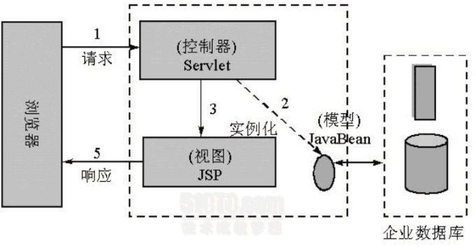

> MVC模式分析

​	当控制器收到来自用户的请求

​	控制器调用JavaBean完成业务

​	完成业务后通过控制器跳转JSP页面的方式给用户反馈信息

​	Jsp用户做出响应


##### 3>MVC的各个部分都有那些技术来实现? 

M(Model) 模型 javabean

V(View) 视图  html jsp volicity freemaker

C(Control) 控制器 Servlet,Action

Jsp+Servlet+javabean 最经典mvc模式,实际上就是model2的实现方式，就是把视图和逻辑隔离开来

Model1的方式 jsp+service+dao

Model2的方式 jsp+servlet+service+dao

使用struts2和springmvc这样的mvc框架后，jsp+核心控制器+action+javabean


##### 4>MVC框架

​	<font color=red>为了解决传统MVC模式(Jsp + Servlet + JavaBean)的一些问题而出现的框架</font>

- 传统MVC模式问题

​	所有的Servlet和Servlet映射都要配置在web.xml中，如果项目太大，web.xml就太庞大，并且不能实现模块化管理

​	Servlet的主要功能就是接受参数、调用逻辑、跳转页面，比如像其他字符编码、文件上传等功能也要写在Servlet中，不能让Servlet主要功能而需要做处理一下特例

​	接受参数比较麻烦不能通过model接收，只能单个接收，接收完成后转换封装model

```java
String name = request.getParameter(“name”)
User user=new User user.setName(name)
```

​	跳转页面方式比较单一(forword,redirect)，并且当页面名称发生改变时需要修改Servlet源代码

- 现在比较常用的MVC框架

  struts、webwork、Struts2、Spring MVC


##### 5>bootstrap是什么？

​	BootStrap是一个移动设备优先的UI框架。常用：模态框、表单，表单项、布局、删格系统


##### 6>动态代理概念

- JDK 动态代理
- CGLib 动态代理
- 使用 Spring aop 模块完成动态代理功能

###### 静态代理和动态代理的区别是什么？


### <2>Maven框架相关

#### maven的核心概念

##### 1>maven的概念模型

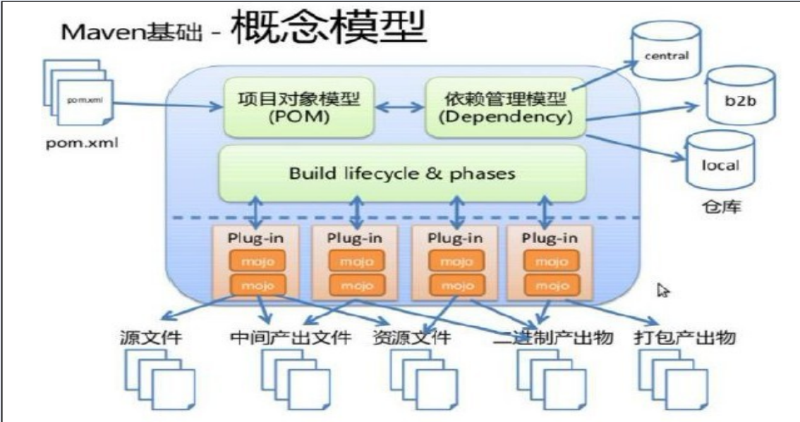


（1）Maven的核心仅仅定义了抽象的生命周期，具体的任务都是交由<font color=red>插件</font>完成的

（2）每个插件都能实现多个功能，每个功能就是一个插件目标

（3）Maven的生命周期与插件目标相互绑定，以完成某个具体的构建任务


##### 2>maven的生命周期

​	maven生命周期就是为了对所有的构建过程进行抽象和统一，其包括项目清理，初始化，编译，打包，测试，部署等几乎所有构建步骤

​	<font color=red>maven三大生命周期（相互独立）：</font>clean（清理项目）、default（构建项目）、site（生成项目站点）

| 生命周期          | 说明                                                         | 指令        |
| ----------------- | ------------------------------------------------------------ | ----------- |
| Clean Lifecycle   | 在进行真正的构建之前进行一些清理工作                         | mvn clean   |
| Default Lifecycle | 构建的核心部分：<br />编译(compile)<br />测试(test)<br />打包(package)<br />部署(deploy) | mvn install |
| Site Lifecycle    | 生成项目报告，站点，发布站点                                 | mvn site    |


##### 3>maven的继承和聚合

> <font color=red>何为继承？</font>

​	继承是为了消除重复，提取相同的配置（例如：grouptId，version等）

​	优点：使用继承是为了统一管理每个使用的jar包的版本，由Parent项目中统一定义版本

​	缺点：Hello、HelloFriend 、MakeFriend Parent每个项目都需要执行install安装

 

> <font color=red>何为聚合？</font>

​	如果想要执行每个子工程都需要：编辑-测试-打包-部署，可以在父工程中统一定义 


### <3>struts框架相关

#### struts相关

##### 1>STRUTS的应用(如STRUTS架构) 

​	Struts 是采用Java Servlet/JavaServer Pages技术，开发Web应用程序的开放源码的framework。采用Struts能开发出基于MVC(Model-View-Controller)设计模式的应用构架。 

> <font color=red>Struts有如下的主要功能：</font>

​	包含一个controller servlet，能将用户的请求发送到相应的Action对象

​	JSP自由tag库，并且在controller servlet中提供关联支持，帮助开发员创建交互式表单应用

​	提供了一系列实用对象：XML处理、通过Java reflection APIs自动处理JavaBeans属性、国际化的提示和消息


##### 2>简单讲一下struts2的执行流程？

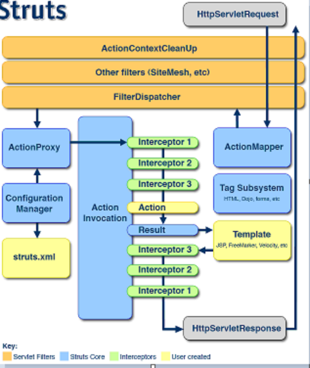

一个请求在Struts2框架中的处理大概分为以下几个步骤：

1>客户端浏览器发送请求；

2>这个请求经过一系列的过滤器（Filter）（这些过滤器中有一个叫做ActionContextCleanUp的可选过滤器，这个过滤器对于Struts2和其他框架的集成很有帮助，例如：SiteMesh Plugin）；

3>接着FilterDispatcher(StrutsPrepareAndExecuteFilter)被调用，FilterDispatcher

(StrutsPrepareAndExecuteFilter)询问ActionMapper来决定这个请求是否需要调用某个Action；

4>如果ActionMapper决定需要调用某个Action，FilterDispatcher；

  (StrutsPrepareAndExecuteFilter)把请求的处理交给ActionProxy；

5>ActionProxy通过Configuration Manager询问框架的配置文件，找到需要调用的Action类；

6>ActionProxy创建一个ActionInvocation的实例；

7>ActionInvocation实例使用命名模式来调用，在调用Action的过程前后，涉及到相关拦截器（Intercepter）的调用；

8>一旦Action执行完毕，ActionInvocation负责根据struts.xml中的配置找到对应的返回结果。返回结果通常是（但不总是，也可能是另外的一个Action链）一个需要被表示的JSP或者FreeMarker的模版。在表示的过程中可以使用Struts2框架中继承的标签。在这个过程中需要涉及到ActionMapper；

 

> <font color=red>分析：拦截、判断、寻找、执行、响应</font>

1>浏览器发送请求，经过一系列的过滤器后，到达核心过滤器(StrutsPrepareAndExecuteFilter)；

2>StrutsPrepareAndExecuteFilter通过ActionMapper判断当前的请求是否需要某个Action处理,如果不需要，则走原来的流程。如果需要则把请求交给ActionProxy来处理；

3>ActionProxy通过Configuration Manager询问框架的配置文件(Struts.xml)，找到需要调用的Action类；

4>创建一个ActionInvocation实例，调用Action的对应方法来获取结果集的name,在调用前后会执行相关拦截器；

5>通过结果集的Name知道对应的结果集来对浏览器进行响应；


##### 3>Struts2中的拦截器的应用？

​	java里的拦截器是动态拦截Action调用的对象。它提供了一种机制可以使开发者可以定义在一个action执行的前后执行的代码，也可以在一个action执行前阻止其执行，同时也提供了一种可以提取action中可重用部分的方式

​	在AOP（Aspect-Oriented Programming）中拦截器用于在某个方法或字段被访问之前，进行拦截然后在之前或之后加入某些操作

 

> <font color=red>分析：</font>

​	struts2中的的功能（参数处理、文件上传、字符编码等）都是通过系统拦截器实现的

​	如果业务需要，当然我们也可以自定义拦截器,进行可插拔配置，在执行Action的方法前后、加入相关逻辑完成业务

- 使用场景：

​	1>用户登录判断，在执行Action的前面判断是否已经登录，如果没有登录的跳转到登录页面

​	2>用户权限判断，在执行Action的前面判断是否具有，如果没有权限就给出提示信息

​	3>操作日志等


### <4>Spring系列

#### Spring框架

##### 1>什么是Spring？

​	Spring是分层的JavaSE/JavaEE一站式服务，轻量级的开源框架

​	JavaEE程序在服务器被分为三层：web层[表现层]、业务逻辑层， 数据访问层[集成层，持久层]

| 分层   | 说明                                                         |
| ------ | ------------------------------------------------------------ |
| web层  | SpringMVC表现层                                              |
| 业务层 | Sping的Bean的管理、 AOP的管理、事务管理                      |
| 持久层 | SpringJDBCTemplate 、ORM模块(整合其他的ORM比如MyBatis或者HIbernate) |


##### 2>Spring框架的优点

> <font color=red>方便解耦，简化开发</font>

​	Spring就是一个大工厂，可以将所有对象创建和依赖关系维护，交给Spring管理

> <font color=red>AOP编程的支持</font>

​	Spring提供面向切面编程，可以方便的实现对程序进行权限拦截、运行监控等功能

> <font color=red>声明式事务的支持</font>

​	只需要通过配置就可以完成对事务的管理，而无需手动编程

> <font color=red>方便程序的测试</font>

​	Spring对Junit4支持，可以通过注解方便的测试Spring程序

> <font color=red>方便集成各种优秀框架</font>

​	Spring不排斥各种优秀的开源框架，其内部提供了对各种优秀框架（如：Struts、Hibernate、MyBatis、Quartz等）的直接支持

> <font color=red>降低JavaEE API的使用难度</font>

​	Spring 对JavaEE开发中非常难用的一些API（JDBC、JavaMail、远程调用等），都提供了封装，使这些API应用难度大大降低


##### 3>Spring的核心

> <font color=red>Spring的核心：IOC控制反转、AOP面向切面的编程</font>

###### IOC和DI

- <font color=blue>IOC容器和DI依赖注入</font>

  <font color=red>本质上IOC和DI是同一思想下不同维度的表现，IOC是bean的注册，DI是bean的初始化</font>

​	IOC容器（ Inverser Of Control反转控制）：就是把原来在程序中创建HelloService对象的控制权限交给Spring管理，即HelloService对象控制器被反转到Spring框架内

```java
// 方式1：普通创建对象方式
HelloServiceImpl helloServiceImpl = new HelloServiceImpl();
helloServiceImpl.setInfo("测试");
helloServiceImpl.sayHello();

// 方式2：IOC
ApplicationContext ac = new ClassPathXmlApplicationContext("spring/applicationContext.xml"); 
HelloService service = (HelloService)ac.getBean("helloService");
service.sqyHello();
```

​	DI： 依赖注入 在Spring框架负责创建Bean对象的时候 动态的将数据注入到Bean的组件

```xml
<bean id="helloService" class="com.sz.test.HelloServiceImpl">
    <property name="info" value="测试"></property>
</bean>
```

​	IOC容器装配Bean的方式就是实例化该对象的方式，Spring提供了三种装配Bean的方式  

```properties
使用类的构造函数进行初始化  (默认是无参的构造函数)
使用静态工厂方法：利用factory-method=属性指定静态工厂方法
使用实例化工厂方法 (工厂模式)
```

###### 依赖注入实现原理和实现方式？


###### AOP

- <font color=blue>aop概念</font>

​	<font color=red>AOP（Aspect Oriented Programing）面向切面编程：其底层实现原理是“代理机制”</font>

​	<font color=blue>AOP采取横向抽取机制，取代了传统纵向继承体系重复性代码（性能监视、事务管理、安全检查、缓存）</font>

​	Spring AOP使用纯Java实现，不需要专门的编译过程和类加载器，在运行期通过代理方式向目标类织入增强代码

​	AspectJ是一个基于Java语言的AOP框架，Spring2.0开始，Spring AOP引入对Aspect的支持，AspectJ扩展了Java语言，提供了一个专门的编译器，在编译时提供横向代码的织入

> <font color=red>应用分析</font>

​	日志模块：传统方式实现DAO操作的日志记录，需要在相应方法中调用相关的日志操作方法

```java
class UserDAO{
    // 日志记录操作
    public void writeLog(){
        // 执行日志记录操作
        ......
    }
    
    // 业务操作
    public void update(){
        // 调用日志记录操作
        writeLog();
        // 业务操作
        ......
    }
}
```

​	<font color=red>纵向继承</font>：随着业务的迭代，不同业务相应需要记录日志（通过定义BaseDAO抽离公共日志操作概念）

```java
abstract class BaseDAO{
    // 日志记录操作
    public void writeLog(){
        // 执行日志记录操作
        ......
    }
}

// 子业务1
public subBusinessDAO1 extends BaseDAO{
    // 直接在业务方法中调用父类BaseDAO的日志操作
}


// 子业务2
public subBusinessDAO2 extends BaseDAO{
    // 直接在业务方法中调用父类BaseDAO的日志操作
}
```

​	<font color=red>代理机制</font>：采用AOP横向抽取机制完成代码的复用

```
客户端->通过监听子业务DAO的指定方法，访问自定义代理类OperLogProxy
自定义OperLogProxy，将需要复用的代码放入该代理类中（例如此处的writeLog方法）
```

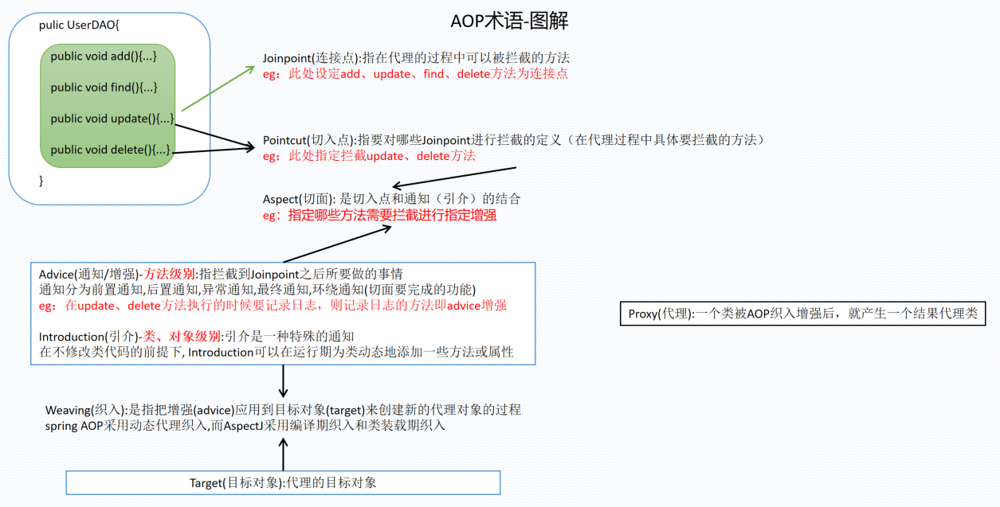


> AOP应用场景

<font color=red>aop框架种类包括：aspectJ、JBoss AOP、Spring AOP</font>

性能监控：在方法调用前后记录调用时间，方法执行太长或超时报警

缓存代理：缓存某方法的返回值，下次执行该方法时，直接从缓存里获取

软件破解：使用AOP修改软件的验证类的判断逻辑

记录日志：在方法执行前后记录系统日志

工作流系统：工作流系统需要将业务代码和流程引擎代码混合在一起执行，可用AOP将其分离，并动态挂接业务

权限验证：方法执行前验证是否有权限执行当前方法，没有则抛出没有权限执行异常，由业务代码捕捉


> AOP的五类Advice

AOP联盟为通知Advice定义了org.aopalliance.aop.Interface.Advice

Spring按照通知Advice在目标类方法的连接点位置，可以分为5类

> <font color=red>前置通知 org.springframework.aop.MethodBeforeAdvice</font>

​	在目标方法执行前实施增强

> <font color=red>后置通知 org.springframework.aop.AfterReturningAdvice</font>

​	在目标方法执行后实施增强

> <font color=red>环绕通知 org.aopalliance.intercept.MethodInterceptor</font>

​	在目标方法执行前后实施增强

> <font color=red>异常抛出通知 org.springframework.aop.ThrowsAdvice</font>

​	 在方法抛出异常后实施增强

> <font color=red>引介通知 org.springframework.aop.IntroductionInterceptor</font>

​	在目标类中添加一些新的方法和属性

###### 如何强制Spring AOP使用CGLIB实现动态代理？


##### 5>Spring事务

###### Spring事务基础概念

> Spring事务管理高层抽象主要包括3个接口

| 接口                       | 说明                                                         |
| -------------------------- | ------------------------------------------------------------ |
| PlatformTransactionManager | 事务管理器<br />Spring为不同的持久化框架提供了不同事务管理器的接口实现 |
| TransactionDefinition      | 事务定义信息(包括隔离级别、传播行为、超时、只读)             |
| TransactionStatus          | 事务具体运行状态                                             |

> <font color=red>Spring的隔离级别</font>

事务的四大特性：ACID 原子性、一致性、隔离性、持久性

由于隔离性导致的四大问题脏读、不可重复读、虚读（幻读）、丢失更新

为了解决上述四大问题提供了四种隔离级别：

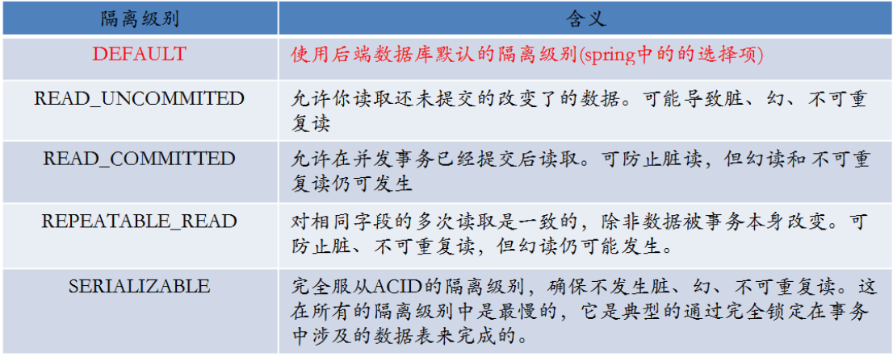


> <font color=red>spring的传播行为</font>

<font color=red>传播行为不是JDBC定义的规范，传播行为是针对实际开发中的问题定义的</font>

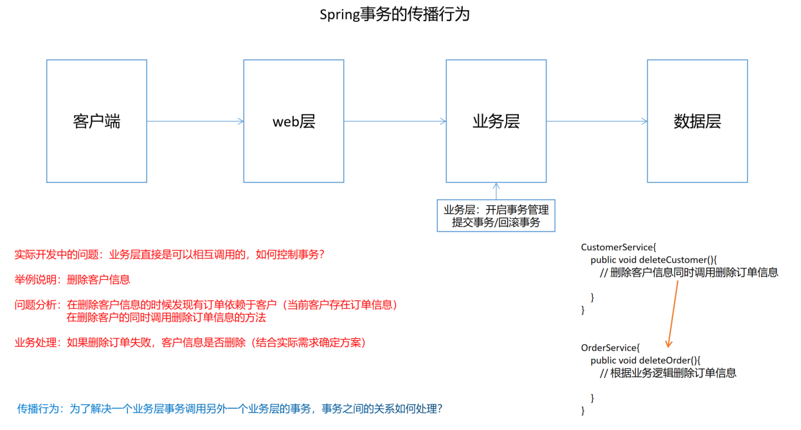

为了解决多个业务层调用事务之间的关系处理Spring定义了七种传播行为

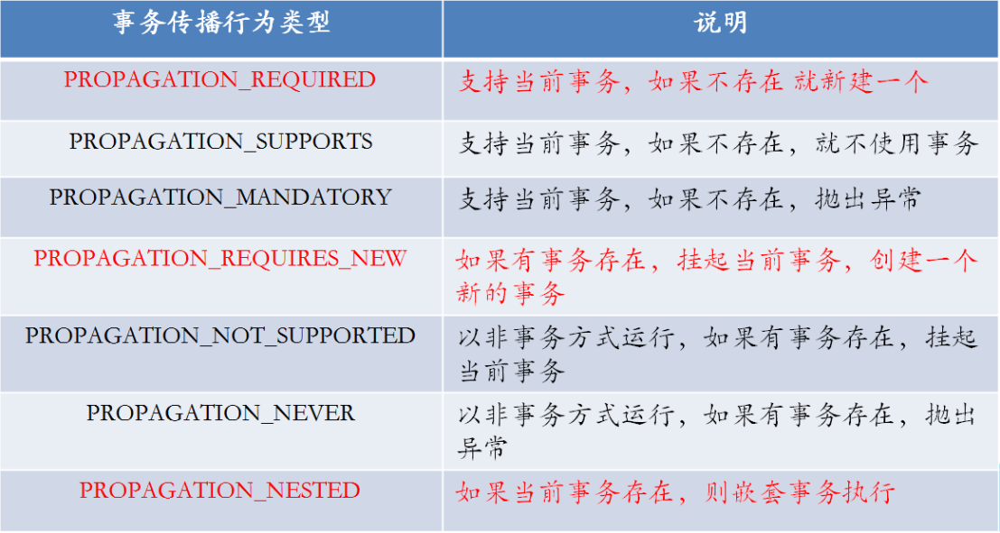

> 简单说明：（重点掌握标注的3个内容，其余简单记忆）

<font color=red>PROPAGATION_REQUIRED支持当前事务，如果当前事务不存在则创建一个新的事务</font>

举例：删除客户同时删除订单处于同一个事务中，如果删除订单失败，删除客户信息也要回滚。

PROPAGATION_SUPPORTS支持当前事务，如果不存在则不使用事务

PROPAGATION_MANDATORY支持当前事务，如果不存在则抛出异常

​	说明：必须有事务的存在

<font color=red>PROPAGATION_REQUIRES_NEW如果存在事务则挂起当前事务，创建一个新的事务</font>

​	举例：日常生活中生成订单的同时，系统会自动发送邮件通知客户，通知邮件会创建一个新的事务，如果邮件发送失败，不影响订单的生成。

PROPAGATION_NOT_SUPPORTED：以非事务的方式运行，如果存在事务则取消事务。

PROPAGATION_NEVER ：以非事务的方式运行，如果存在事务则抛出异常

<font color=red>PROPAGATION_NESTED如果当前事务存在则嵌套事务执行</font>

​	举例：删除客户的时候删除订单，删除客户后可以设置savepoint, 然后执行删除订单，删除客户和删除订单都在同一个事务内，删除订单失败后，事务回滚到savepoint,剩余的是继续提交还是回滚均由用户自行决定


###### Spring事务的管理

Spring事务管理分为两种形式

> <font color=red>编程式事务  (了解)</font>

​	在代码中使用TransactionTemplate手动进行管理事务 (实际开发中几乎没有使用)

> <font color=red>声明式事务 (重点掌握)</font>

​	基于配置文件的声明式事务

​	基于注解的声明式事务


##### @Qualifier 注解有什么作用？


##### Spring中对象的作用域是怎样的?怎么改变Spring中对象的作用域?


##### Spring中对象是线程安全的吗?如何保证Spring中的对象线程安全?


##### 如何保证Spring中的对象线程安全？


##### Spring Framework 中有多少个模块，它们分别是什么？


#### SpringMVC框架

##### 1>SpringMVC知识点梳理

> <font color=red>基础知识</font>

什么是SpringMVC? 

SpringMVC框架原理(掌握)

​	前端控制器、处理器映射器、处理器适配器、视图解析器

SpringMVC的入门程序

​	目的：对前端控制、处理器映射器、处理器适配器、视图解析器学习

​	非注解的处理器映射器、非注解的处理器适配器

​	注解的处理器映射器、处理器适配器

SpringMVC和MyBatis的整合

SpringMVC注解开发(重点)

​	常用的注解学习

​	参数绑定(简单类型、POJO、集合类型)

​	自定义参数绑定


> <font color=red>高级应用</font>

数据回显

上传图片

JSON数据支持

RESTful支持

拦截器


##### 2>SpringMVC的执行流程？

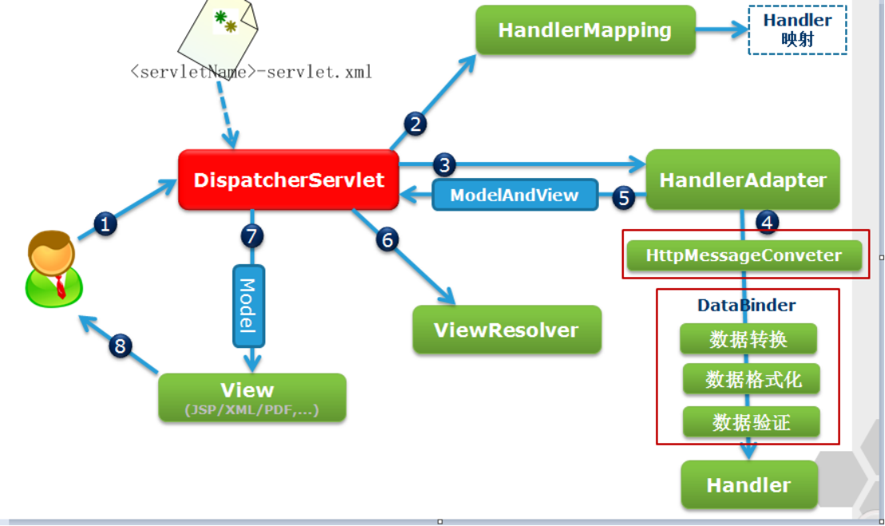


\1. 用户向服务器发送请求，请求被Spring 前端控制Servelt DispatcherServlet捕获；

 \2. DispatcherServlet对请求URL进行解析，得到请求资源标识符（URI）。然后根据该URI，调用HandlerMapping获得该Handler配置的所有相关的对象（包括Handler对象以及Handler对象对应的拦截器），最后以HandlerExecutionChain对象的形式返回；

 \3. DispatcherServlet 根据获得的Handler，选择一个合适的HandlerAdapter。（**附注**：如果成功获得HandlerAdapter后，此时将开始执行拦截器的preHandler(...)方法）

  \4.  提取Request中的模型数据，填充Handler入参，开始执行Handler（Controller)。 在填充Handler的入参过程中，根据你的配置，Spring将帮你做一些额外的工作：

   HttpMessageConveter： 将请求消息（如Json、xml等数据）转换成一个对象，将对象转换为指定的响应信息

   数据转换：对请求消息进行数据转换。如String转换成Integer、Double等

   数据根式化：对请求消息进行数据格式化。 如将字符串转换成格式化数字或格式化日期等

   数据验证： 验证数据的有效性（长度、格式等），验证结果存储到BindingResult或Error中

   \5.  Handler执行完成后，向DispatcherServlet 返回一个ModelAndView对象；

   \6.  根据返回的ModelAndView，选择一个适合的ViewResolver（必须是已经注册到Spring容器中的ViewResolver)返回给DispatcherServlet ；

   \7. ViewResolver 结合Model和View，来渲染视图

   \8. 将渲染结果返回给客户端。

面试：

1、 用户向服务器发送请求，请求被Spring 前端控制Servelt DispatcherServlet捕获(捕获)

2、 DispatcherServlet对请求URL进行解析，得到请求资源标识符（URI）。然后根据该URI，调用HandlerMapping获得该Handler配置的所有相关的对象（包括Handler对象以及Handler对象对应的拦截器），最后以HandlerExecutionChain对象的形式返回；(查找handler)

3、 DispatcherServlet 根据获得的Handler，选择一个合适的HandlerAdapter。 提取Request中的模型数据，填充Handler入参，开始执行Handler（Controller), Handler执行完成后，向DispatcherServlet 返回一个ModelAndView对象(执行handler)

4、DispatcherServlet 根据返回的ModelAndView，选择一个适合的ViewResolver（必须是已经注册到Spring容器中的ViewResolver) (选择ViewResolver)

5、通过ViewResolver 结合Model和View，来渲染视图,DispatcherServlet 将渲染结果返回给客户端。（渲染返回）

快速记忆技巧：

核心控制器捕获请求、查找Handler、执行Handler、选择ViewResolver,通过ViewResolver渲染视图并返回


##### 3>说一下struts2和springMVC有什么不同？

目前企业中使用SpringMvc的比例已经远远超过Struts2,那么两者到底有什么区别，是很多初学者比较关注的问题，下面我们就来对SpringMvc和Struts2进行各方面的比较:

\1. 核心控制器（前端控制器、预处理控制器）：对于使用过mvc框架的人来说这个词应该不会陌生，核心控制器的主要用途是处理所有的请求，然后对那些特殊的请求 （控制器）统一的进行处理(字符编码、文件上传、参数接受、异常处理等等),spring mvc核心控制器是Servlet，而Struts2是Filter。

2.控制器实例：Spring Mvc会比Struts快一些（理论上）。Spring Mvc是基于方法设计，而Sturts是基于对象，每次发一次请求都会实例一个action，每个action都会被注入 属性，而Spring更像Servlet一样，只有一个实例，每次请求执行对应的方法即可(注意：由于是单例实例，所以应当避免全局变量的修改，这样会产生线程安全问题)。

\3. 管理方式：大部分的公司的核心架构中，就会使用到spring,而spring mvc又是spring中的一个模块，所以spring对于spring mvc的控制器管理更加简单方便，而且提供了全 注解方式进行管理，各种功能的注解都比较全面，使用简单，而struts2需要采用XML很多的配置参数来管理（虽然也可以采用注解，但是几乎没有公司那 样使用）。

4.参数传递：Struts2中自身提供多种参数接受，其实都是通过（ValueStack）进行传递和赋值，而SpringMvc是通过方法的参数进行接收。

5.学习难度：Struts更加很多新的技术点，比如拦截器、值栈及OGNL表达式，学习成本较高，springmvc 比较简单，很较少的时间都能上手。

6.intercepter 的实现机制：struts有以自己的interceptor机制，spring mvc用的是独立的AOP方式。这样导致struts的配置文件量还是比spring mvc大，虽然struts的配置能继承，所以我觉得论使用上来讲，spring mvc使用更加简洁，开发效率Spring MVC确实比struts2高。spring mvc是方法级别的拦截，一个方法对应一个request上下文，而方法同时又跟一个url对应，所以说从架构本身上spring3 mvc就容易实现restful url。struts2是类级别的拦截，一个类对应一个request上下文；实现restful url要费劲，因为struts2 action的一个方法可以对应一个url；而其类属性却被所有方法共享，这也就无法用注解或其他方式标识其所属方法了。spring3 mvc的方法之间基本上独立的，独享request response数据，请求数据通过参数获取，处理结果通过ModelMap交回给框架方法之间不共享变量，而struts2搞的就比较乱，虽然方法之间 也是独立的，但其所有Action变量是共享的，这不会影响程序运行，却给我们编码，读程序时带来麻烦。

7.spring mvc处理ajax请求,直接通过返回数据，方法中使用注解@ResponseBody，spring mvc自动帮我们对象转换为JSON数据。而struts2是通过插件的方式进行处理

在SpringMVC流行起来之前，Struts2在MVC框架中占核心地位，随着SpringMVC的出现，SpringMVC慢慢的取代struts2,但是很多企业都是原来搭建的框架，使用Struts2较多。


##### 4>说一下Spring中的两大核心？

Spring是什么？

spring是J2EE应用程序框架，是轻量级的IOC和AOP的容器框架(相对于重量级的EJB)，主要是针对javaBean的生命周期进行管理的轻量级容器，可以单独使用，也可以和Struts框架，ibatis框架等组合使用。

1、IOC(Inversion of Control )或DI(Dependency Injection)

​    IOC控制权反转

​     原来：我的Service需要调用DAO，Service就需要创建DAO

​     Spring:Spring发现你Service依赖于dao,就给你注入.

​    核心原理：就是配置文件+反射(工厂也可以)+容器(map)  

2、AOP:面向切面编程

​    核心原理：使用动态代理的设计模式在执行方法前后或出现异常做加入相关逻辑。

   我们主要使用AOP来做：

   1、事务处理

   2、权限判断

   3、日志

   4、....


##### **5>AOP是什么？你都拿它做什么？**	

AOP:面向切面编程

​	核心原理：使用动态代理的设计模式在执行方法前后或出现异常做加入相关逻辑。

​	我们主要使用AOP来做：

   1、事务处理 执行方法前，开启事务、执行完成后关闭事务、出现异常后回滚事务

   2、权限判断 在执行方法前，判断是否具有权限

   3、日志   在执行前进行日志处理

   4、....


##### 6>讲一下Spring的事务传播特性

多个事务存在是怎么处理的策略

\1. PROPAGATION_REQUIRED: 如果存在一个事务，则支持当前事务。如果没有事务则开启
\2. PROPAGATION_SUPPORTS: 如果存在一个事务，支持当前事务。如果没有事务，则非事务的执行
\3. PROPAGATION_MANDATORY: 如果已经存在一个事务，支持当前事务。如果没有一个活动的事务，则抛出异常。
\4. PROPAGATION_REQUIRES_NEW: 总是开启一个新的事务。如果一个事务已经存在，则将这个存在的事务挂起。
\5. PROPAGATION_NOT_SUPPORTED: 总是非事务地执行，并挂起任何存在的事务。
\6. PROPAGATION_NEVER: 总是非事务地执行，如果存在一个活动事务，则抛出异常
\7. PROPAGATION_NESTED：如果一个活动的事务存在，则运行在一个嵌套的事务中. 如果没有活动事务, 则按TransactionDefinition.PROPAGATION_REQUIRED 属性执行

 

Propagation

Required 需要 如果存在一个事务，则支持当前事务。如果没有事务则开启

Supports 支持 如果存在一个事务，支持当前事务。如果没有事务，则非事务的执行

Mandatory 必要的 如果已经存在一个事务，支持当前事务。如果没有一个活动的事务，则抛出异常。

required_new 总是开启一个新的事务。如果一个事务已经存在，则将这个存在的事务挂起。

Not_support 总是非事务地执行，并挂起任何存在的事务。

Never 绝不 总是非事务地执行，如果存在一个活动事务，则抛出异常

Nested 嵌套的 如果有就嵌套、没有就开启事务

<11> Spring事务的隔离级别
\1. ISOLATION_DEFAULT： 这是一个PlatfromTransactionManager默认的隔离级别，使用数据库默认的事务隔离级别.

另外四个与JDBC的隔离级别相对应
\2. ISOLATION_READ_UNCOMMITTED： 这是事务最低的隔离级别，它充许令外一个事务可以看到这个事务未提交的数据。
   这种隔离级别会产生脏读，不可重复读和幻像读。
\3. ISOLATION_READ_COMMITTED： 保证一个事务修改的数据提交后才能被另外一个事务读取。另外一个事务不能读取该事务未提交的数据
\4. ISOLATION_REPEATABLE_READ： 这种事务隔离级别可以防止脏读，不可重复读。但是可能出现幻像读。
   它除了保证一个事务不能读取另一个事务未提交的数据外，还保证了避免下面的情况产生(不可重复读)。
\5. ISOLATION_SERIALIZABLE 这是花费最高代价但是最可靠的事务隔离级别。事务被处理为顺序执行。

除了防止脏读，不可重复读外，还避免了幻像读。

**其中的一些概念的说明：**

 **脏读:** 指当一个事务正在访问数据，并且对数据进行了修改，而这种修改还没有提交到数据库中，这时，另外一个事务也访问这个数据，然后使用了这个数据。因为这个数据是还没有提交的数据， 那么另外一 个事务读到的这个数据是脏数据，依据脏数据所做的操作可能是不正确的。

**不可重复读:** 指在一个事务内，多次读同一数据。在这个事务还没有结束时，另外一个事务也访问该同一数据。 那么，在第一个事务中的两次读数据之间，由于第二个事务的修改，那么第一个事务两次读到的数据可能是不一样的。这样就发生了在一个事务内两次读到的数据是不一样的，因此称为是不可重复读。

 **幻觉读:** 指当事务不是独立执行时发生的一种现象，例如第一个事务对一个表中的数据进行了修改，这种修改涉及 到表中的全部数据行。同时，第二个事务也修改这个表中的数据，这种修改是向表中插入一行新数据。那么，以后就会发生操作第一个事务的用户发现表中还有没有修改的数据行，就好象发生了幻觉一样。


### <5>持久层框架

#### 基础概念

##### 1>什么是ORM?

​	对象关系映射（Object Relational Mapping，简称ORM）模式是一种为了<font color=red>解决面向对象与关系数据库存在的互不匹配的现象的技术</font>。简单的说，ORM是通过使用描述对象和数据库之间映射的元数据，将程序中的对象自动持久化到关系数据库中。那么，到底如何实现持久化呢？一种简单的方案是采用硬编码方式(jdbc操作sql方式)，为每一种可能的数据库访问操作提供单独的方法

> 该方案存在以下不足： 

  1>持久化层缺乏弹性：一旦出现业务需求的变更，就必须修改持久化层的接口 

  2>持久化层同时与域模型与关系数据库模型绑定，不管域模型还是关系数据库模型发生变化，都要修改持久化曾的相关程序代码，增加了软件的维护难度。 

  ORM提供了实现持久化层的另一种模式，它采用映射元数据来描述对象关系的映射，使得ORM中间件能在任何一个应用的业务逻辑层和数据库层之间充当桥梁

> Java典型的ORM框架有：Hibernate、ibatis(mybatis)、spingframework

​	ORM的方法论基于三个核心原则： 

　　  简单：以最基本的形式建模数据

　　  传达性：数据库结构被任何人都能理解的语言文档化

　　  精确性：基于数据模型创建正确标准化了的结构


##### 2>iBatis(mybatis)与Hibernate有什么不同?

> <font color=red>相同点：</font>

 	都是java中orm框架、屏蔽jdbc api的底层访问细节，程序可以直接完成对数据库的持久化操作。jdbc api编程流程固定，还将sql语句与java代码混杂在了一起，经常需要拼凑sql语句，细节很繁琐。

​	ibatis的好处：屏蔽jdbc api的底层访问细节；将sql语句与java代码进行分离;提供了将结果集自动封装称为实体对象和对象的集合的功能。queryForList返回对象集合，用queryForObject返回单个对象；提供了自动将实体对象的属性传递给sql语句的参数。

  Hibername的好处：Hibernate是一个全自动的orm映射工具，它可以自动生成sql语句，并执行并返回java结果

> <font color=red>不同点：</font>

​	hibernate提供自动生成sql语句的方法，能够快速实现简单查询

​	ibatis支持在xml配置文件中写sql语句，能够支持复杂查询的语句实现

​	应用上ibatis要比hibernate简单的多。ibatis是面向sql的，不同考虑对象间一些复杂的映射关系。


#### Mybatis框架

##### 知识点索引

> <font color=blue>mybatis基础知识</font>

对原生态的jdbc程序单独使用有哪些问题

MyBatis框架的原理(掌握)

MyBatis的入门程序：实现用户的增删改查

MyBatis开发DAO的两种方式：

- 原始dao开发(程序要编写dao接口和实现类)（掌握）

- MyBatis的mapper接口(相当于dao接口) 代理开发的方法（掌握重点）

MyBatis的配置详解 SqlMapConfig.xml

MyBatis的核心：

- MyBatis的输入映射(掌握)

- MyBatis的输出映射(掌握)

MyBatis的动态SQL(掌握)


> <font color=blue>mybatis高级知识</font>

订单商品的数据模型的分析

高级结果集映射(一对一、一对多、多对多)

MyBatis的延迟加载

MyBatis的查询缓存(一级缓存、二级缓存)

Mybatis和Spring整合(掌握) Mybatis的逆向工程


##### 常见问题分析

###### 1>MyBatis是什么？

​	MyBatis是支持普通 SQL 查询，存储过程和高级映射的优秀持久层框架。 MyBatis消除了几乎所有的 JDBC 代码和参数的手工设置以及对结果集的检索。 MyBatis可以使用简单的XML 或注解用于配置和原始映射，将接口和 Java 的 POJO（ Plain Old Java Objects，普通的Java 对象）映射成数据库中的记录。

​	MyBatis让程序将主要精力放在sql上，通过mybatis提供的映射方式，可以自由灵活的生成满足条件的sql（半自动化的orm框架）


​	<font color=red>mybatis是一个持久层框架，简化传统JDBC访问数据库的开发（注册驱动、创建connection、执行操作等），通过简单的xml或注解用于配置和原始映射，将接口和JAVA的POJO映射成数据库中的记录</font>


###### 2>ORM是什么？

​	ORM(object relation mapping)对象映射关系，面向对象的对象模型和关系型模型数据之间的相互转换，元数据一般采用XML格式，并且存放在专门的对象一映射文件中，可以理解为一种框架的格式

​	常见的ORM框架：Hibernate（Nhibernate）、iBATIS、mybatis、EclipseLink、JFinal

​	

###### 3>为什么说Mybatis是半自动ORM映射工具？它与全自动的区别在哪里？

​	Hibernate属于全自动 ORM 映射工具，使用 Hibernate查询关联对象或者关联集合对象时，可以根据对象关系模型直接获取，所以它是全自动的

​	Mybatis在查询关联对象或关联集合对象时，需要手动编写 sql 来完成，因此称之为半自动 ORM 映射工具


###### 4>传统JDBC开发存在的问题?

​	性能上：频繁创建数据库连接对象、释放，容易造成系统资源浪费，影响系统性能。（可以使用连接池解决）

​	可维护性：sql语句定义、参数设置、结果集处理存在硬编码。实际项目中sql语句变化的可能性较大，一旦发生变化，需要修改java代码，系统需要重新编译，重新发布，不便维护

​	代码重用性：结果集处理存在重复代码，处理麻烦。如果可以映射成Java对象会比较方便。


###### 5>JDBC编程有哪些不足之处，MyBatis是如何解决这些问题的？

​	在xml文件中配置数据库连接池，使用数据库连接池管理数据库连接

​	通过xml和注解实现配置和原始映射，将sql与java代码分离，实现java对象->sql语句、执行结果->pojo对象的自定映射

​	mybatis、mybatis-plus可扩展BaseDAO、BaseService概念，封装通用的操作方法，实现代码的可重用性


###### 6>Mybatis优缺点

> 优点：

​	简化传统JDBC编程，能够与Spring集成、兼容各种数据库

​	提供映射标签，可以通过XML或者注解的方式进行配置和映射

​	基于SQL编程概念，解除SQL与程序代码的耦合，便于统一管理；提供XML标签，支持编写动态SQL语句

> 缺点：

​	SQL语句的编写工作量较大，尤其当字段多、关联表多时，对开发人员编写SQL语句的功底有一定要求

​	SQL语句依赖于数据库，导致数据库移植性差，不能随意更换数据库


###### 7>MyBatis框架适用场景

​	mybatis专注于SQL本身，是一个足够灵活的DAO层解决方案

​	对性能的要求很高或者需求变化较多的项目


###### 8>Hibernate和MyBatis的区别

​	Mybatis和hibernate不同，它不完全是一个ORM框架，因为MyBatis需要程序员自己编写Sql语句

​	Mybatis直接编写原生态sql，可以严格控制sql执行性能，灵活度高，非常适合对关系数据模型要求不高的软件开发，因为这类软件需求变化频繁，一但需求变化要求迅速输出成果。但是灵活的前提是mybatis无法做到数据库无关性，如果需要实现支持多种数据库的软件，则需要自定义多套sql映射文件，工作量大

​	Hibernate对象/关系映射能力强，数据库无关性好，对于关系模型要求高的软件，如果用hibernate开发可以节省很多代码，提高效率


###### 9>MyBatis的功能架构、解析和运行原理


获取数据库源：获取Mybatis的全局配置核心标签

执行语句：insert、update、select、delete

操作：Connection、PrepareStatement、ResultSet


###### 10>MyBatis编程步骤是什么样的？

​	引入mybatis相关依赖和配置（ssm整合通过xml配置、springboot整合通过yml指定）

​	编写mapper接口和xml文件

​	


###### 13>MyBatis的框架架构设计是怎么样的？


###### 14>Mybatis都有哪些Executor执行器？它们之间的区别是什么？

​	Mybatis 支持全局修改执行器, 参数名为: defaultExecutorType。建议在获取sqlSession对象时设置. Mybatis 共有三种执行器:

​	SIMPLE: 默认的执行器, 对每条sql进行预编译->设置参数->执行等操作

​	BATCH: 批量执行器, 对相同sql进行一次预编译, 然后设置参数, 最后统一执行操作

​	REUSE: REUSE 执行器会重用预处理语句（prepared statements）。以sql作为key查找Statement对象，存在就使用，不存在就创建，用完后，不关闭Statement对象，而是放置于Map内，供下一次使用


> Mybatis中如何指定使用哪一种Executor执行器？

​	在Mybatis配置文件中，可以指定默认的ExecutorType执行器类型


> B系统传入一条SQL语句到A平台如何进行校验？

​	SQL 语法引擎概念

​	mybatis源码在解析#{param}的时候会将其替换成?字符（可通过打印sql日志查看信息），不是为了解决sql注入或者预编译的概念，而是为了将非法的sql语句转化，让不同的数据库能够正常解析


###### 16>Mybatis是否支持延迟加载？如果支持，它的实现原理是什么？

​	Mybatis支持association关联对象（一对一）和collection（一对多）关联集合对象的延迟加载。在Mybatis配置文件中，可以配置是否启用延迟加载LazyLoadingEnabled=true|false。

​	原理分析：使用CGLIB创建目标对象的代理对象，当调用目标方法时，进入拦截器方法，比如调用a.getB().getName()，拦截器invoke()方法发现a.getB()是null值，则会单独发送实现保存好的查询关联B对象的SQL，把B查询上来，然后调用a.setB(b)，于是a的对象b熟悉就有值了，接着完成a.getB().getName()方法的调用。这就是延迟加载的基本原理


###### 17>#{}和${}的区别。

\#{}是预编译处理，${}是字符串替换；

Mybatis在处理#{}时，会将sql中的#{}替换为?号，调用PreparedStatement的set方法来赋值；

Mybatis在处理${}时，就是把${}替换成变量的值；

使用#{}可以有效的防止SQL注入，提高系统安全性。


###### 18>模糊查询like语句该怎么写？

​	在JAVA代码中拼接sql通配符

```java
mapper.java:
List<name> names = mapper.selectLike("%tom%");

mapper.xml:
<select id="selectLike">
    select * from users where name like #{value}
</select>
```

​	在sql语句中拼接sql语句（contact函数）

```java
mapper.java:
list<name> names = mapper.selectLike("tom");

mapper.xml:
<select id="selectLike">
    select * from users where name like contact("%", #{value}, "%")
</select>
```


###### 19>在mapper中如何传递多个参数？

​	通过在dao层定义变量，或者通过@Param注解进行控制

​	或者定义一个查询参数实体或者Map进行装载控制


###### 20>Mybatis如何执行批量操作？

```java
default boolean updateBatchById(Collection<T> entityList) {
    return this.updateBatchById(entityList, 1000);
}
    
public boolean updateBatchById(Collection<T> entityList, int batchSize) {
    String sqlStatement = this.sqlStatement(SqlMethod.UPDATE_BY_ID);
    return this.executeBatch(entityList, batchSize, (sqlSession, entity) -> {
        ParamMap<T> param = new ParamMap();
        param.put("et", entity);
        sqlSession.update(sqlStatement, param);
    });
}
```


###### 21>简述Mybatis的Xml映射文件和Mybatis内部数据结构之间的映射关系？

​	Mybatis将所有Xml配置信息都封装到All-In-One重量级对象Configuration内部。在Xml映射文件中，`<parameterMap>`标签会被解析为`ParameterMap`对象，其每个子元素会被解析为`ParameterMapping`对象。`<resultMap>`标签会被解析为`ResultMap`对象，其每个子元素会被解析为`ResultMapping`对象。每一个`<select>`、`<insert>`、`<update>`、`<delete>`标签均会被解析为MappedStatement对象，标签内的sql会被解析为BoundSql对象。


###### 22>mybatis加载mapper方式有几种？

方式1：按类加载：根据指定类名（mapper.java和mapper.xml同级）

方式2：按包加载：根据mapper类所在包名（mapper.java和mapper.xml同级）

方式3：按resources加载：根据指定mapper.xml文件路径

方式4：引入不同的mapper-config.xml配置


###### 23>mybatis如何自定义插件

​	MyBatis 自定义插件针对 MyBatis 四大对象（Executor,StatementHandler,ParamentHandler,ResultSetHandler）进行拦截

​	Executor ：拦截内部执行器，它负责调用StatementHandler 操作数据库，并把结果集通过 ResultSetHandler 进行自动映射，另外它还处理了二级缓存的操作

​	StatementHandler ：拦截 SQL 语法构建的处理，它是MyBatis 直接和数据库执行 SQL脚本的对象，另外它也实现了 MyBatis一级缓存

​	ParamenterHandler ：拦截参数的处理

​	ResultSetHandler ：拦截结果集的处理


#### Hibernate

##### Hibernate映射对象的状态

​	临时状态/瞬时状态(transient)：刚刚用new语句创建，没有被持久化

​	不处于session中(没有使用session的方法去操作临时对象)。该对象成为临时对象

持久化状态/托管状态(persistent)：已经被持久化，加入到session的缓存中。session是没有关闭该状态的对象为持久化对象。

游离状态/脱管状态(detached)：已经被持久化，但不处于session中。

​	该状态的对象为游离对象。

删除状态(removed)：对象有关联的ID，并且在Session管理下，但是已经被计划(事务提交的时候,commit())删除。如果没有事务就不能删除

相互转换

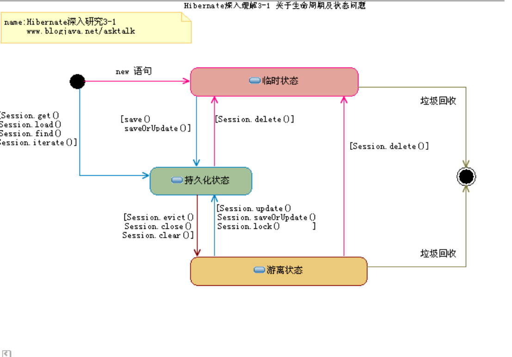


##### 介绍一下Hibernate的缓存?

> <font color=red>why（为什么要用Hibernate缓存？）</font>

​	Hibernate是一个持久层框架，经常访问物理数据库。

​	为了降低应用程序对物理数据源访问的频次，从而提高应用程序的运行性能。

​	缓存内的数据是对物理数据源中的数据的复制，应用程序在运行时从缓存读写数据，在特定的时刻或事件会同步缓存和物理数据源的数据。

​	为了提供访问速度，把磁盘或数据库访问变成内存访问

 

> <font color=red>二、what（Hibernate缓存原理是怎样的？）</font>

​	Hibernate缓存包括两大类：Hibernate一级缓存和Hibernate二级缓存

- Hibernate一级缓存又称为“Session的缓存”

​	Session缓存内置不能被卸载，Session的缓存是事务范围的缓存（Session对象的生命周期通常对应一个数据库事务或者一个应用事务）

​	一级缓存中，持久化类的每个实例都具有唯一的OID

 

- Hibernate二级缓存又称为“SessionFactory的缓存”

​	由于SessionFactory对象的生命周期和应用程序的整个过程对应，因此Hibernate二级缓存是进程范围或者集群范围的缓存，有可能出现并发问题，因此需要采用适当的并发访问策略，该策略为被缓存的数据提供了事务隔离级别。

​	第二级缓存是可选的，是一个可配置的插件，默认下SessionFactory不会启用这个插件

​	Hibernate提供了org.hibernate.cache.CacheProvider接口,它充当缓存插件与Hibernate之间的适配器

 

面试：

  Hibernate中的缓存分一级缓存和二级缓存。

  一级缓存就是Session级别的缓存，在事务范围内有效是,内置的不能被卸载。二级缓存是SesionFactory级别的缓存，从应用启动到应用结束有效。是可选的，默认没有二级缓存，需要手动开启。

  保存数据库后，在内存中保存一份，如果更新了数据库就要同步更新。

 什么样的数据适合存放到第二级缓存中？ 　　

1) 很少被修改的数据 　帖子的最后回复时间　

2) 经常被查询的数据  电商的地点

2) 不是很重要的数据，允许出现偶尔并发的数据 　　

3) 不会被并发访问的数据 　　

4) 常量数据 

扩展：hibernate的二级缓存默认是不支持分布式缓存的。使用memcahe,redis等中央缓存来代替二级缓存。


##### 简单讲一下webservice使用的场景？

webservice是一个SOA（面向服务的编程）的架构，它是不依赖于语言，不依赖于平台，可以实现不同的语言间的相互调用，通过Internet进行基于Http协议的网络应用间的交互。

1、异构系统(不同语言)的整合

不同客户端的整合 浏览器、手机端(android,ios.塞班)、微信单、PC端等终端来访问

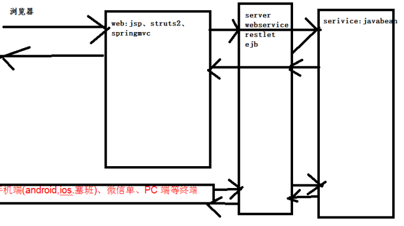

​	天气预报：可以通过实现webservice客户端调用远程天气服务实现的。

​    单点登录：一个服务是所有系统的登录


##### activit\flowable 流程引擎相关

Activiti是一个业务流程管理(BPM)和工作流系统，适用于开发人员和系统管理员。其核心是超快速，稳定的BPMN2流程引擎。它易于与 Spring集成使用。

主要要在OA中，把线下流程放到线上。 把现实生活中一些流程固话定义到系统中，然后通过输入表单数据完成业务。

他可用在OA系统的流程管理中：

请假流程 小于三天，一级主管审批，大于三天二级才能审批。

报销流程 1000 2000 3000>....

如果你想找专门这方面的工作，要下去复习


### <6>EJB

#### EJB基础概念


##### 1>EJB是基于哪些技术实现的？并说出SessionBean和EntityBean的区别，StatefulBean和StatelessBean的区别

 EJB包括Session Bean、Entity Bean、Message Driven Bean，基于JNDI、RMI、JAT等技术实现。
SessionBean在J2EE应用程序中被用来完成一些服务器端的业务操作，例如访问数据库、调用其他EJB组件。EntityBean被用来代表应用系统中用到的数据。
　对于客户机，SessionBean是一种非持久性对象，它实现某些在服务器上运行的业务逻辑。
　对于客户机，EntityBean是一种持久性对象，它代表一个存储在持久性存储器中的实体的对象视图，或是一个由现有企业应用程序实现的实体。
　Session Bean 还可以再细分为 Stateful Session Bean 与 Stateless Session Bean ，这两种的 Session Bean都可以将系统逻辑放在 method之中执行，不同的是 Stateful Session Bean 可以记录呼叫者的状态，因此通常来说，一个使用者会有一个相对应的 Stateful Session Bean 的实体。Stateless Session Bean 虽然也是逻辑组件，但是他却不负责记录使用者状态，也就是说当使用者呼叫 Stateless Session Bean 的时候，EJB Container 并不会找寻特定的 Stateless Session Bean 的实体来执行这个 method。换言之，很可能数个使用者在执行某个 Stateless Session Bean 的 methods 时，会是同一个 Bean 的 Instance 在执行。从内存方面来看， Stateful Session Bean 与 Stateless Session Bean 比较， Stateful Session Bean 会消耗 J2EE Server 较多的内存，然而 Stateful Session Bean 的优势却在于他可以维持使用者的状态


##### 2>EJB包括（SessionBean,EntityBean）说出他们的生命周期，及如何管理事务的？

　SessionBean： Stateless Session Bean 的生命周期是由容器决定的，当客户机发出请求要建立一个Bean的实例时，EJB容器不一定要创建一个新的Bean的实例供客户机调用，而是随便找一个现有的实例提供给客户机。当客户机第一次调用一个Stateful Session Bean 时，容器必须立即在服务器中创建一个新的Bean实例，并关联到客户机上，以后此客户机调用Stateful Session Bean 的方法时容器会把调用分派到与此客户机相关联的Bean实例。
EntityBean：Entity Beans能存活相对较长的时间，并且状态是持续的。只要数据库中的数据存在，Entity beans就一直存活。而不是按照应用程序或者服务进程来说的。即使EJB容器崩溃了，Entity beans也是存活的。Entity Beans生命周期能够被容器或者 Beans自己管理。
　EJB通过以下技术管理实务：对象管理组织（OMG）的对象实务服务（OTS），Sun Microsystems的Transaction Service（JTS）、Java Transaction API（JTA），开发组（X/Open）的XA接口


##### 3>EJB的角色和三个对象

​	一个完整的基于EJB的分布式计算结构由六个角色组成，这六个角色可以由不同的开发商提供，每个角色所作的工作必须遵循Sun公司提供的EJB规范，以保证彼此之间的兼容性。这六个角色分别是EJB组件开发者（Enterprise Bean Provider） 、应用组合者（Application Assembler）、部署者（Deployer）、EJB 服务器提供者（EJB Server Provider）、EJB 容器提供者（EJB Container Provider）、系统管理员（System Administrator）
​	三个对象是Remote（Local）接口、Home（LocalHome）接口，Bean类


##### 4>EJB容器提供的服务

​	主要提供声明周期管理、代码产生、持续性管理、安全、事务管理、锁和并发行管理等服务


##### 5>EJB规范规定EJB中禁止的操作有哪些？

1.不能操作线程和线程API(线程API指非线程对象的方法如notify,wait等)
2.不能操作awt
3.不能实现服务器功能
4.不能对静态属生存取
5.不能使用IO操作直接存取文件系统
6.不能加载本地库
7.不能将this作为变量和返回，
8.不能循环调用


##### 6>remote接口和home接口主要作用

remote接口定义了业务方法，用于EJB客户端调用业务方法。
home接口是EJB工厂用于创建和移除查找EJB实例


##### 7>bean 实例的生命周期

​	对于Stateless Session Bean、Entity Bean、Message Driven Bean一般存在缓冲池管理，而对于Entity Bean和Statefull Session Bean存在Cache管理，通常包含创建实例，设置上下文、创建EJB Object（create）、业务方法调用、remove等过程，对于存在缓冲池管理的Bean，在create之后实例并不从内存清除，而是采用缓冲池调度机制不断重用实例，而对于存在Cache管理的Bean则通过激活和去激活机制保持Bean的状态并限制内存中实例数量


##### 8>EJB的激活机制

​	以Stateful Session Bean 为例：其Cache大小决定了内存中可以同时存在的Bean实例的数量，根据MRU或NRU算法，实例在激活和去激活状态之间迁移，激活机制是当客户端调用某个EJB实例业务方法时，如果对应EJB Object发现自己没有绑定对应的Bean实例则从其去激活Bean存储中（通过序列化机制存储实例）回复（激活）此实例。状态变迁前会调用对应的 ejbActive和ejbPassivate方法


##### 9>EJB的几种类型

​	会话（Session）Bean ，实体（Entity）Bean 消息驱动的（Message Driven）Bean
​	会话Bean又可分为有状态（Stateful）和无状态（Stateless）两种
​	实体Bean可分为Bean管理的持续性（BMP）和容器管理的持续性（CMP）两种


##### 10>客服端调用EJB对象的几个基本步骤

​	设置JNDI服务工厂以及JNDI服务地址系统属性，查找Home接口，从Home接口调用Create方法创建Remote接口，通过Remote接口调用其业务方法


##### 11>EJB与JAVA BEAN的区别？

　Java Bean 是可复用的组件，对Java Bean并没有严格的规范，理论上讲，任何一个Java类都可以是一个Bean。但通常情况下，由于Java Bean是被容器所创建（如Tomcat）的，所以Java Bean应具有一个无参的构造器，另外，通常Java Bean还要实现Serializable接口用于实现Bean的持久性。Java Bean实际上相当于微软COM模型中的本地进程内COM组件，它是不能被跨进程访问的。Enterprise Java Bean 相当于DCOM，即分布式组件。它是基于Java的远程方法调用（RMI）技术的，所以EJB可以被远程访问（跨进程、跨计算机）。但EJB必须被布署在诸如Webspere、WebLogic这样的容器中，EJB客户从不直接访问真正的EJB组件，而是通过其容器访问。EJB容器是EJB组件的代理， EJB组件由容器所创建和管理。客户通过容器来访问真正的EJB组件