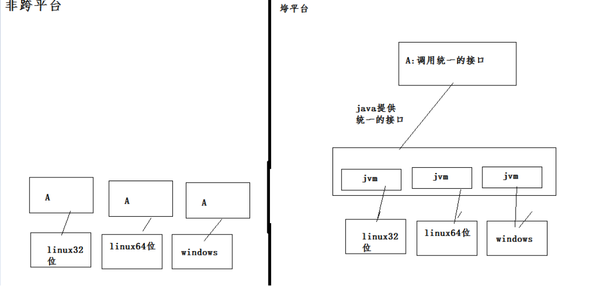
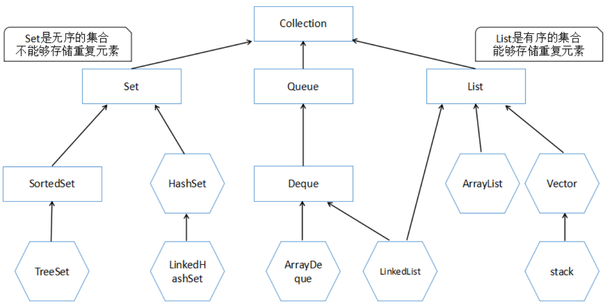
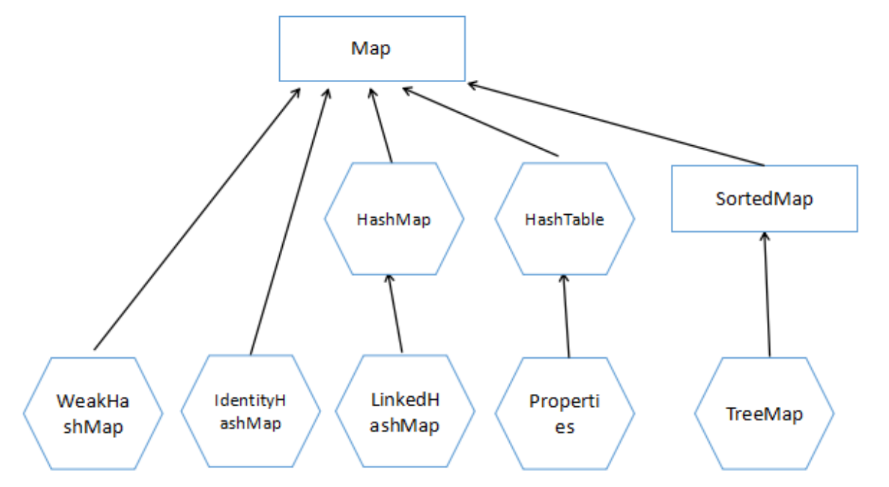
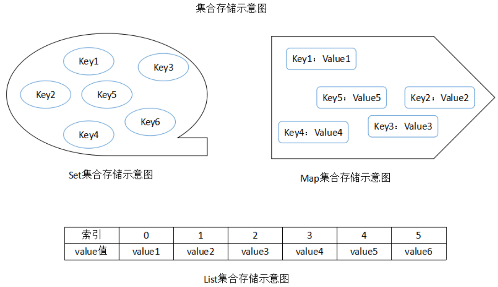

# [JAVA]-基础知识点

[TOC]

java基础知识图谱


## 1.JAVA的基础部分

### <1>基础语法


#### JAVA概念

##### 1>简单讲一下java的跨平台原理

​	由于各操作系统（windows,liunx等）支持的指令集，不是完全一致的。就会让程序在不同的操作系统上要执行不同程序代码。Java开发了适用于不同操作系统及位数的java虚拟机来屏蔽个系统之间的差异，提供统一的接口。对于java开发者而言，只需要在不同的系统上安装对应的不同java虚拟机，相应的java程序只要遵循java规范，就可以在所有的操作系统上面运行。

​	<font color=blue>Java通过不同的系统、不同版本、不同位数的java虚拟机(jvm),来屏蔽不同的系统指令集差异而对外体统统一的接口(java API),对于普通的java开发者而言，只需要按照接口开发即可。如果系统需要部署到不同的环境时，只需在系统上面按照对应版本的虚拟机即可</font>




##### 2>什么是Java虚拟机？为什么Java被称作是“平台无关的编程语言”？

​	Java虚拟机是一个可以执行Java字节码的虚拟机进程。Java源文件被编译成能被Java虚拟机执行的字节码文件

​	Java被设计成允许应用程序可以运行在任意的平台，而不需要程序员为每一个平台单独重写或者是重新编译。Java虚拟机让这个变为可能，因为它知道底层硬件平台的指令长度和其他特性


##### 3>JDK和JRE的区别是什么？

​	Java运行时环境(JRE)是将要执行Java程序的Java虚拟机。它同时也包含了执行applet需要的浏览器插件。Java开发工具包(JDK)是完整的Java软件开发包，包含了JRE，编译器和其他的工具(比如：JavaDoc，Java调试器)，可以让开发者开发、编译、执行Java应用程序


##### 4>描述JVM加载class文件的原理机制

​	JVM中类的装载是由ClassLoader和它的子类来实现的，Java ClassLoader 是一个重要的Java运行时系统组件。它负责在运行时查找和装入类文件的类


##### 5>搭建一个java开发环境的步骤

> <font color=red>java开发环境需要些什么？</font>

- 适用于开发环境的jdk

- 对应开发环境eclipse、idea

- web服务器(tomcat)、下载对应组件
- 项目版本管理：git、svn

> <font color=red>环境搭建、软件安装</font>

jdk,安装正常流程安装即可，配置JAVA_HOME,eclispe和tomcat会依赖于这个变量

eclispe正常解压就ok,设置workspace的默认编码

tomcat 正常解压就ok,把tomcat集成到eclispe中，安装插件就OK。

项目版本管理：svn/git


##### 6>assert概念

​	assertion(断言)在软件开发中是一种常用的调试方式，很多开发语言中都支持这种机制。在实现中，assertion就是在程序中的一条语句，它对一个boolean表达式进行检查，一个正确程序必须保证这个boolean表达式的值为true；如果该值为false，说明程序已经处于不正确的状态下，系统将给出警告或退出。一般来说，assertion用于保证程序最基本、关键的正确性。assertion检查通常在开发和测试时开启。为了提高性能，在软件发布后，assertion检查通常是关闭的


##### 7>请说明一个JAVA类中主要包含哪几个元素？并说明每个元素的作用

​	<font color=blue>java类中包含全局变量、方法、构造方法、代码块、类（内部类）</font>

​	全局变量分为实例变量（不以static修饰）、类变量（以static修饰）--> 类的属性

​	方法：[修饰符] 返回类型 方法名（形式参数列表）{ 方法体 } --> 类的功能

​	构造方法：用于初始化类中定义的全局变量，在创建对象的时候执行

​	代码块：代码块的功能与构造器的功能类似，用以初始化成员变量，在类加载（类初始化）的时候执行一次，且优先于构造器执行

​	类（内部类）：非静态内部类、静态内部类、局部内部类、匿名内部类（lambda表达式简化创建匿名内部类的对象）


##### 8>解释内存中的栈(stack)、堆(heap)和静态存储区的用法

​	定义一个基本数据类型的变量，一个对象的引用，还有就是函数调用的现场保存都使用内存中的栈空间；

​	而通过 new 关键字和构造器创建的对象放在堆空间；

​	程序中的字面量（literal）如直接书写的 100、“hello”和常量都是放在静态存储区中。

​	栈空间操作最快但是也很小，通常大量的对象都是放在堆空间，整个内存包括硬盘上的虚拟内存都可以被当成堆空间来使用。 

​	`String str = new String(“hello”);` 

​	分析上述语句: str 放在栈上，用 new 创建出来的字符串对象放在堆上，而“hello”这个字面量放在静态存储区

​	补充：较新版本的 Java 中使用了一项叫“`逃逸分析`“的技术，可以将一些局部对象放在栈上以提升对象的操作性能（JVM知识点补充）


##### 9>assert概念

​	assertion(断言)在软件开发中是一种常用的调试方式，很多开发语言中都支持这种机制。一般来说，assertion 用于保证程序最基本、关键的正确性。assertion 检查通常在开发和测试时开启。为了提高性能，在软件发布后， assertion 检查通常是关闭的。在实现中，断言是一个包含布尔表达式的语句，在执行这个语句时假定该表达式为 true；如果表达式计算为 false，那么系统会报告一个AssertionError

​	断言用于调试目的： 

```java
assert(a > 0); // throws an AssertionError if a <= 0 
```

​	断言可以有两种形式： 

```java
assert Expression1; 
assert Expression1 : Expression2 ; 
```

​	Expression1应该总是产生一个布尔值。 

​	Expression2可以是得出一个值的任意表达式；这个值用于生成显示更多调试信息的字符串消息。 

​	断言在默认情况下是禁用的，要在编译时启用断言，需使用 source 1.4 标记： javac -source 1.4 Test.java要在运行时启用断言，可使用-enableassertions 或者-ea 标记。 要在运行时选择禁用断言，可使用-da 或者-disableassertions 标记。 要在系统类中启用断言，可使用-esa 或者-dsa 标记。还可以在包的基础上启用 或者禁用断言。可以在预计正常情况下不会到达的任何位置上放置断言。断言可以用于验证传递给私有方法的参数。不过，断言不应该用于验证传递给公有方法的参数，因为不管是否启用了断言，公有方法都必须检查其参数。不过，既可以在公有方法中，也可以在非公有方法中利用断言测试后置条件。另外，断言不应该以任何方式改变程序的状态。

##### 10>JAVA程序初始化顺序？

父类的静态代码块>子类的静态代码块>父类的普通代码块>父类的构造方法>子类的普通代码块>子类的构造方法

<font color=red>静态代码块>普通代码块>构造方法</font>

如果存在父子类概念，则先初始化父类的普通代码块和构造方法在初始化子类


##### 11>创建对象有几种方式？

​	用new语句创建对象，这是最常用的创建对象的方式；

​	运用反射手段，调用Java.lang.Class或者java.lang.reflect.Constructor类的newInstance()实例方法；

​	调用对象的clone()方法；

​	运用反序列化手段，调用java.io.ObjectInputStream对象的readObject()方法；


#### JVM相关

##### 1>描述一下 JVM 加载 class 文件的原理机制?

​	JVM 中类的装载是由类加载器（ClassLoader） 和它的子类来实现的，Java 中的类加载器是一个重要的 Java 运行时系统组件，它负责在运行时查找和装入类文件中的类

> <font color=red>扩展知识点</font>

​	由于 Java 的跨平台性，经过编译的 Java 源程序并不是一个可执行程序，而是 一个或多个类文件。当 Java 程序需要使用某个类时，JVM 会确保这个类已经被加载、连接(验证、准备和解析)和初始化。类的加载是指把类的.class 文件中的数据读入到内存中，通常是创建一个字节数组读入.class 文件，然后产生与所加载类对应的Class 对象。加载完成后，Class 对象还不完整，所以此时的类还不可用。当类被加载后就进入连接阶段，这一阶段包括验证、准备(为静态变量分配内存并设置默认的初始值)和解析(将符号引用替换为直接引用)三个步骤。最后JVM 对类进行初始化，包括：1 如果类存在直接的父类并且这个类还没有被初始化，那么就先初始化父类；2 如果类中存在初始化语句，就依次执行这些初始化语句。 

​	类的加载是由类加载器完成的，类加载器包括：根加载器（BootStrap）、扩展加载器（Extension）、系统加载器（System）和用户自定义类加载器（java.lang.ClassLoader 的子类）。从 JDK 1.2 开始，类加载过程采取了父亲委托机制(PDM)。PDM 更好的保证了 Java 平台的安全性，在该机制中，JVM 自带的Bootstrap 是根加载器，其他的加载器都有且仅有一个父类加载器。类的加载首先请求父类加载器加载，父类加载器无能为力时才由其子类加载器自行加载。JVM 不会向 Java 程序提供对 Bootstrap 的引用。下面是关于几个类加载器的说明：

​	a)Bootstrap：一般用本地代码实现，负责加载 JVM 基础核心类库（rt.jar）； 

​	b)Extension：从 java.ext.dirs 系统属性所指定的目录中加载类库，它的父加载器是 Bootstrap； 

​	c)System：又叫应用类加载器，其父类是 Extension。它是应用最广泛的类加载器。它从环境变量 classpath 或者系统属性 java.class.path 所指定的目录中记载类，是用户自定义加载器的默认父加载器。


##### 2>类加载器有哪些？

​	启动类加载器(Bootstrap ClassLoader)用来加载 java 核心类库，无法被 java 程序直接 引用。

​	扩展类加载器(extensions class loader):它用来加载 Java 的扩展库。Java 虚拟机的 实现会提供一个扩展库目录。该类加载器在此目录里面查找并加载 Java 类。

​	系统类加载器(system class loader):它根据 Java 应用的类路径(CLASSPATH) 来加载 Java 类。一般来说，Java 应用的类都是由它来完成加载的。可以通过 ClassLoader.getSystemClassLoader()来获取它。

​	用户自定义类加载器，通过继承 java.lang.ClassLoader 类的方式实现


##### 3>类加载的方式有几种，它们的区别是什么？


##### 4>JVM加载class文件的原理机制是什么(JVM的类加载的原理机制是什么)？


##### 5>堆和栈的区别？

从数据存储方面来说：

栈空间中一般存储基本数据类型，对象的地址；

堆空间一般存放对象本身，block的copy等


1.说一下 jvm 运行时数据区？
2.说一下堆栈的区别？
3.队列和栈是什么？有什么区别？
4.什么是双亲委派模型？
5.说一下类加载的执行过程？
6.怎么判断对象是否可以被回收？
7.java 中都有哪些引用类型？
8.说一下 jvm 有哪些垃圾回收算法？
9.说一下 jvm 有哪些垃圾回收器？
10.详细介绍一下 CMS 垃圾回收器？


#### JAVA基础语法

##### 1>构造函数？构造函数重载？复制构造函数？

> 构造方法的定义

​	构造方法的定义：[修饰符] 类名（）{ 方法体 }

​	作用：在创建实例的时候执行，用以初始化类中定义的全局变量

​	特征：构造方法的方法名与类同名，没有返回值，一个类中可有多个构造方法。每个类都有自己默认的构造器，系统默认的构造器是无参的构造器，如果一旦人为指定，系统默认的构造器将不再执行，而是执行用户指定的构造器


​	当新对象被创建的时候，构造函数会被调用。每一个类都有构造函数。在程序员没有给类提供构造函数的情况下，Java编译器会为这个类创建一个默认的构造函数

​	Java中构造函数重载和方法重载很相似。可以为一个类创建多个构造函数。每一个构造函数必须有它自己唯一的参数列表

​	Java不支持像C++中那样的复制构造函数，这个不同点是因为如果你不自己写构造函数的情况下，Java不会创建默认的复制构造函数


##### 2>”static”关键字？Java中是否可以覆盖(override)一个private或者是static的方法？

​	“static”关键字表明一个成员变量或者是成员方法可以在没有所属的类的实例变量的情况下被访问。

​	Java中static方法不能被覆盖，因为方法覆盖是基于运行时动态绑定的，而static方法是编译时静态绑定的。static方法跟类的任何实例都不相关，所以概念上不适用


##### 3>基本数据类型和包装类型概念

> <font color=red>八种基本数据类型和包装类以及大小</font>

​	整型（byte、short、int、long）、字符型（char）、浮点型（float、double）、布尔型（boolean）

|          | 数据类型 | 字节数 | 位数 |
| -------- | -------- | ------ | ---- |
| 整数类型 | byte     | 1      | 8位  |
| 整数类型 | short    | 2      | 16位 |
| 整数类型 | int      | 4      | 32位 |
| 整数类型 | long     | 8      | 64位 |
| 字符型   | char     | 2      | 16位 |
| 浮点型   | float    | 4      | 32位 |
| 浮点型   | double   | 8      | 64位 |
| 布尔型   | boolean  | -      | 1位  |


> <font color=red>有了基本数据类型，为什么还需要包装类型？</font>

<font color=red>Java是一个面向对象的语言，而基本的数据类型，不具备面向对象的特性</font>

​	包装类型：每一个基本的数据类型都会一一对应一个包装类型（wrapper class），从 JDK 1.5 开始引入了自动装箱/拆箱机制，使得二者可以相互转换


> <font color=red>“装箱和拆箱”概念</font>

<font color=blue>装箱：把基本的数据类型转换成对应的包装类型</font>

```java
Integer.valueOf(1)
Integer i = 1;自动装箱，实际上在编译时会调用Integer.valueOf方法来装箱
```

<font color=blue>拆箱：就是把包装类型转换为基本数据类型.基本数据类型 名称 = 对应的包装类型</font>

```java
Integer i = 1;
int j = i;// 自动拆箱
// int j = i=intValue();手动拆箱
```

自动拆箱：实际上会在编译调用intValue

| 原始类型 | 包装类型  |
| -------- | --------- |
| boolean  | Boolean   |
| char     | Character |
| byte     | Byte      |
| short    | Short     |
| int      | Integer   |
| long     | Long      |
| float    | Float     |
| double   | Double    |


###### 代码分析

```java
// JAVA自动装箱、拆箱测试
    @Test
    public void test01() {
        // Integer和int分析
        Integer a = new Integer(3);
        Integer b = 3;
        int c = 3;
        // false:引用比较(比较引用地址)
        System.out.println("a==b:" + (a == b));
        // true:a自动拆箱为int类型再与c进行值的比较(比较值大小)
        System.out.println("a==c:" + (a == c));

        /**
         * Integer分析：Integer.valueOf()源码分析:涉及值范围和常量池的概念
         */
        Integer f1 = 100, f2 = 100, f3 = 150, f4 = 150;
        System.out.println("f1==f2:" + (f1 == f2));// true
        System.out.println("f3==f4:" + (f3 == f4));// false
    }

# Integer的内部类IntegerCache分析，valueOf源码分析，简单来说：如果值在-128-127之间则不会new新的Integer对象而是直接引用常量池中的Integer对象
```


##### 4>"=="和equals方法的区别？

​	Java程序中有两种方式是两个变量是否相等：一种是利用==判断，另外一种是使用equals方法来判断

​	==：如果比较的两个变量都是基本类型的变量，并且都是数值类型，则只要两个变量的值相同时，便返回true。但如果两个变量的类型是引用类型，则只有两个变量均指向相同的对象才返回true（比较对应的引用的内存的首地址）

​	equals ：用于比较两个独立对象的内容是否相同，使用equals方法进行判断时则以具体equals方法中实际比较的项目为准，可通过重写equals方法实现自定义的比较方式

 

##### 5>String、StringBuilder、StringBuffer三者的区别？

> <font color=red>从类定义上理解</font>

​	在java中提供三个类String、StringBuillder、StringBuffer来表示和操作字符串。字符串就是多个字符的集合

​	String是内容不可变的字符串（String类使用final修饰，不可继承）。String底层使用了一个不可变的字符数组(`private final char[]`)

```java
String str =new String(“bbbb”);
```

​	而StringBuillder、StringBuffer是内容可以改变的字符串。StringBuillder、StringBuffer底层使用的可变的字符数组（没有使用final来修饰：`char[] value`） 

​	<font color=red>PS：继承 String 本身就是一个错误的行为，对 String 类型最好的重用方式是关联（HAS-A）而不是继承（IS-A） -- 涉及模型元素之间的连接关系概念</font>


> <font color=red>从应用上区分：字符串拼接</font>

​	String使用“+”进行字符串拼接：`String c = “a”+”b”;`

​	StringBuilder、StringBuffer： `StringBuilder sb = new StringBuilder(); sb.apend(“a”).apend(“b”)`


> <font color=red>性能和场景考虑</font>

​	StringBuilder是线程不安全的，效率较高。而StringBuffer是线程安全的，效率较低


> <font color=red>个人解析：</font>

​	String类与StringBuffer类、StringBuider类都是用于存储字符串类型的数据，但String类（不可变类）存储的是不可变的字符串序列（即一个String对象被创建之后，包含在这个字符串对象的字符序列不能够被改变，直到该对象被销毁、被垃圾回收都不会改变），而StringBuffer类、StringBuilder类存储的是可变的字符串序列，可通过该类对应提供的append/insert/reverse/setCharAt等方法改变对应字符串对象的字符序列。但StringBuffer是线程安全的，StringBuilder是线程不安全的。三者之间执行的速度是 StringBuilder>StringBuffer>String

​	String 实现了 equals 方法，而 StringBuffer 没有实现 equals 方法

```java
new String(“abc”).equals(newString(“abc”) // true
new StringBuffer(“abc”).equals(newStringBuffer(“abc”) // false 
```


> <font color=red>String样例扩展分析</font>

- `String s = "Hello" ;  s = s + " world!" ;`代码执行后，原始的String对象中的内容到底变了没有？

​	没有。因为 String 被设计成不可变类，所以它的所有对象都是不可变对象。在这段代码中，s 原先指向一个 String 对象，内容是 "Hello"，然后我们对 s 进行了+（拼接）操作，这时，s 不指向原来那个对象了，而指向了另一个 String 对象，内容为"Hello world!"，原来那个对象还存在于内存之中，只是 s 这个引用变量不再指向它 


- `String s = new String("xyz");`创建了几个String Object?二者之间有什么区别？

​	两个或一个，”xyz”对应一个对象，这个对象放在字符串常量缓冲区，常量”xyz”不管出现多少遍，都是缓冲区中的那一个。new String 每写一遍，就创建一个新的对象。但如果以前就用过“xyz”，则new String不会创建新的”xyz”了，而是直接从缓冲区拿 


> <font color=red>扩展问题分析</font>

###### +和append的选择	

​	+和append的选择，有没有哪种情况用+做字符串连接比调用 StringBuffer / StringBuilder 对象的 append 方法性能更好？

​	考虑代码可读性和实际执行效率，如果连接后得到的字符串在静态存储区中是早已存在的，那么用+做字符串连接是优于 StringBuffer / StringBuilder 的 append 方法的

```java
import org.junit.Test;

/**
 * String相关测试demo
 */
public class StringDemo {

    @Test
    public void test01(){
        String a = "hello";
        String b = new String("hello");
        String c = "he" + "llo";
        System.out.println("a==b:"+(a==b));
        System.out.println("a==c:"+(a==c));
        System.out.println("a.equals(b):"+a.equals(b));
        System.out.println("a.equals(c):"+a.equals(c));
        System.out.println("intern():"+(a.intern()==b.intern()));
    }

}
测试结果分析:
a==b:false
a==c:true
a.equals(b):true
a.equals(c):true
intern():true
```

​	intern() 方法返回字符串对象的规范化表示形式。它遵循以下规则：对于任意两个字符串 s 和 t，当且仅当 s.equals(t) 为 true 时，s.intern() == t.intern() 才为 true。


###### String为什么要用final修饰？

```java
public final class String
    implements java.io.Serializable, Comparable<String>, CharSequence {
    /** The value is used for character storage. */
    private final char value[];
    ......
}
```

<font color=red>从两个方面阐述：安全和性能</font>

​	安全：final修饰的类不可继承、final修饰的变量不可二次修改

​	性能：字符串在日常程序设计中应用特别频繁，系统分配给JAVA虚拟机的内存是有限的，因此引入共享字符串概念：将字符串对象存放到虚拟机中的方法区里面的常量池里，不同的类、方法、线程，可以使用同一个字符串对象，而不需要额外在内存中开辟新的内存空间，从而极大的降低了内存的消耗，也提升了程序运行效率。

​	final char value[]：字符串在日常开发中会被大量使用，考虑char[]的共享性，触发对线程安全性的考虑，通过final限制并发场景下的行为不可预测

​	final class：限制产生子类（限制多态/行为的变化），如果通过多态方式使用String子类对象及其方法一定程度上导致性能下降（多态的实现原理：底层的虚函数表），且String方法的重写导致程序语义不安全甚至逻辑错误，违背安全理念


##### 6>一个".java"源文件中是否可以包括多个类（不是内部类）？有什么限制？

​	一个“.java”文件中可以有多个类，但只能有一个 被public关键字修饰的类，并且被public关键字修饰的类名必须与文件名相同、一致


##### 7>说说&和&&的区别

&（与）与&&（短路）均为逻辑运算符：一假必假，两个条件同时为true才返回true

&：无论左侧运算结果如何，右侧均会参与运算

&&：<font color=red>“短路概念”</font>-一旦左侧运算结果为false，右侧不再参与运算（结果直接返回false）

PS：以此类推，|与||的区别也可类似进行分析


​	对于 if(str != null&& !str.equals(“”))表达式，当 str 为 null 时，后面的表达式不会再执行，所以不会出现 NullPointerException ，但如果将&&改为&，则会抛出 NullPointerException 异常

​	&还可以用作位运算符，当&操作符两边的表达式不是 boolean 类型时， &我们通常使用 0x0f 来与一个整数进行&运算，来获取该整数的最低 4 个 bit 位，例如：0x31 & 0x0f 的结果为 0x01


##### 8>用最有效率的方法算出 2 乘以 8 等於几? 

​	2 << 3， 因为将一个数左移 n 位，就相当于乘以了 2 的 n 次方，那么，一个数乘以 8 只要将其左移 3 位即可，而位运算 cpu是直接支持的，其效率最高，所以，2乘以8等於几的最效率的方法是 2 << 3

> <font color=red>扩展：思考问题：参考下述代码，在为编写的类重写 hashCode 方法时为什么要使用这样的乘法运算来产生哈希码（散列码）</font>

```java
/**
 * 自定义PhoneNumber实体重载hashCode和equals方法
 */
public class PhoneNumber {

    private int areaCode;
    private String prefix;
    private String lineNumber;

    /**
     * 选择31是因为可以用移位和减法运算来代替乘法，从而得到更好的性能
     * 31*num <==> (num<<5)-num 即(2^5-1)*num
     **/
    @Override
    public int hashCode() {
        final int prime = 31;
        int result = 1;
        result = prime * result + areaCode;
        result = prime * result
                + ((lineNumber == null) ? 0 : lineNumber.hashCode());
        result = prime * result + ((prefix == null) ? 0 : prefix.hashCode());
        return result;
    }

    @Override
    public boolean equals(Object obj) {
        if (this == obj)
            return true;
        if (obj == null)
            return false;
        if (getClass() != obj.getClass())
            return false;
        PhoneNumber other = (PhoneNumber) obj;
        if (areaCode != other.areaCode)
            return false;
        if (lineNumber == null) {
            if (other.lineNumber != null)
                return false;
        } else if (!lineNumber.equals(other.lineNumber))
            return false;
        if (prefix == null) {
            if (other.prefix != null)
                return false;
        } else if (!prefix.equals(other.prefix))
            return false;
        return true;
    }

}
```


##### 9>能被 switch的数据类型有哪些？

​	在 switch（ expr1）中， expr1 只能是一个整数表达式或者枚举常量， 所以能被 Switch 的数据类型有： byte,short,int,char。 从JDK1.5版开始，Java 中引入了枚举类型（enum）,expr可为枚举；从JDK 1.7版开始，还可以是字符串（String）。不支持长整型（long）


##### 10>char 型变量中能不能存贮一个中文汉字?为什么? 

​	char型变量中可以存储一个英文或者是一个中文汉字

​	char型变量（2个字节）是用来存储Unicode编码的字符的，Unicode编码字符集中包含了汉字，因此char型变量可以存储汉字，但如果汉字不在指定的Unicode编码字符集中，则char变量就不能够存储这个特殊的汉字

> <font color=red>扩展知识点</font>

​	使用 Unicode 意味着字符在 JVM 内部和外部有不同的表现形式，在 JVM 内部都是 Unicode，当这个字符被从 JVM 内部转移到外部时（例如存入文件系统中），需要进行编码转换。所以 Java 中有字节流和字符流，以及在字符流和字节流之间进行转换的转换流，如 InputStreamReader 和 OutputStreamReader，这两个类是字节流和字符流之间的适配器类，承担了编码转换的任务；对于 C 程序员来说，要完成这样的编码转换恐怕要依赖于union（联合体/共用体）共享内存的特征来实现了


##### 11>值传递和引用传递概念

​	对象被值传递，意味着传递了对象的一个副本。因此，就算是改变了对象副本，也不会影响源对象的值

​	对象被引用传递，意味着传递的并不是实际的对象，而是对象的引用。因此，外部对引用对象所做的改变会反映到所有的对象上


##### 12>类型转换相关

###### float f=3.4;是否正确?

​	不正确。3.4 是双精度数，将双精度型（double）赋值给浮点型（float）属 于下转型（down-casting，也称为窄化）会造成精度损失，因此需要强制类型转换：`float f =(float)3.4`; 或者写成 `float f =3.4F`;

​	在java里面，没小数点的默认是int类型，有小数点的默认是 double类型。编译器可以自动向上转型，long精度较高可实现int->long的自动转换，但double->float需要强制类型转换


###### `short s1 = 1;s1 = s1 + 1;`是否正确?  `short s1 = 1; s1 += 1;`是否正确?

​	对于 `short s1 = 1; s1 = s1 + 1;`由于 1 是 int 类型，因此 s1+1 运算结果也是 int 型，需要强制转换类型才能赋值给 short 型

​	而 `short s1 = 1; s1 += 1;`可以正确编译，因为 `s1+= 1;`相当于 `s1 = (short)(s1 + 1);`，其中有隐含 的强制类型转换


##### 13>Math.round(11.5) 等于多少? Math.round(-11.5)等于多少?

​	Math.round(11.5)的返回值是 12，Math.round(-11.5)的返回值是-11。四舍五入的原理是在参数上加 0.5 然后进行下取整


##### 14>break、continue、return

​	break：跳出指定的多重循环

​	continue：跳出当次循环

​	return：结束整个方法体

​	break、continue的作用有点类似于C、C++中的goto语句，在程序代码中需要注意相应的使用


##### 15>如何实现字符串的反转及替换？

​	方式1：使用 String 或 StringBuffer / StringBuilder 中的方法

​	方式2：自定义方法实现（for循环遍历实现、递归方式实现）

```java
	public static String reverseStr(String originStr){
        // 确定递归出口
        if(originStr==null||originStr.length()<=1){
            return originStr;
        }
        return reverseStr(originStr.substring(1))+originStr.charAt(0);
    }
```


##### 16>指定编码字符串转换（例如GB2312转ISO-8859-1）

```java
String s1 = "测试";
String s2 = new String(s1.getBytes("GB2312"),"ISO-8859-1");
```


#### 面向对象概念

##### 1>面向对象编程（OOP）

​	Java是一个支持并发、基于类和面向对象的计算机编程语言。OOP具备如下优点：

- 代码开发模块化，更易维护和修改

- 代码复用

- 增强代码的可靠性和灵活性

- 增加代码的可理解性

面向对象编程四大特性：封装、继承、多态、抽象


##### 2>面向对象的特征有哪些方面？

> <font color=red>java中面向对象有四大基本特征：封装、抽象、继承、多态</font>

- <font color=blue>封装</font>

​	概念：将对象封装成一个高度自治和相对封闭的个体，对象状态（属性）由这个对象自己的行为（方法）来读取和改变

​	<font color=blue>分析：类的属性私有化，对外提供该属性的获取或改变的方法</font>

```java
private name setName getName
```

​	封装的优势：

```
通过隐藏对象的属性来保护对象内部的状态
提高了代码的可用性和可维护性，因为对象的行为可以被单独的改变或者是扩展
禁止对象之间的不良交互提高模块化
```


- <font color=blue>抽象</font>

​	概念：抽象就是找出一些事物的相似和共性之处，然后将这些事物归为一个类，这个类只考虑这些事物的相似和共性之处，并且会忽略与当前主题和目标无关的那些方面，将注意力集中在与当前目标有关的方面。 <font color=red>即把现实生活中的对象，抽象为类</font>

​	<font color=blue>抽象是把想法从具体的实例中分离出来的步骤（目的是将类的行为和实现细节分离）</font>

​	Java支持创建只暴露接口而不包含方法实现的抽象类，根据功能而不是实现细节来创建类

​	抽象和封装是互补的概念：抽象关注对象的行为，而封装关注对象行为的细节。一般是通过隐藏对象内部状态信息做到封装，因此，封装可以看成是用来提供抽象的一种策略。


- <font color=blue>继承：JAVA单继承</font>

​	<font color=blue>子类继承父类，拥有父类的基本属性和方法，通过重写父类方法实现代码复用，也可拥有自己的方法完成功能扩展</font>

```java
public class Father{
	// 定义相关的基本属性和方法
}
public class Child extends Father{
    // 子类继承父类，拥有父类基本属性和方法
    // 通过重写父类方法实现“多态”
    // 可扩展属于自己的方法
}
```

​	继承给对象提供了从基类获取字段和方法的能力。继承提供了代码的重用行，也可以在不修改类的情况下给现存的类添加新特性


- <font color=blue>多态</font>

​	多态是编程语言给不同的底层数据类型做相同的接口展示的一种能力。一个多态类型上的操作可以应用到其他类型的值上面。

> <font color=red>多态可以分为“编译时多态”和“运行时多态”</font>

编译时多态：方法的重载

运行时多态：子类继承父类、类实现接口


> <font color=red>扩展说明</font>

​	多态是指程序中定义的引用变量所指向的具体类型和通过该引用变量的方法调用在编程时并不确定，而是在程序运行期间才确定，即一个引用变量倒底会指向哪个类的实例对象，该引用变量发出的方法调用到底是哪个类中实现的方法，必须在由程序运行期间才能决定

```java
Object obj = new xxx();
UserDao userDao = new UserDaoJdbcImpl();
UserDao userDao = new UserDaoHibernateImpl();
```

​	靠的是父类或接口定义的引用变量可以指向子类或具体实现类的实例对象，而程序调用的方法在运行期才动态绑定，就是引用变量所指向的具体实例对象的方法，也就是内存里正在运行的那个对象的方法，而不是引用变量的类型中定义的方法

<font color=red>原则：回答比较抽象问题的时候，要举例说明</font>


##### 3>Overload 和 Override(OverWrite)概念

> <font color=red>方法的重载Overload</font>

​	定义：如果一个类中包含了两个以上的方法名相同、形式参数列表不同称为方法的重载 

​	特点：“两同一不同”-->在同一个类中，方法名相同，形式参数列表不同(a.个数不同,b.位置不同.c 类型不同)，和返回值、修饰符无关

​	<font color=blue>Overload 与返回值类型和修饰符以及异常无关只要方法名相同形式参数不同即为重载</font>

 

> <font color=red>方法的覆盖Override</font>

​	定义：当子类继承父类并重写了父类的方法的这种行为被称为方法的覆盖

​	特点：“两同两小一大“-->

​	两同即方法名相同，形式参数列表相同

​	两小是指子类方法的返回值类型(协变类型(拥有继承关系))应该比父类更小，子类抛出的异常应该比父类更少更小。(继承关系、抛出异常)

​	一大是指子类的作用权限比父类的作用权限要大或者相等

​	通过子类创建的实例对象调用这个方法时，将调用子类中的定义方法，这相当于把父类中定义的那个完全相同的方法给覆盖了，这也是面向对象编程的多态性的一种表现


##### 4>成员变量（全局变量）和局部变量的区别？

> <font color=red>从不同的方面分析：</font>

- <font color=blue>a.定义的位置：</font>

局部变量定义在函数中、语句内

成员变量定义在类中

- <font color=blue>b.内存中的位置： </font>

局部变量存储在栈内存中  

成员变量存储在堆内存中 

- <font color=blue>c.初始化值：</font>

局部变量没有默认初始化值，必须赋值才可以使用

成员变量有默认初始化值

- <font color=blue>d.生命周期：</font>

局部变量一旦作用区域结束，就立刻释放

成员变量也称为实例(对象)变量,随着对象的出现而出现。随着对象的被回收而释放


##### 5>静态变量和实例变量的区别？ 

> <font color=red>个人分析：</font>

​	静态变量是属于类所有的，可以供类的所有对象共享

​	实例变量是属于对象的

​	类的变量的作用域比实例变量作用域更大，实例变量随着实例的存在而存在，而类变量是随着类的存在而存在，实例可以访问类变量。同一个类中所有的实例访问类变量时，实际上是访问的是该类本身的一个变量

 

> <font color=red>参考分析：</font>

​	在语法定义上的区别：静态变量前要加 static 关键字，而实例变量前则不加。 

​	在程序运行时的区别：实例变量属于某个对象的属性，必须创建了实例对象，其中的实例变量才会被分配空间，才能使用这个实例变量。静态变量不属于某个实例对象，而是属于类， 所以也称为类变量，只要程序加载了类的字节码，不用创建任何实例对象，静态变量就会被分配空间，静态变量就可以被使用了。总之，实例变量必须创建对象后才可以通过这个对象来使用，静态变量则可以直接使用类名来引用。     

- <font color=blue>a.生命周期：</font>

成员变量又叫实例变量，是随着对象的出现而出现，随着对象的消失而消失

静态变量又叫类变量，是随着类的加载而出现，随着类的消失而消失

- <font color=blue>b.内存中的存储位置：</font>

成员变量存在在堆内存的对象中

静态变量存储在方法区的静态区中

- <font color=blue>c.存储的数据特点：</font> 

成员变量存储的数据是对象的特有数据

静态变量存储的数据是对象的共享数据   

- <font color=blue>d.调用方式：</font>

成员变量，只能被对象所调用

静态变量，能被对象调用，也可以被类名调用


##### 6>说明作用域 public， private， protected，以及不写时的区别

​	说明：如果在修饰的元素上面没有写任何访问修饰符，则表示 friendly。

​	JAVA语言中的权限访问修饰符按照访问权限大小从小到大分为四种，分别为private（私有的）、default（默认）、protected（保护）、public（公有的）

| 作用域    | 说明           | 作用范围说明                                 |
| --------- | -------------- | -------------------------------------------- |
| private   | 私有的         | 只能本类中使用                               |
| default   | 默认的访问级别 | 在同一个类中，同一个包中使用                 |
| protected | 受保护的级别   | 在同一个类中，同一个包中，不同包的子类中使用 |
| public    | 公有的         | 任意类都可以使用                             |

> <font color=red>作用范围：</font>

|            | private | default | protected | public |
| ---------- | ------- | ------- | --------- | ------ |
| 同一个类中 | √       | √       | √         | √      |
| 同一个包中 |         | √       | √         | √      |
| 子类中     |         |         | √         | √      |
| 全局范围内 |         |         |           | √      |

 

##### 7>构造器 Constructor 能否被继承？是否可被 override?能否被 overload?

​	构造器Constructor可以被重载（同一个类中不同参数列表的构造器），但不能够被继承、重写，子类可以通过super关键字调用父类的构造器，但不能够进行重写（覆盖） 


##### 8>final, finally, finalize 的区别 

​	<font color=red>final是java的关键字、修饰符，可以用来修饰变量、方法、类</font>

```properties
final修饰的变量不能够二次赋值
final修饰的方法不能够被重写
final修饰的类不能够被继承
```

​	<font color=red>final是java的一种异常处理机制，是异常处理语句结构的一部分，表示总是执行。</font>在异常机制中try...catch...finally...语句中出现的，放在finally语句块中的语句最后总会执行，通常用finally实现资源的回收。使用 finally 可以维护对象的内部状态，并可以清理非内存资源

​	<font color=red>finalize是 Object 类的一个方法，在垃圾收集器执行的时候会调用被回收对象的此方法，供垃圾收集时的其他资源回收，例如关闭文件等。</font>Java技术使用finalize()方法在垃圾收集器将对象从内存中清除出去前，做必要的清理工作。这个方法是由垃圾收集器在确定这个对象没有被引用时对这个对象调用的。它是在Object类中定义的，因此所有的类都继承了它。子类覆盖finalize()方法以整理系统资源或者执行其他清理工作。finalize()方法是在垃圾收集器删除对象之前对这个对象调用的


##### 9>可以从一个 static 方法内部发出对非 static 方法的调用？

​	<font color=red>不可以。因为非 static方法是要与对象关联在一起的，必须创建一个对象后，才可以在该对象上进行方法调用，而 static 方法调用时不需要创建对象，可以通过类直接调用</font>

​	反向思考：当一个 static 方法被调用时，可能还没有创建任何实例对象，如果从一个 static 方 法中发出对非 static 方法的调用，那个非 static方法是关联到哪个对象上的呢？这个逻辑无法成立，所以，一个 static方法内部不能对非static方法的调用


##### 10>使用static修饰属性或方法之后，属性和方法有什么特征？

​	被静态修饰的内容可以实现被所有的对象共享

​	静态数据是随着类的加载而加载，意味着随着类的消失而消失，生命周期过长，优于对象存在的

​	由于静态数据属于类，所有多了一种调用方式：类名.属性名、类名.方法名

​	被static修饰的属性亦可称之为类变量，表示这个变量是属于类所有

​	被static修饰的方法称之为静态方法，静态的方法只能访问静态的方法 ，而不能访问非静态方法(被static修饰的方法 只能访问被static修饰的方法,static方法不能直接访问非static的方法)，静态方法中不可以使用this关键字 以及super关键字


##### 11>abstract class（抽象类）和 interface（接口）有什么区别?

> <font color=red>个人解析：</font>

​	接口是一种抽象类的特殊情况，使用interface进行修饰

- <font color=blue>相同之处：</font>

​	接口和抽象类都不能被实例化，他们都是依赖于子类实现

​	接口和抽象类都可以包含抽象方法，实现接口或继承抽象类都必须实现这里定义的全部的抽象方法

- <font color=blue>不同之处：</font>

​	接口中只能包含抽象方法和默认方法，和类方法，不能为普通方法提供方法的实现。

​	接口中不可以定义构造函数、抽象类中可以定义构造函数

​	接口中不能定义初始化代码块，抽象类可以包含初始化代码块

​	一个类最多只能包含一个直接父类，但是接口可以有多个父接口。而且一个类可以实现多个接口

 

> <font color=red>参考解析：</font>

- <font color=blue>a.抽象类： </font>

​	含有 abstract 修饰符的类即为抽象类，abstract 类不能创建的实例对象换句话说就是不能被 new

​	包含有 abstract 方法的类必须定义为抽象类，抽象类中可以有普通方法

​	抽象类的子类必须全部覆盖该抽象类的所有的抽象方法，所以，不能有抽象构造方法或抽象静态方法。如果的子类没有实现抽象父类中的所有抽象方法，那么子类也 必须定义为 abstract 类型

​	abstract 能修饰类，修饰方法，不能修饰属性 

- <font color=blue>b.接口： </font>

​	接口（interface）可以说成是抽象类的一种特例，接口为更为纯粹的抽象类，不能有任何方法的实现，只能有方法的声明

​	接口中的方法定义默认为 public abstract 类 型，接口中的成员变量类型默认为 public static final

​	实现类必须实现所有接口中的 全部方法声明

​	接口中没有构造函数，即接口没有对象

​	接口是多实现，即一 个类可以实现多个接口，中间用逗号隔开

- <font color=blue>c.两者比较语法区别：</font> 

​	抽象类可以有构造方法，接口中不能有构造方法

​	抽象类中可以有普通成员变量，接口中没有普通成员变量 

​	抽象类中可以包含非抽象的普通方法，接口中的所有方法必须都是抽象的，不能有非 抽象的普通方法。

​	抽象类中可以包含静态方法，接口中不能包含静态方法 

​	抽象类和接口中都可以包含静态成员变量，抽象类中的静态成员变量的访问类型可 以任意，但接口中定义的变量只能是 public static final 类型，并且默认即为 public static final 类型

​	一个类可以实现多个接口，但只能继承一个抽象类

- <font color=blue>d.两者在应用上的区别： </font>

​	接口更多的是在系统架构设计方法发挥作用，接口是用来定义规范的。主要用于定义模块之间的通信契约。而抽象类在代码实现方面发挥作用，可以实现代码的重用，实现了一种价值叫模版策略


##### 12>java 中实现多态的机制是什么？

​	Java引用变量有两个类型，一个是编译时的类型，一个是运行时的类型。其中编译时的类型由声明该变量时使用的类型决定，而运行时的类型由实际赋值给该变量的对象决定。

​	<font color=blue>多态分为编译时多态（又称静态多态）运行时多态（又称动态多态）</font>

​	编译时多态有<font color=red>重载（overload）</font>，编译时多态在编译时就已经确定，运行的时候调用的是确定的方法

​	运行时多态有<font color=red>子类继承父类（extends）、类实现接口（implements）</font>，通过父类发出的方法调用可能执行的是方法在父类中的实现，也可能是某个子类中的实现，它是由运行时刻具体的对象类型决定的。父类或接口定义的引用变量可以指向子类或具体实现类的实例对象，而程序调用的方法在运行期才动态绑定，就是引用变量所指向的具体实例对象的方法，也就是内存里正在运行的那个对象的方法，而不是引用变量的类型中定义的方法

 

##### 13>什么是内部类？Static Nested Class 和 Inner Class 的不同

​	内部类就是在一个类的内部定义的类，内部类分为静态内部类，非静态内部类，局部内部类和匿名内部类

​	非静态内部类可以无条件访问外部类的成员，不可以和自己的外部类重名但是可以与外部类平级同包的类重名，非静态内部类不能有static 修饰的变量

​	静态内部类不能访问外部类的非静态属性，外部类也不能访问静态内部类的成员，但是可以使用静态内部类的类名作为调用者使用

​	内部类可以通过 new 外部类( ).new 内部类( )进行实例化

```java
 Inner in=new Outer().new Inner(); 
```

​	内部类可以被其他类继承继续它的类需要写一个构造方法并且手工调用外部类.super(); 	

```java
public class SubClass extends Out.In{    
    public SubClass(Out out){     
    	out.super(); 
    }   
} 
```


##### 14>如何实现对象克隆？

​	实现对象克隆有两种方式：

​	<font color=red>a.实现 Cloneable 接口并重写 Object 类中的 clone()方法；</font>

​	<font color=red>b.实现 Serializable 接口，通过对象的序列化和反序列化实现克隆，可以实现真正的深度克隆</font>

```java
import java.io.ByteArrayInputStream;
import java.io.ByteArrayOutputStream;
import java.io.ObjectInputStream;
import java.io.ObjectOutputStream;

public class CloneUtil {

    private CloneUtil(){
        throw new AssertionError();
    }

    public static <T> T clone(T obj) throws Exception{
        ByteArrayOutputStream bout = new ByteArrayOutputStream();
        ObjectOutputStream oos = new ObjectOutputStream(bout);
        oos.writeObject(obj);
        ByteArrayInputStream bin = new ByteArrayInputStream(bout.toByteArray());
        ObjectInputStream ois = new ObjectInputStream(bin);
        return (T)ois.readObject() ;
        /**
         * 调用ByteArrayOutputStream或ByteArrayInputStream对象的close方法没有任何意义
         * 这两个基于内存的溜只要垃圾回收器清理对象就能够释放资源
          */
    }
}

```

​	PS：基于序列化和反序列化实现的克隆不仅仅是深度克隆，更重要的是通过泛型限定，可以检查出要克隆的对象是否支持序列化，这项检查是编译器完成的，不是在运行时抛出异常， 这种是方案明显优于使用 Object 类的 clone 方法克隆对象。


##### 15>写 clone()方法时，通常都有一行代码，是什么？

​	必须实现 Cloneable 接口并重写 clone 方法

```java
protected Object clone( ) throws CloneNotSupportedException {   
	return super.clone();  
} 
```

​	有一个对象A，在某一时刻A中已经包含了一些有效值，此时可能会需要一个和A完全相同新对象B，并且此后对B任何改动都不会影响到A中的值，也就是说，A与B是两个独立的对象，但B的初始值是由A对象确定的。Clone 有缺省行为，`super.clone( )`;他负责产生正确大小的空间，并逐位复制。使用clone()来复制一个对象，clone()从Object类继承。所有具有clone功能的类都有一个特性，那就是它直接或间接地实现了Cloneable接口。（Object类相关：浅克隆概念）


##### 16>Java参数的“按值传递”和“引用传递”概念

​	参考学习链接：https://blog.csdn.net/u012726702/article/details/72236968

​	<font color=red>问题分析：当一个对象被当作参数传递到一个方法后，此方法可改变这个对象的属性，并可返回变化后的结果，那么这里到底是值传递还是引用传递?</font>

​	"值传递"：Java编程语言只有值传递参数。当一个对象实例作为一个参数被传递到方法中时，参数的值就是该对象的引用一个副本。指向同一个对象,对象的内容可以在被调用的方法中改变，但对象的引用(不是引用的副本)是永远不会改变的

​	Java应用程序中的变量可以为以下两种类型之一：引用类型或基本类型。当作为参数传递给一个方法时，Java 应用程序按值传递参数(引用类型或基本类型)，其实都是传递他们的一份拷贝，而不是数据本身。(不是像 C++中那样对原始值进行操作)

​	按值传递意味着当将一个参数传递给一个函数时，函数接收的是原始值的一个副本。因此，如果函数修改了该参数，仅改变副本，而原始值保持不变。按引用传递意味着当将一个参数传递给一个函数时，函数接收的是原始值的内存地址，而不是值的副本。因此，如果函数修改了该参数的值，调用代码中的原始值也随之改变。如果函数修改了该参数的地址,调用代码中的原始值不会改变

​	当传递给函数的参数不是引用时，传递的都是该值的一个副本（按值传递），其区别在于引用。在 C++中当传递给函数的参数是引用时，传递的就是这个引用，或者内存地址（按引用传递）。<font color=blue>在 Java应用程序中，当对象引用是传递给方法的一个参数时，传递的是该引用的一个副本（按值传递），而不是引用本身。</font>

```java
import org.junit.Test;

/**
 * JAVA参数传递概念
 *
 */
public class ParamPassDemo {

    /**
     * 基本类型参数传递测试
     */
    public void changeByBaseType(int i, int j) {
        int temp = i;
        i = j;
        j = temp;
    }

    /**
     * 引用类型参数传递测试
     */
    public void changeByQuote(int[] counts) {
        // 修改第一个元素
        counts[0] = 6;
        System.out.println("指定count[0]:"+counts[0]);
    }

    @Test
    public void testChange(){
        /**
         * a.基本类型传递测试
         * 参数中传递的是基本类型a和b的拷贝,在函数中交换的也是那份拷贝的值,而不是数据本身
         */
        System.out.println("----------测试1结果----------");
        int a=3,b=4;
        changeByBaseType(a,b);
        System.out.println("changeByBaseType方法执行后a:"+a);
        System.out.println("changeByBaseType方法执行后b:"+b);

        /**
         * b.引用方式传递测试
         * 在方法中传递引用数据类型int数组，实际上传递的是其引用count的拷贝，
         * 他们都指向数组对象，在方法中可以改变数组对象的内容。
         * 即:对复制的引用所调用的方法更改的是同一个对象。
         */
        System.out.println("----------测试2结果----------");
        int[] counts = {1,2,3,4,5};
        changeByQuote(counts);
        System.out.println("changeByQuote方法执行后:");
//        Arrays.asList(counts).forEach((item)-> System.out.print(item+"--"));
        for (int count : counts) {
            System.out.print(count+"--");
        }


        /**
         * c.类引用传递
         *  在该程序中，对象的引用指向的是A ,而在change方法中，传递的引用的一份副本则指向了一个新的OBJECT，并对其进行操作。
         *  而原来的A对象并没有发生任何变化。 引用指向的是还是原来的A对象。
         */
        System.out.println("\n----------测试3结果----------");
        A objectA = new A();
        add(objectA);
        System.out.println("指定add方法后A对象中i的值:"+objectA.i);


        /**
         * d.String与char[]的测试
         * String是final的,所以值是不变的。 函数中String对象引用的副本指向了另外一个新String对象,而数组对象引用的副本没有改变,而是改变对象中数据的内容.
         * 对于对象类型(Object的子类)，如果在方法中修改了其成员的值，那个修改是生效的，方法调用结束后，它的成员是新的值，
         * 但是如果你把它指向一个其它的对象，方法调用结束后，原来对它的引用并没用指向新的对象。
         */
        System.out.println("----------测试4结果----------");
        Example ex = new Example();
        ex.change(ex.str, ex.ch);
        System.out.println("执行指定change方法后str值:"+ex.str);
        System.out.println("执行指定change方法后ch值:");
        for (char item : ex.ch) {
            System.out.print(item);
        }
    }

    // 对象的引用(不是引用的副本)是永远不会改变的
    class A {
        int i = 0;
    }

    public void add(A a) {
        a = new A();
        a.i++;
    }


    // String、char[]测试
    class Example {
        String str = new String("good");

        char[] ch = { 'a', 'b', 'c' };

        public void change(String str, char ch[]) {
            str = "test ok";
            ch[0] = 'g';
        }
    }
}

```

测试结果参考：

```properties
----------测试1结果----------
changeByBaseType方法执行后a:3
changeByBaseType方法执行后b:4
----------测试2结果----------
指定count[0]:6
changeByQuote方法执行后:
6--2--3--4--5--
----------测试3结果----------
指定add方法后A对象中i的值:0
----------测试4结果----------
执行指定change方法后str值:good
执行指定change方法后ch值:
gbc
```

​	Java参数，不管是原始类型还是引用类型，传递的都是副本(有另外一种说法是传值，但是说传副本更好理解吧，传值通常是相对传址而言)。

​	如果参数类型是原始类型，那么传过来的就是这个参数的一个副本，也就是这个原始参数的值，这个跟之前所谈的传值是一样的。如果在函数中改变了副本的值不会改变原始的值.

​	如果参数类型是引用类型，那么传过来的就是这个引用参数的副本，这个副本存放的是参数的地址。如果在函数中没有改变这个副本的地址，而是改变了地址中的值，那么在函数内的改变会影响到传入的参数。如果在函数中改变了副本的地址，如new一个，那么副本就指向了一个新的地址，此时传入的参数还是指向原来的地址，所以不会改变参数的值。

​	 ( 对象包括对象引用即地址和对象的内容)

​	a.传递值的数据类型：八种基本数据类型和String(这样理解可以，但是事实上String也是传递的地址,只是string对象和其他对象是不同的，string对象是不能被改变的，内容改变就会产生新对象。那么StringBuffer就可以了，但只是改变其内容。不能改变外部变量所指向的内存地址)。

​	b.传递地址值的数据类型：除String以外的所有复合数据类型，包括数组、类和接口


##### 17>抽象的（abstract）方法是否可同时是静态的（static）,是否可同时是本地方法（native），是否可同时被 synchronized 修饰?

​	都不能。抽象方法需要子类重写，而静态的方法是无法被重写的，因此二者是矛盾的。本地方法是由本地代码（如 C 代码）实现的方法，而抽象方法是没有实现的，也是矛盾的。synchronized 和方法的实现细节有关，抽象方法不涉及实现细节，因此也是相互矛盾的。


##### 18>普通类和抽象类的区别

​	abstract修饰符（抽象方法）、具体实现过程、实例化、子类实现父类的抽象方法

​	普通类中不可含有抽象方法，可以被实例化；

​	抽象类，则抽象类中所有的方法自动被认为是抽象方法，没有实现过程，不可被实例化；抽象类的子类，除非也是抽象类，否则必须实现该抽象类声明的方法


### <2>集合相关

#### 基础概念

##### 1>Collection、Map框架的结构

Java中的集合分为value（Conllection），key-value(Map)两种存储结构

> <font color=red>存储value有分为List 、Set、Queue</font>

​	List：有序，可存储重复元素

​	Set：无序，元素不可重复。根据equals和hashcode判断（如果一个对象要存储在Set中，必须重写equals和hashCode方法）

​	Queue：队列

> <font color=red>存储key-value的为map</font>








###### 集合如何安全地批量删除元素?

 

##### 3>Java中的HashMap的底层原理实现、工作原理？

> <font color=red>工作原理分析</font>

​	Java中的HashMap是以键值对(key-value)的形式存储元素的。HashMap需要一个hash函数，它使用hashCode()和equals()方法来向集合/从集合添加和检索元素。当调用put()方法的时候，HashMap会计算key的hash值，然后把键值对存储在集合中合适的索引上。如果key已经存在了，value会被更新成新值

​	HashMap的一些重要的特性是它的容量(capacity)，负载因子(load factor)和扩容极限(threshold resizing)

> <font color=red>对比jdk1.7和jdk1.8版本的不同</font>

​	底层数据结构不一样，1.7是数组+链表，1.8则是数组+链表+红黑树结构（当链表长度大于8，转为红黑树）。

​	JDK1.8中resize()方法在表为空时，创建表；在表不为空时，扩容；而JDK1.7中resize()方法负责扩容，inflateTable()负责创建表。

​	1.8中没有区分键为null的情况，而1.7版本中对于键为null的情况调用putForNullKey()方法。但是两个版本中如果键为null，那么调用hash()方法得到的都将是0，**所以键为null的元素都始终位于哈希表table【0】中。**

​	当1.8中的桶中元素处于链表的情况，遍历的同时最后如果没有匹配的，直接将节点添加到链表尾部；而1.7在遍历的同时没有添加数据，而是另外调用了addEntry()方法，将节点添加到链表头部。

​	1.7中新增节点采用头插法，1.8中新增节点采用尾插法。这也是为什么1.8不容易出现环型链表的原因。

​	1.7中是通过更改hashSeed值修改节点的hash值从而达到rehash时的链表分散，而1.8中键的hash值不会改变，rehash时根据（hash&oldCap）==0将链表分散。

​	 1.8rehash时保证原链表的顺序，而1.7中rehash时有可能改变链表的顺序（头插法导致）。

​	在扩容的时候：1.7在插入数据之前扩容，而1.8插入数据成功之后扩容。


##### 2>集合之间的比较

###### ArrayList、Vector、LinkedList的区别和使用场景？

> <font color=red>从“父接口”、“底层实现”、“应用场景”、“线程安全"等方面加以区分</font>

- <font color=blue>底层实现</font>

​	Java提供了一个线性接口。而ArrayList/Vector/LinkedList都是其子类

​	ArrayList和Vector底层都是数组结构（实现了List接口），而LinkedList集合底层是链表结构（实现了List、Deque接口）

- <font color=blue>性能安全</font>

​	从同步性来说Vector是线程安全的，ArrayList 和LinkedList不是线程安全的

- <font color=blue>应用场景（效率）</font>

​	ArrayList和Vector：查找修改速度快、增加删除效率慢

​	LinkedList：增加删除效率快、查找修改速度慢

​	如果需要经常执行插入、删除操作改变含有大量数据的List集合的大小可以使用LinkedList：使用ArrayList和Vector会重新分配内部数组的大小和位置，LinkedList插入时不需要移动内存，只需改变引用指向即可

​	如果经常用到查找和修改操作可以使用ArrayList和Vector：链表不要求内存是连续的，在当前元素中存放下一个或上一个元素的地址。查询时需要从头部开始一个个查找，查询效率低


###### HashMap、HashTable、ConcurrentHashMap?

​	HashMap和HasheTalbe都是map集合的子类，用来存储key-value的数据，在没有并发的情况下可相互替代

```java
public class Hashtable  extends  Dictionary  implements Map 
public class HashMap  extends  AbstractMap  implements Map
```

​	HashMap允许使用null作为key和value值（也只能有一个key值为null,而value不限制）；Hastable不允许使用Null作为key和value

​	HashMap是线程不安全的，效率较高；HashTalbe是线程安全的，效率较低；ConcurrentHashMap 是线程安全的集合容器


###### HashMap和TreeMap的区别

​	HashMap：数组方式存储key/value，线程非安全，允许null作为key和value，key不可以重复，value允许重复，不保证元素迭代顺序是按照插入时的顺序，key的hash值是先计算key的hashcode值，然后再进行计算，每次容量扩容会重新计算所以key的hash值，会消耗资源，要求key必须重写equals和hashcode方法默认初始容量16，加载因子0.75，扩容为旧容量乘2，查找元素快，如果key一样则比较value，如果value不一样，则按照链表结构存储value，就是一个key后面有多个value；

​	TreeMap：基于红黑二叉树的NavigableMap的实现，线程非安全，不允许null，key不可以重复，value允许重复，存入TreeMap的元素应当实现Comparable接口或者实现Comparator接口，会按照排序后的顺序迭代元素，两个相比较的key不得抛出classCastException。主要用于存入元素的时候对元素进行自动排序，迭代输出的时候就按排序顺序输出


> 在性能上有什么区别？日常使用比较倾向于哪一个？

​	HashMap不保证迭代顺序（非线程安全 ），底层基于哈希表实现。适用于在Map中插入、删除和定位元素。

​	TreeMap是根据key值对map集合进行排序（非线程安全 ），底层基于红黑树实现。适用于按自然顺序或自定义顺序遍历键(key)。

​	分析：HashMap通常比TreeMap快一点(树和哈希表的数据结构使然)，建议多使用HashMap，在需要排序的Map时候才用TreeMap。


###### HashSet和TreeSet的区别

​	HashSet是由一个hash表来实现的，因此，它的元素是无序的。add()，remove()，contains()方法的时间复杂度是O(1)

​	另一方面，TreeSet是由一个树形的结构来实现的，它里面的元素是有序的。因此，add()，remove()，contains()方法的时间复杂度是O(logn)


##### 5>Collection和 Collections的区别

​	Collextion是接口，Java的集合由其派生而来，其是根接口，其下包括子类和实现类

​	Collections针对集合类的一个工具类，Collections工具类提供了大量的方法实现对集合（set、list、map）的排序、修改、查询等操作

 

##### 5>Set里的元素是不能重复的，用什么方法来区分重复与否呢?是用==还是 equals()?它们有何区别?

​	Set 里的元素是不能重复的，用iterator()方法来区分重复与否，equals()是判读两个Set是否相等。

​	equals()和 ==方法决定引用值是否指向同一对象 equals()在类中被覆盖，为的是当两个分离的对象的内容和类型相配的话，返回真值


##### 6>对象值相同(x.equals(y) == true)，但却可有不同的hash code，这句话对不对?

​	hashcode()：返回对象的散列码（int类型的散列码）

​	从两个角度进行分析：Java原生规定、自定义对象重写equals、hashcode的方法(存储到容器的场景)

> <font color=red>赞成“不对”的观点：</font>

​	如果两个对象x 和 y 满足 x.equals(y) == true，它们的哈希码（hashCode）应当相同。Java 对于eqauls 方法和 hashCode 方法是这样规定的：

​	a.如果两个对象相同（equals 方法返回 true），那么它们的hashCode 值一定要相同；

​	b.如果两个对象的 hashCode 相同，它们并不一定相同

> <font color=red>赞成"对"的观点</font>

​	当违背了上述原则就会发现在使用容器时，“相同的对象”可以出现在 Set 集合中，同时增加新元素的效率会大大下降（对于使用哈希存储的系统，如果哈希码频繁的冲突将会造成存取性能急剧下降）

​	如果对象要保存在 HashSet 或 HashMap 中，它们的 equals 相等，则hashcode 值就必须相等。 如果不是要保存在HashSet或HashMap，则与hashcode没有什么关系了，这时候hashcode 不等是可以的，例如 ArrayList 存储的对象就不用实现 hashcode，但是通常都会去实现的


> <font color=blue>扩展说明：</font>

​	<font color=red>equals 方法必须满足自反性、对称性、传递性、一致性</font>

​	自反性（x.equals(x)必须返回 true）、

​	对称性（x.equals(y)返回 true 时，y.equals(x)也必须返回 true）、

​	传递性（x.equals(y)和 y.equals(z)都返回 true 时，x.equals(z)也必须返回 true）

​	一致性（当x 和 y 引用的对象信息没有被修改时，多次调用 x.equals(y)应该得到同样的返回值），而且对于任何非null值的引用 x，x.equals(null)必须返回false

实现equals方法的诀窍包括：

```
1. 使用‘==’操作符检查"参数是否为这个对象的引用"；
2. 使用 instanceof 操作符检查"参数是否为正确的类型"；
3. 对于类中的关键属性，检查参数传入对象的属性是否与之相匹配；
4. 编写完 equals 方法后，问自己它是否满足对称性、传递性、一致性；
5. 重写 equals 时总是要重写 hashCode；
6. 不要将 equals 方法参数中的 Object 对象替换为其他的类型，在重写时不要忘掉@Override注解；
```


##### 8>TreeSet 里面放对象，如果同时放入了父类和子类的实例对象，那比较时使用的是父类的 compareTo 方法，还是使用的子类的 compareTo 方法，还是抛异常！ 

​	当前的 add 方法放入的是哪个对象，就调用哪个对象的 compareTo 方法，至于这个 compareTo 方法怎么做，就看当前这个对象的类中是如何编写这个方法的。 

```java
class Parent implements Comparable {
	private int age = 0;
	public Parent(int age) {
		this.age = age;
	}
	public int compareTo(Object o) {
		System.out.println("method of parent");
		Parent o1 = (Parent) o;
		return age > o1.age ? 1 : age < o1.age ? -1 : 0;
	}
}

class Child extends Parent {
	public Child() {
		super(3);
	}
	public int compareTo(Object o) {
		System.out.println("methodof child");
		return 1;
	}
}

public class TreeSetTest {
	public static void main(String[] args) {
		TreeSet set = new TreeSet();
		set.add(new Parent(3));
		set.add(new Child());
		set.add(new Parent(4));
		System.out.println(set.size());
	}
}
```

执行结果：

```
method of parent
method of child
method of parent
method of parent
3
```


#### 迭代器

##### 1>什么是迭代器(Iterator)？

​	Iterator接口提供了很多对集合元素进行迭代的方法。每一个集合类都包含了可以返回迭代器实例的迭代方法。迭代器可以在迭代的过程中删除底层集合的元素。


##### 2>Iterator和ListIterator的区别是什么？

​	Iterator可用来遍历Set和List集合，但是ListIterator只能用来遍历List

​	Iterator对集合只能是前向遍历，ListIterator既可以前向也可以后向

​	ListIterator实现了Iterator接口，并包含其他的功能，比如：增加元素，替换元素，获取前一个和后一个元素的索引等


##### 3>快速失败(fail-fast)和安全失败(fail-safe)的区别是什么？

​	Iterator的安全失败是基于对底层集合做拷贝，因此，它不受源集合上修改的影响。java.util包下面的所有的集合类都是快速失败的，而java.util.concurrent包下面的所有的类都是安全失败的。快速失败的迭代器会抛出ConcurrentModificationException异常，而安全失败的迭代器永远不会抛出这样的异常


##### 4>Enumeration接口和Iterator接口的区别有哪些？

​	Enumeration速度是Iterator的2倍，同时占用更少的内存。但是，Iterator远远比Enumeration安全，因为其他线程不能够修改正在被iterator遍历的集合里面的对象。同时，Iterator允许调用者删除底层集合里面的元素，这对Enumeration来说是不可能的


#### 扩展概念

##### 1>为什么集合类没有实现Cloneable和Serializable接口？

​	克隆(cloning)或者是序列化(serialization)的语义和含义是跟具体的实现相关的。因此，应该由集合类的具体实现来决定如何被克隆或者是序列化


##### 2>hashCode()和equals()方法的重要性体现在什么地方？

​	Java中的HashMap使用hashCode()和equals()方法来确定键值对的索引，当根据键获取值的时候也会用到这两个方法。如果没有正确的实现这两个方法，两个不同的键可能会有相同的hash值，因此，可能会被集合认为是相等的。而且，这两个方法也用来发现重复元素。所以这两个方法的实现对HashMap的精确性和正确性是至关重要的

​	<font color=red>自定义判断两个对象相等通过重写hashcode( )、equals( )方法实现</font>


##### 3>Comparable和Comparator接口是干什么的？列出它们的区别

​	Java提供了只包含一个`compareTo()`方法的`Comparable`接口。这个方法可以个给两个对象排序。具体来说，它返回负数，0，正数来表明输入对象小于，等于，大于已经存在的对象。

​	Java提供了包含compare()和equals()两个方法的Comparator接口。compare()方法用来给两个输入参数排序，返回负数，0，正数表明第一个参数是小于，等于，大于第二个参数。equals()方法需要一个对象作为参数，它用来决定输入参数是否和comparator相等。只有当输入参数也是一个comparator并且输入参数和当前comparator的排序结果是相同的时候，这个方法才返回true


##### 4>大O符号(big-O notation)？不同数据结构的例子？

​	大O符号描述了当数据结构里面的元素增加的时候，算法的规模或者是性能在最坏的场景下有多么好

​	大O符号也可用来描述其他的行为，比如：内存消耗。因为集合类实际上是数据结构，我们一般使用大O符号基于时间，内存和性能来选择最好的实现。大O符号可以对大量数据的性能给出一个很好的说明


##### 5>如何权衡是使用无序的数组还是有序的数组？

​	有序数组最大的好处在于查找的时间复杂度是O(log n)，而无序数组是O(n)。有序数组的缺点是插入操作的时间复杂度是O(n)，因为值大的元素需要往后移动来给新元素腾位置。相反，无序数组的插入时间复杂度是常量O(1)


##### 6>Java集合类框架的最佳实践有哪些？

​	根据应用的需要正确选择要使用的集合的类型对性能非常重要

​	有些集合类允许指定初始容量。如果能估计出存储的元素的数目，可设置初始容量来避免重新计算hash值或者是扩容

​	为了类型安全，可读性和健壮性的原因总是要使用泛型。同时，使用泛型还可以避免运行时ClassCastException

​	使用JDK提供的不变类(immutable class)作为Map的键可以避免为自定义类实现hashCode()和equals()方法

​	编程的时候接口优于实现

​	底层的集合实际上是空的情况下，返回长度是0的集合或者是数组，不要返回null


##### 什么是泛型？泛型有什么作用？

所谓的泛型就是在创建集合的时候指定集合的类型

作用：

​	提高java程序的类型安全

​	消除强制类型转换

​	具有潜在的性能收益

**如果数据类型不确定，可以使用泛型方法的方式，达到简化代码、提高代码重用性的目的**


### <3>IO与GC

#### 文件处理相关

##### 1>实现一个拷贝文件的工具类使用字节流还是字符流?

​	拷贝的文件不确定是只包含字符流，有可能有字节流(图片、声音、图像等)，为考虑到通用性，可使用字节流


##### 2>java 中有几种类型的流？JDK为每种类型的流提供了一些抽象类以供继承，请说出他们分别是哪些类？

​	字节流继承于`InputStream`、 `OutputStream`，

​	字符流继承于`InputStreamReader`、`OutputStreamWriter`

​	在 java.io 包中还有许多其他的流，主要是为了提高性能和使用方便


##### 3>字符流和字节流的区别 

​	字节流在操作的时候本身是不会用到缓冲区（内存）的，是与文件本身直接操作的，而字符流在操作的时候是使用到缓冲区的 

​	字节流在操作文件时，即使不关闭资源（close 方法），文件也能输出，但是如果字符流 不使用 close 方法的话，则不会输出任何内容，说明字符流用的是缓冲区，并且可以使用 flush 方法强制进行刷新缓冲区，这时才能在不 close 的情况下输出内容  

​	Reader 类的 read()方法返回类型为 int ：作为整数读取的字符（占两个字节共 16 位）， 范围在 0 到 65535 之间 (0x00-0xffff)，如果已到达流的末尾，则返回 -1 inputStream 的 read()虽然也返回 int，但由于此类是面向字节流的，一个字节占 8 个位，所 以返回 0 到 255 范围内的 int 字节值。如果因为已经到达流末尾而没有可用的字节，则 返回值 -1。因此对于不能用 0-255 来表示的值就得用字符流来读取！比如说汉字

​	字节流与字符流主要的区别是他们的的处理方式字节流：处理字节和字节数组或二进制对象； 字符流：处理字符、字符数组或字符串

 

##### 4>开发中对字节流、字符流的选择？

​	字符（Reader 和 Writer）：中文，字符是只有在内存中才会形成的，操作字符、字符数 组或字符串

​	字节（InputStream 和 OutputStream）：音频文件、图片、歌曲，所有的硬盘上保存文 件或进行传输的时候，操作字节和字节数组或二进制对象, 如果要 java 程序实现一个拷贝功能，应该选用字节流进行操作（可能拷贝的是图片），并且采用边读边写的方式（节省内存）


##### 5>什么是java序列化，如何实现java序列化？或者请解释Serializable接口的作用

> <font color=red>java序列化概念</font>

​	序列化：把Java对象转换为字节序列的过程
​	反序列化：把字节序列恢复为Java对象的过程

​	序列化一种用来处理对象流的机制，所谓对象流也就是将对象的内容进行流化。可以对流化后的对象进行读写操作，也可将流化后的对象传输于网络之间。<font color=red>序列化是为了解决在对对象流进行读写操作时所引发的问题</font>

​	对象的序列化主要有两种用途：把对象的字节序列永久地保存到硬盘上（存放在文件中）、在网络上传送对象的字节序列 


> <font color=red>java序列化的实现</font>

​	序列化的实现：将需要被序列化的类实现`Serializable`接口，该接口没有需要实现的方法，implements Serializable只是为了标注该对象是可被序列化的，然后使用一个输出流(如：FileOutputStream)来构造一个ObjectOutputStream(对象流)对象，使用ObjectOutputStream对象的writeObject(Object obj)方法就可以将参数为obj的对象写出(即保存其状态)，要恢复的话则用输入流


><font color=red>Serializable接口的作用</font>

​	<font color=red>Serializable是java提供的通用数据保存和读取的接口。</font>数据的读取和存储都被隐藏在函数参数的背后，任何类型只要实现了Serializable接口，就可以被保存到文件中，或者作为数据流通过网络发送到别的地方。也可以用管道来传输到系统的其他程序中

 

> <font color=red>场景分析</font>

​	比如最常见的是Web服务器中的 Session 对象，当有10万用户并发访问，就有可能出现10万个Session对象，内存可能吃不消，于是Web容器就会把一些seesion先序列化到硬盘中，需要使用时再把保存在硬盘中的对象还原到内存中。 当两个进程在进行远程通信时，彼此可以发送各种类型的数据。无论是何种类型的数据，都会以二进制序列的形式在网络上传送。发送方需要把这个 Java 对象转换为字节序列，才能在网络上传送；接收方则需要把字节序列再恢复为 Java 对象。


##### 6>BIO 和 NIO 以及 AIO 的区别  

> <font color=red>同步阻塞 IO（JAVA BIO）： </font>   

​	同步并阻塞，服务器实现模式为一个连接一个线程，即客户端有连接请求时服务器端就 需要启动一个线程进行处理，如果这个连接不做任何事情会造成不必要的线程开销，当然可 以通过线程池机制改善。 同步非阻塞 IO(Java NIO) ： 同步非阻塞，服务器实现模式为一个请求一个线程，即客户端 发送的连接请求都会注册到多路复用器上，多路复用器轮询到连接有 I/O 请求时才启动一个 线程进行处理。用户进程也需要时不时的询问 IO 操作是否就绪，这就要求用户进程不停的 去询问

 

> <font color=red>Java AIO(NIO.2)）异步非阻塞 IO:    </font>

​	在此种模式下，用户进程只需要发起一个 IO 操作然后立即返回，等 IO 操作真正的完成 以后，应用程序会得到 IO 操作完成的通知，此时用户进程只需要对数据进行处理就好了， 不需要进行实际的 IO 读写操作，因为真正的 IO 读取或者写入操作已经由内核完成了

 

> <font color=red>BIO、NIO、AIO 适用场景分析:    </font>

​	BIO 方式适用于连接数目比较小且固定的架构，这种方式对服务器资源要求比较高，并 发局限于应用中，JDK1.4 以前的唯一选择，但程序直观简单易理解。

​	NIO 方式适用于连接数目且连接比较短（轻操作）的架构，比如聊天服务器，并发局 限于应用中，编程比较复杂，JDK1.4 开始支持

​	AIO 方式使用于连接数目多且连接比较长（重操作）的架构，比如相册服务器，充分调 用 OS 参与并发操作，编程比较复杂，JDK7 开始支持

 

> <font color=red>BIO 和 NIO 以及 AIO 的区别 </font>

​	Buffer(缓冲区)：在基本 IO 操作中，所有的数据都是以流的形式操作的，而在 NIO 中，则都 是使用缓冲区，所有的读写操作都是使用缓冲区完成的。缓冲区本质上是一块可以写入数据， 然后可以从中读取数据的内存。这块内存被包装成 NIO Buffer 对象，并提供了一组方法，用 来方便的访问该块内存

​	Channel(管道，通道)：是一个 TCP 连接之间的抽象，一个 Tcp 连接可以对应多个 Channel， 而不是以前的方式只有一个通信信道，这个时候就减少 TCP 了连接的次数。 Selector(选择器，多路复用器)：轮询所有的注册通道，根据通道状态执行相关操作。状态包 括：Connect，Accept，Read，Write

​	在 server 端会创建一个 Selector 多路复用器，所有的客户端想和服务器建立连接都要创建一 个 SocketChannel 注册到 Selector 上，然后 Selector 使用一个线程轮询着检测所有的注册的 SocketChannel 的状态，根据每个不同的通道的状态执行相关的代码。NIO 的本质就是避免原 始的 TCP 建立连接使用三次握手的操作，减少连接的开销

​	NIO2 最大的改进是引入了四个异步 Channel, 用于支持异步读写. 同时, 它还增加了对文件 系统和文件属性的支持, 提供了 WatchService/FileVisitor 这些高级功能


#### GC(Garbage Collectors)-垃圾回收

##### 1>GC 是什么?为什么要有 GC?

​	<font color=red>垃圾回收的目的是识别并且丢弃应用不再使用的对象来释放和重用资源</font>

​	`System.gc()`和`Runtime.gc()`用来提示JVM要进行垃圾回收，由JVM决定是立即开始还是延迟进行垃圾回收

​	GC 是垃圾收集的意思（Gabage Collection）,内存处理是编程人员容易出现问题的地方，忘记或者错误的内存回收会导致程序或系统的不稳定甚至崩溃，Java 提供的 GC 功能可以自动监测对象是否超过作用域从而达到自动回收内存的目的，Java 语言没有提供释放已分配内存的显示操作方法

​	Java程序员不用担心内存管理，因为垃圾收集器会自动进行管理。要请求垃圾收集，可以调用下面的方法之一:

​	`System.gc()` 或`Runtime.getRuntime().gc()` 

  <font color=red>垃圾回收可以有效的防止内存泄露，有效的使用可以使用的内存。</font>垃圾回收器通常是作为一个单独的低优先级的线程运行，不可预知的情况下对内存堆中已经死亡的或者长时间没有使用的对象进行清除和回收，程序员不能实时的调用垃圾回收器对某个对象或所有对象进行垃圾回收。回收机制有分代复制垃圾回收、标记垃圾回收、增量垃圾回收等方式。

> <font color=red>扩展：</font>

​	Java 平台对堆内存回收和再利用的基本算法被称为标记和清除，但是 Java 对其进行了改进，采用“分代式垃圾收集”。这种方法会跟 Java 对象的生命周期将堆内存划分为不同的区域，在垃圾收集过程中，可能会将对象移动到不同区域： 

​	伊甸园（Eden）：这是对象最初诞生的区域，并且对大多数对象来说，这里是它们唯一存在过的区域

​	幸存者乐园（Survivor）：从伊甸园幸存下来的对象会被挪到这里

​	终身颐养园（Tenured）：这是足够老的幸存对象的归宿。年轻代收集（Minor-GC）过程是不会触及这个地方的。当年轻代收集不能把对象放进终身颐养园时，就会触发一次完全收集（Major-GC），这里可能还会牵扯到压缩，以便为大对象腾出足够的空间 

​	与垃圾回收相关的 JVM 参数： 

`-Xms / -Xmx` --- 堆的初始大小 / 堆的最大大小 

`-Xmn` --- 堆中年轻代的大小 

`-XX:-DisableExplicitGC` --- 让 System.gc()不产生任何作用 

`-XX:+PrintGCDetail` --- 打印 GC 的细节 

`-XX:+PrintGCDateStamps` --- 打印 GC 操作的时间戳


##### 2>垃圾回收的优点和原理，并考虑2种回收机制

​	Java 语言中一个显著的特点就是引入了垃圾回收机制，其具备如下优点：

​	使得 Java 程序员在编写程序的时候不再需要考虑内存管理

​	垃圾回收可以有效的防止内存泄露，有效的使用可以使用的内存

​	Java 中的对象不再有"作用域"的概念，只有对象的引用才有"作用域"

​	原理：垃圾回收器通常是作为一个单独的低级别的线程运行，不可预知的情况下对内存堆中已经死亡的或者长时间没有使用的对象进行清楚和回收，程序员不能实时的调用垃圾回收器对某个对象或所有对象进行垃圾回收。

​	垃圾回收机制：分代复制垃圾回收和标记垃圾回收，增量垃圾回收

http://blog.csdn.net/u011320646/article/details/38640703

http://blog.csdn.net/java_grass/article/details/62886965

http://blog.csdn.net/wyyz5/article/details/78060205


##### 3>垃圾回收器的基本原理是什么？垃圾回收器可以马上回收内存吗？有什么办法主动通 知虚拟机进行垃圾回收？

​	对于 GC 来说，当程序员创建对象时，GC 就开始监控这个对象的地址、大小以及使用情况。通常，GC 采用有向图的方式记录和管理堆(heap)中的所有对象。通过这种方式确定哪些对象是"可达的"，哪些对象是"不可达的"。当 GC 确定一些对象为"不可达"时，GC 就有责任回收这些内存空间

​	垃圾回收期可以马上回收内存。程序员可以手动执行 System.gc()，通知 GC 运行，但是 Java 语言规范并不保证 GC 一定会执行


##### 4>finalize()方法什么时候被调用？析构函数(finalization)的目的是什么？

​	在释放对象占用的内存之前，垃圾收集器会调用对象的finalize()方法。一般建议在该方法中释放对象持有的资源


##### 5>Java堆的结构是什么样子的？什么是堆中的永久代(Perm Gen space)?

​	JVM的堆是运行时数据区，所有类的实例和数组都是在堆上分配内存。它在JVM启动的时候被创建。对象所占的堆内存是由自动内存管理系统也就是垃圾收集器回收

​	堆内存是由存活和死亡的对象组成的。存活的对象是应用可以访问的，不会被垃圾回收。死亡的对象是应用不可访问尚且还没有被垃圾收集器回收掉的对象。一直到垃圾收集器把这些对象回收掉之前，他们会一直占据堆内存空间


##### 6>串行(serial)收集器和吞吐量(throughput)收集器的区别是什么？

​	吞吐量收集器使用并行版本的新生代垃圾收集器，它用于中等规模和大规模数据的应用程序。而串行收集器对大多数的小应用(在现代处理器上需要大概100M左右的内存)就足够了


##### 7>在Java中，对象什么时候可以被垃圾回收？

​	当对象对当前使用这个对象的应用程序变得不可触及的时候，这个对象就可以被回收了。

​	如果对象的引用被置为null，垃圾收集器不会立即释放对象占用的内存，在下一个垃圾回收周期中，这个对象将是可被回收的


##### 8>JVM的永久代中会发生垃圾回收么？

​	垃圾回收不会发生在永久代，如果永久代满了或者是超过了临界值，会触发完全垃圾回收(Full GC)。如果你仔细查看垃圾收集器的输出信息，就会发现永久代也是被回收的。这就是为什么正确的永久代大小对避免Full GC是非常重要的原因。请参考下Java8：从永久代到元数据区 


##### 9>java 中会存在内存泄漏吗，请简单描述

​	所谓内存泄露就是指一个不再被程序使用的对象或变量一直被占据在内存中。java 中有垃圾回收机制，它可以保证一对象不再被引用的时候，即对象编程了孤儿的时候，对象将自动被垃圾回收器从内存中清除掉。

​	然而在实际开发中，可能会存在无用但可达的对象，这些对象不能被 GC 回收也会发生内存泄露。例如Hibernate 的 Session（一级缓存）中的对象属于持久态，垃圾回收器是不会回收这些对象的，然而这些对象中可能存在无用的垃圾对象。

​	由于 Java 使用有向图的方式进行垃圾回收管理，可以消除引用循环的问题，例如有两个对象，相互引用，只要它们和根进程不可达的，那么 GC 也是可以回收它们的


> <font color=red>扩展说明</font>

```

```


##### 10>内存溢出原因及解决方案 

> <font color=red>内存溢出原因：</font>

​	1.内存中加载的数据量过于庞大，如一次从数据库取出过多数据； 

​	2.集合类中有对对象的引用，使用完后未清空，使得 JVM 不能回收； 

​	3.代码中存在死循环或循环产生过多重复的对象实体； 

​	4.使用的第三方软件中的 BUG； 

​	5.启动参数内存值设定的过小 


> <font color=red>解决方案：</font>

- 第一步，修改 JVM 启动参数，直接增加内存。(-Xms，-Xmx 参数一定不要忘记加。) 

- 第二步，检查错误日志，查看“OutOfMemory”错误前是否有其它异常或错误。 

- 第三步，对代码进行走查和分析，找出可能发生内存溢出的位置。 

​	重点排查以下几点： 

​	检查对数据库查询中，是否有一次获得全部数据的查询。一般来说，如果一次取十万条记 录到内存，就可能引起内存溢出。这个问题比较隐蔽，在上线前，数据库中数据较少，不容 易出问题，上线后，数据库中数据多了，一次查询就有可能引起内存溢出。因此对于数据库 查询尽量采用分页的方式查询。 

​	检查代码中是否有死循环或递归调用。 

​	检查是否有大循环重复产生新对象实体。 

​	检查 List、MAP 等集合对象是否有使用完后，未清除的问题。List、MAP 等集合对象会始 终存有对对象的引用，使得这些对象不能被 GC 回收。 

- 第四步，使用内存查看工具动态查看内存使用情况


### <4>异常相关

#### 基础概念

##### 1>Java中的异常处理机制的简单原理和应用

　当JAVA 程序违反了JAVA的语义规则时，JAVA虚拟机就会将发生的错误表示为一个异常。违反语义规则包括2种情况。一种是JAVA类库内置的语义检查。例如数组下标越界,会引发IndexOutOfBoundsException;访问null的对象时会引发NullPointerException。另一种情况就是JAVA允许程序员扩展这种语义检查，程序员可以创建自己的异常，并自由选择在何时用throw关键字引发异常。所有的异常都是 java.lang.Thowable的子类


##### 2>Java中的两种异常类型是什么？他们有什么区别？

​	Java中有两种异常：受检查的(checked)异常和不受检查的(unchecked)异常。不受检查的异常不需要在方法或者是构造函数上声明，就算方法或者是构造函数的执行可能会抛出这样的异常，并且不受检查的异常可以传播到方法或者是构造函数的外面。相反，受检查的异常必须要用throws语句在方法或者是构造函数上声明


##### 3>运行时异常与一般异常有何异同？

​	异常表示程序运行过程中可能出现的非正常状态，运行时异常表示虚拟机的通常操作中可能遇到的异常，是一种常见运行错误。java 编译器要求方法必须声明抛出可能发生的非运行时异常或者捕获，但是并不要求必须声明抛出未被捕获的运行时异常。

> <font color=red>扩展知识点</font>

《Effective Java》中对异常的使用给出了以下指导原则： 

```properties
不要将异常处理用于正常的控制流（设计良好的 API 不应该强迫它的调用者为了正常的控制流而使用异常） 
对可以恢复的情况使用受检异常，对编程错误使用运行时异常
避免不必要的使用受检异常（可以通过一些状态检测手段来避免异常的发生）
优先使用标准的异常 
每个方法抛出的异常都要有文档 
保持异常的原子性 
不要在 catch 中忽略掉捕获到的异常
```


##### 4>error和exception有什么区别? 

​	<font color=blue>Exception和Error都是Throwable的子类。Exception用于用户程序可以捕获的异常情况。Error定义了不期望被用户程序捕获的异常</font>

​	<font color=red>error（错误）表示运行应用程序中较严重问题。（恢复不是不可能但很困难的情况下的一种严重问题）。</font>是 java 运行环境中的内部错误或者硬件问题。比如：内存资源不足等（OutOfMemoryError）。对于这种错误，程序基本无能为力比如说内存溢出。 exception 表示一种设计或实现问题。它处理的是因为程序设计的瑕疵而引起的问题或者外在的输入等引起的一般性问题，是程序必须处理的

​	<font color=red>Exception（异常）是应用程序中可能的可预测、可恢复问题。</font>一般大多数异常表示中度到轻度的问题。异常一般是在特定环境下产生的，通常出现在代码的特定方法和操作中。在 EchoInput 类中，当试图调用 readLine 方法时，可能出现 IOException 异常


##### 5>最常见的runtime exception

​	常见的运行时异常有空指针异常（NullPointerException）、数组下标越界异常（IndexOutOfBoundsException）、数学运算异常（ArithmeticException）、类转换异常（ClassCastException）、非法参数异常（IllegalArgumentException）、访问权限异常（lllegalAccessException）


```java
//1.java.lang.NullPointerException-->空指针异常：调用了未经初始化的对象或者是不存在的对象
//数组的初始化是指对数组分配需要的空间，而初始化后的数组对应的数组元素并没有被初始化（实例化），
//其依然还是空的，所以调用的时候出现空指针异常
int[] arr = null;
System.out.println(arr[0]);
		
//2.java.lang.ClassNotFoundException-->指定的类不存在
		
//3. java.lang.ArithmeticException: / by zero -->数学运算异常
System.out.println(1/0);
		
//4.java.lang.ArrayIndexOutOfBoundsException--> 数组下标越界异常
String[] s = new String[3];
System.out.println(s[3]);
		
//5.java.lang.lllegalArgumentException-->非法参数异常
//调用类库的方法时出现参数传递错误
		
//6.java.lang.lllegalAccessException-->没有访问权限
//当应用程序要调用一个类，但当前的方法没有对该类的访问权限，则会出现这个异常
```


> <font color=red>runtime exception</font>

`ArithmeticException`, `ArrayStoreException`, `BufferOverflowException`, `BufferUnderflowException`, `CannotRedoException`, `CannotUndoException`, `ClassCastException`, `CMMException`, `ConcurrentModificationException`, `DOMException`, `EmptyStackException`, `IllegalArgumentException`, `IllegalMonitorStateException`, `IllegalPathStateException`, `IllegalStateException`, `ImagingOpException`, `IndexOutOfBoundsException`, `MissingResourceException`, `NegativeArraySizeException`, `NoSuchElementException`, `NullPointerException`, `ProfileDataException`, `ProviderException`, `RasterFormatException`, `SecurityException`, `SystemException`, `UndeclaredThrowableException`, `UnmodifiableSetException`, `UnsupportedOperationException`


#### 异常处理

##### 1>throw和throws有什么区别？

​	throw关键字用来在程序中明确的抛出异常，相反，throws语句用来表明方法不能处理的异常。每一个方法都必须要指定哪些异常不能处理，所以方法的调用者才能够确保处理可能发生的异常，多个异常是用逗号分隔的


如果调用一个抛出异常的方法 那么调用者有两种处理方式

​	a.在本方法内处理

​	b.继续向上一级抛出 throws IOException

​	如果需要在程序中自行抛出异常，则使用throw进行抛出异常

​	throws是方法可能抛出异常的声明。(用在声明方法时，表示该方法可能要抛出异常)

区别：

​	throws出现在方法函数头；而throw出现在函数体。

​	throws表示出现异常的一种可能性，并不一定会发生这些异常；throw则是抛出了异常，执行throw则一定抛出了某种异常对象。

​	两者都是消极处理异常的方式（这里的消极并不是说这种方式不好），只是抛出或者可能抛出异常，但是不会由函数去处理异常，真正的处理异常由函数的上层调用处理


##### 2>异常处理的时候，finally代码块的重要性是什么？

​	无论是否抛出异常，finally代码块总是会被执行。就算是没有catch语句同时又抛出异常的情况下，finally代码块仍然会被执行。最后要说的是，finally代码块主要用来释放资源，比如：I/O缓冲区，数据库连接。

​	当try...catch...语句中存在return语句时，finally语句的执行是在return语句执行之后、返回之前


##### 3>异常处理完成以后，Exception对象会发生什么变化？

​	Exception对象会在下一个垃圾回收过程中被回收掉


##### 4>捕获到异常后如何处理？异常如何处理？ 

```properties
a.看异常的类型  
b.根据异常的类型进行不同类别的处理，可以使用try catch捕获，然后还可以使用 throws 和 throw 抛出异常
c.打印一下异常信息查阅是否可以正常处理 
d.记录日志信息，把错误的时间、错误发生的代码所在处与错误的原因都记录到日志中 	
e.查阅日志相关的内容 提出不同解决方案 
```


### <5>多线程相关

#### 线程基础概念

##### 1>什么是线程？ 

​	线程是操作系统能够进行运算调度的最小单位，它被包含在进程之中，是进程中的实际运作单位。可使用线程进行多处理器编程，对运算密集型任务提速。比如，如果一个线程完成一个任务要 100 毫秒，那么用十个线程完成改任务只需 10 毫秒。Java 在语言层面对多线程提供了卓越的支持。 


##### 2>线程和进程有什么区别？

​	<font color=blue>进程是执行着的应用程序，而线程是进程内部的一个执行序列。一个进程可以有多个线程。线程又叫做轻量级进程</font>


> <font color=red>两者的概念</font>

​	<font color=red>进程是处于运行中的程序，并且具有一定的独立功能，进程是系统进程资源分配和调度的一个独立单位，其有三个特性： 独立性，动态性，并发性</font>

​	独立性：进程是系统中独立的实体 它可以拥有自己的独立资源，每一个进程都拥有自己的私有空间，在没有进程本身允许的情况下，一个用户进程不可以直接访问其他进程的地址空间。

​	动态性：进程与程序的区别： 程序只是一个静态指令的集合，进程是一个正在系统中活动的指令集合，在进程中加入了时间的概念，进程具有了生命周期和各种不同的状态，这些都是程序不具备的。

​	并发性：多个进程可以在单个处理器上并发执行，多个进程之间不会互相影响。

​	<font color=red>线程是进程的子集，一个进程可以有很多线程，每条线程并行执行不同的任务。</font>线程是程序中独立的并发执行流，进程是包含了多个线程，进程中的线程之间的隔离度要小，可以相互访问，他们是共享内存的文件句柄和其他每个进程应用的状态


> <font color=red>两者的区别</font>

​	不同的进程使用不同的内存空间，而所有的线程共享一片相同的内存空间。每个线程都拥有单独的栈内存用来存储本地数据。所以进程之间不能共享内存但是线程之间可以；

​	系统创建进程需要为该进程分配系统资源，创建线程代价比较小，因此使用多线程来实现多任务并发比进程效率高


##### 3>线程的生命周期

​	当线程被创建并且启动后，它经历了 5 种状态：新建、就绪、运行、阻塞和死亡状态。 当线程对象被创建出来是进入了新建状态，和其他的 java 对象一样，仅仅是由 java 虚拟机为其分配了内存。当调用了 start 方法后，线程进入就绪状态。其实线程内部还是依赖 JVM 的调度，当调用了 start 方法后，JVM 会认为这个线程可以执行，至于什么时候执行取决于 JVM 的内部调度。 当线程在运行的时候，不能一直占有 CPU 时间片，CPU 会在多个线程之间进行调度，线程的状态也会多次切换于阻塞和运行状态

> <font color=red>线程的生命周期：</font>

​	新建：创建一个新的线程

​	就绪：线程调用start方法，线程进入就绪状态

​	运行：线程通过执行run方法进入运行状态，可以理解为当线程占据了cpu，即获取到cpu的执行权则可认为线程进入运行状态（线程调用start方法只是进入就绪状态，至于线程何时启动依赖于jvm虚拟机内部调度）

​	阻塞：线程调用了相关的阻塞方法，进入到阻塞状态

​	死亡：线程执行完相关操作，进入死亡状态


##### 5>概括的解释下线程的几种可用状态

> <font color=red>线程在执行过程中，可以处于下面几种状态：</font>

就绪(Runnable):线程准备运行，不一定立马就能开始执行

运行中(Running)：进程正在执行线程的代码

等待中(Waiting):线程处于阻塞的状态，等待外部的处理结束

睡眠中(Sleeping)：线程被强制睡眠

I/O阻塞(Blocked on I/O)：等待I/O操作完成

同步阻塞(Blocked on Synchronization)：等待获取锁

死亡(Dead)：线程完成了执行


##### 6>线程在哪些情况下进入阻塞状态？通过什么方式又进入运行状态？

​	如果就绪状态的线程获取了CPU，那么这个线程处于运行状态，当这个线程运行时，不会一直霸占 CPU，线程在执行的过程中会被在 CPU 上调度下来，以便其他线程能够获取执行机会

> <font color=red>线程进入阻塞状态的情况：</font>

​	线程调用一个阻塞方法，方法返回前该线程一直阻塞

​	线程调用 sleep 方法进入阻塞 

​	线程尝试获取同步监视器，但该同步监视器被其他线程持有

​	线程调用了 suspend 方法挂起

> <font color=red>线程解除阻塞，重新进入就绪状态的情况： </font>

​	调用的阻塞方法返回 

​	调用的 sleep 到期 

​	线程成功获取同步监视器 

​	被 suspend 的方法挂起的线程被调用了 resume 方法恢复


##### 7>线程的创建方式和优缺点？启动方式？区分方式？

> <font color=red>线程的创建（实现方式）和优缺点</font>

线程的创建有两种方式：通过继承Thread类或者实现Runnable接口都可以实现多线程

- 继承Thread类，重写run方法，调用start方法启动线程
- 实现Runnable接口，重写run方法，调用start方法启动线程
- 应用程序可以使用`Executor`框架来创建线程池

两种方式的优缺点：

​	java支持单继承，如果是一个类继承Thread就不能继承其他的类了，通过实现了Runnable接口便于扩展

​	实现Runnable接口的方式访问当前线程：`Thread.currentThread()；`继承Thread的方式访问当前线程，直接使用`this`对象即可


> <font color=red>线程的启动方式</font>

```java
// 启动线程使用start方法，而启动了以后执行的是run方法
Thread thread = new Thread(继承了Thread的对象/实现了Runnable的对象)
thread.setName(“设置一个线程名称”);
thread.start();
```


> <font color=red>线程的区分方式</font>

​	在一个系统中有很多线程，每个线程都会打印日志，实际开发过程中通过设定线程名称从而区分是哪个线程打印的日志

```java
// 这是一种规范，在创建线程完成后，都需要设置名称
thread.setName(“指定线程名称”); 
```


##### 8>Thread 类中的 start() 和 run() 方法有什么区别？

​	start()方法被用来启动新创建的线程，而且 start()内部调用了run()方法，这和直接调用 run()方法的效果不一样。当你调用 run()方法的时候，只会是在原来的线程中调用，没有新的线程启动，start()方法才会启动新线程


##### 9>sleep()和 wait()有什么区别? 

​	sleep 是线程类（Thread）的方法，导致此线程暂停执行指定时间，给执行机会给其他线程，但是监控状态依然保持，到时后会自动恢复。调用 sleep 不会释放对象锁。 wait 是 Object 类的方法，对此对象调用 wait 方法导致本线程放弃对象锁，进入等待此对象的等待锁定池，只有针对此对象发出 notify 方法（或 notifyAll）后本线程才进入对象锁定池准备获得对象锁进入运行状态

> <font color=red>区别：</font>

​	sleep 必须指定时间，wait 可以指定可以不指定

​	sleep 和 wait 都可以让线程处于冻结状态，释放执行权

> <font color=red>相同点：</font>

​	持有锁的线程执行 sleep，不释放锁，持有锁的线程执行到 wait 释放锁

​	sleep 到时间会自动醒，wait 没有指定时间，只能被其他线程通过 notify 唤醒


##### 10>什么是Java优先级队列(Priority Queue)？

​	PriorityQueue是一个基于优先级堆的无界队列，它的元素是按照自然顺序(natural order)排序的。在创建的时候，我们可以给它提供一个负责给元素排序的比较器

​	PriorityQueue不允许null值，因为他们没有自然顺序，或者说他们没有任何的相关联的比较器。最后，PriorityQueue不是线程安全的，入队和出队的时间复杂度是O(log(n))


##### 11>as-if-serial规则和happens-before规则的区别


#### Lock体系

##### 1>Lock简介与初识AQS

##### 2>乐观锁的实现方式，什么是 CAS？

##### 3>什么是死锁？

##### 4>死锁与活锁的区别，死锁与饥饿的区别？

##### 5>AQS( AbstractQueuedSynchronizer)详解与源码分析


#### 并发容器

##### 1>并发容器之CopyOnWriteArrayList详解

##### 2>并发容器之ThreadLocal详解

##### 3>并发容器之ConcurrentHashMap详解(JDK1.8版本)与源码分析

##### 4>并发容器之BlockingQueue详解

##### 5>ThreadLocal内存泄漏分析与解决方案


#### 应用层级

##### 1>Java 中Runnable和Callable有什么不同？

​	Runnable 和 Callable 都代表那些要在不同的线程中执行的任务。Runnable 从 JDK1.0开始就有了，Callable 是在 JDK1.5 增加的。它们的主要区别是 Callable 的 call() 方法可以返回值和抛出异常，而 Runnable的run()方法没有这些功能。Callable可以返回装载有计算结果的 Future 对象。 

> <font color=red>不同之处总结： </font>

​	Callable 可以返回一个类型 V，而 Runnable 不可以 

​	Callable 能够抛出 checked exception，而 Runnable 不可以

​	Callable 和 Runnable 都可以应用于 executors，而 Thread 类只支持 Runnable.

​	Callable 与 executors 联合在一起，在任务完成时可立刻获得一个更新了的 Future。而 Runable 却要自己处理


##### 2>Java中CyclicBarrier和CountDownLatch有什么不同？

​	CountDownLatch类位于java.util.concurrent包下，利用它可以实现类似计数器的功能。比如有一个任务 A，它要等待其他 4 个任务执行完毕之后才能执行，此时就可以利用CountDownLatch 来实现这种功能了

​	CyclicBarrier 通过它可以实现让一组线程等待至某个状态之后再全部同时执行。叫做回环是因为当所有等待线程都被释放以后，CyclicBarrier 可以被重用。我们暂且把这个状态就叫做 barrier，当调用 await()方法之后，线程就处于 barrier 了。 

​	CyclicBarrier 和 CountDownLatch 都可以用来让一组线程等待其它线程。不同的是，CyclicBarrier 可以多次使用，CountdownLatch不能重新使用，只能用一次（为 0 后不可变） 


##### 3>Java 中的 volatile 变量是什么？

​	volatile 是一个特殊的修饰符，只有成员变量才能使用它。在 Java 并发程序缺少同步类的情况下，多线程对成员变量的操作对其它线程是透明的。volatile 变量可以保证下一个读取操作会在前一个写操作之后发生。volatile 是轻量级的锁，它只具备可见性，但没有原子特性。用 volatile 声明的变量，它的同步特性，简单来讲就是对该变量的单个读/写是同步的

​	volatile关键字的作用：保证线程的可见性、不保证代码的原子性、不会改变代码的执行顺序


##### 4>Java 中如何停止一个线程？

​	Java 提供了很丰富的 API 但没有为停止线程提供 API。JDK 1.0 具有 stop(), suspend() 和 resume()的控制方法但是由于潜在的死锁威胁因此在后续的 JDK 版本中他们被弃用了，之后 Java API 的设计者就没有提供一个兼容且线程安全的方法来停止一个线程。当run() 或者 call() 方法执行完的时候线程会自动结束,如果要手动结束一个线程，可以用

​	volatile 布尔变量来退出 run()方法的循环或者是取消任务来中断线程


##### 5>一个线程运行时发生异常会怎样？

​	如果异常没有被捕获该线程将会停止执行。Thread.UncaughtExceptionHandler 是用于处理未捕获异常造成线程突然中断情况的一个内嵌接口。当一个未捕获异常将造成线程中断的时候 JVM 会使用 Thread.getUncaughtExceptionHandler()来查询线程的UncaughtExceptionHandler 并将线程和异常作为参数传递给 handlerUncaughtException()方法进行处理


##### 6>Java 中 notify 和 notifyAll 有什么区别？

​	为多线程可以等待单监控锁，Java API 的设计人员提供了一些方法当等待条件改变的时候通知它们，但是这些方法没有完全实现。notify()方法不能唤醒某个具体的线程，所以只有一个线程在等待的时候它才有用武之地。而 notifyAll()唤醒所有线程并允许他们争夺锁确保了至少有一个线程能继续运行。 


##### 7>什么是 ThreadLocal 变量？

​	ThreadLocal 是 Java 里一种特殊的变量。每个线程都有一个 ThreadLocal 就是每个线程都拥有了自己独立的一个变量，竞争条件被彻底消除了。它是为创建代价高昂的对象获取线程安全的好方法，比如可以用 ThreadLocal 让 SimpleDateFormat 变成线程安全的，因为那个类创建代价高昂且每次调用都需要创建不同的实例所以不值得在局部范围使用它，如果为每个线程提供一个自己独有的变量拷贝，将大大提高效率。首先，通过复用减少了代价高昂的对象的创建个数。其次，在没有使用高代价的同步或者不变性的情况下获得了线程安全。线程局部变量的另一个例子是 ThreadLocalRandom 类，它在多线程环境中减少了创建代价高昂的 Random 对象的个数。


##### 8>什么是 FutureTask？

​	在Java并发程序中FutureTask表示一个可以取消的异步运算。它有启动和取消运算、查询运算是否完成和取回运算结果等方法。只有当运算完成的时候结果才能取回，如果运算尚未完成 get 方法将会阻塞。一个 FutureTask 对象可以对调用了 Callable 和 Runnable的对象进行包装，由于 FutureTask 也是调用了 Runnable 接口所以它可以提交给 Executor来执行


##### 9>Java 中 interrupted 和 isInterruptedd 方法的区别？

​	interrupted() 和 isInterrupted()的主要区别是前者会将中断状态清除而后者不会。Java多线程的中断机制是用内部标识来实现的，调用 Thread.interrupt()来中断一个线程就会设置中断标识为 true。当中断线程调用静态方法 Thread.interrupted()来检查中断状态时，中断状态会被清零。而非静态方法 isInterrupted()用来查询其它线程的中断状态且不会改变中断状态标识。简单的说就是任何抛出 InterruptedException 异常的方法都会将中断状态清零。无论如何，一个线程的中断状态有有可能被其它线程调用中断来改变。


##### 10>什么是线程池？ 为什么要使用它？

​	创建线程要花费昂贵的资源和时间，如果任务来了才创建线程那么响应时间会变长，而且一个进程能创建的线程数有限。为了避免这些问题，在程序启动的时候就创建若干线程来响应处理，它们被称为线程池，里面的线程叫工作线程。从 JDK1.5 开始， Java API 提供了 Executor 框架让你可以创建不同的线程池。比如单线程池，每次处理一个任务；数目固定的线程池或者是缓存线程池（一个适合很多生存期短的任务的程序的可扩展线程池）


##### 11>如何避免死锁？

​	Java 多线程中的死锁 死锁是指两个或两个以上的进程在执行过程中，因争夺资源而造成的一种互相等待的现象，若无外力作用，它们都将无法推进下去。这是一个严重的问题，因为死锁会让你的程序挂起无法完成任务，死锁的发生必须满足以下四个条件： 

​	互斥条件：一个资源每次只能被一个进程使用

​	请求与保持条件：一个进程因请求资源而阻塞时，对已获得的资源保持不放

​	不剥夺条件：进程已获得的资源，在末使用完之前，不能强行剥夺

​	循环等待条件：若干进程之间形成一种头尾相接的循环等待资源关系 

​	避免死锁最简单的方法就是阻止循环等待条件，将系统中所有的资源设置标志位、排序，规 定所有的进程申请资源必须以一定的顺序（升序或降序）做操作来避免死锁 


##### 12>Java 中 Semaphore 是什么？

​	Java 中的 Semaphore 是一种新的同步类，它是一个计数信号。从概念上讲，从概念上 讲，信号量维护了一个许可集合。如有必要，在许可可用前会阻塞每一个 acquire()，然后再获取该许可。每个 release()添加一个许可，从而可能释放一个正在阻塞的获取者。但是， 不使用实际的许可对象， Semaphore 只对可用许可的号码进行计数，并采取相应的行动。信号量常常用于多线程的代码中，比如数据库连接池


##### 13>Java 线程池中 submit() 和 execute()方法有什么区别？

​	两个方法都可以向线程池提交任务， execute()方法的返回类型是 void，它定义在Executor 接口中, 而 submit()方法可以返回持有计算结果的 Future 对象，它定义在 ExecutorService 接口中，它扩展了 Executor 接口，其它线程池类像 ThreadPoolExecutor 和 ScheduledThreadPoolExecutor 都有这些方法


##### 14>线程并发库？

​	JDK5中增加了`Doug Lea`的并发库，这一引进给Java线程的管理和使用提供了强大的便利性。 `java.util.current`包中提供了对线程优化、管理的各项操作，使得线程的使用变得的心应手。该包提供了线程的运行，线程池的创建，线程生命周期的控制.

Java通过`Executors`提供四个静态方法创建四种线程池，分别为：

​	`newCachedThreadPool`创建一个可缓存线程池，如果线程池长度超过处理需要，可灵活回收空闲线程，若无可回收，则新建线程。

​	`newFixedThreadPool` 创建一个定长线程池，可控制线程最大并发数，超出的线程会在队列中等待。

​	`newScheduledThreadPool` 创建一个定长线程池，支持定时及周期性任务执行。

​	`newSingleThreadExecutor` 创建一个单线程化的线程池，它只会用唯一的工作线程来执行任务，保证所有任务按照指定顺序(FIFO, LIFO, 优先级)执行


##### 15>ThreadLocal

​	ThreadLocal而是一个线程内部的存储类，可以在指定线程内存储数据，数据存储以后，只有指定线程可以得到存储数据

​	ThreadLocal提供了线程内存储变量的能力，这些变量不同之处在于每一个线程读取的变量是对应的互相独立的。通过get和set方法就可以得到当前线程对应的值。

> 使用方式

```java
static final ThreadLocal<T> sThreadLocal = new ThreadLocal<T>();
sThreadLocal.set()
sThreadLocal.get()
```


> ThreadLocal和Synchronized都是为了解决多线程中相同变量的访问冲突问题，不同的点是

​	Synchronized是通过线程等待，牺牲时间来解决访问冲突

​	ThreadLocal是通过每个线程单独一份存储空间，牺牲空间来解决冲突，并且相比于Synchronized，ThreadLocal具有线程隔离的效果，只有在线程内才能获取到对应的值，线程外则不能访问到想要的值。

​	正因为ThreadLocal的线程隔离特性，使他的应用场景相对来说更为特殊一些。在android中Looper、ActivityThread以及AMS中都用到了ThreadLocal。当某些数据是以线程为作用域并且不同线程具有不同的数据副本的时候，就可以考虑采用ThreadLocal


##### 16>什么是CAS?

​	CAS,compare and swap的缩写，中文翻译成比较并交换

​	通常将 CAS 用于同步的方式是从地址 V 读取值 A，执行多步计算来获得新 值 B，然后使用 CAS 将 V 的值从 A 改为 B。如果 V 处的值尚未同时更改，则 CAS 操作成功。


#### 线程同步

##### 1>同步和异步有何异同，在什么情况下分别使用他们？举例说明

​	如果数据将在线程间共享。例如正在写的数据以后可能被另一个线程读到，或者正在读的数据可能已经被另一个线程写过了，那么这些数据就是共享数据，必须进行同步存取

​	当应用程序在对象上调用了一个需要花费很长时间来执行的方法，并且不希望让程序等待方法的返回时，就应该使用异步编程，在很多情况下采用异步途径往往更有效率


##### 2>什么是死锁(deadlock)？

​	两个进程都在等待对方执行完毕才能继续往下执行的时候就发生了死锁。结果就是两个进程都陷入了无限的等待中


##### 3>如何确保N个线程可以访问N个资源同时又不导致死锁？

​	使用多线程的时候，一种非常简单的避免死锁的方式就是：指定获取锁的顺序，并强制线程按照指定的顺序获取锁。因此，如果所有的线程都是以同样的顺序加锁和释放锁，就不会出现死锁了


##### 4>同步方法和同步代码块的区别是什么？

​	在Java语言中，每一个对象有一把锁。线程可以使用synchronized关键字来获取对象上的锁。synchronized关键字可应用在方法级别(粗粒度锁)或者是代码块级别(细粒度锁)

​	**Synchronized能够保证在同一时刻最多只有一个线程执行该段代码，以达到保证并发安全的效果**

```java
Synchronized实现同步锁的方式：确保一次只能有一个线程进入到当前同步的代码块，直到该线程执行结束才允许下一个线程进入
Synchronize（......）{
// 定义需要同步的代码块
}
a.对象锁：通过this关键字代指当前对象
b.类锁：类.class
c.任意对象锁：Object对象
d.字符串常量锁：此处需要注意new String(“haha”)与“haha”的区别
```


##### 5>线程同步的相关方法

| 方法          | 说明                                                         |
| ------------- | ------------------------------------------------------------ |
| `wait()`      | 使一个线程处于等待状态，并且释放所持有的对象的lock           |
| `sleep()`     | 使一个正在运行的线程处于睡眠状态，是一个静态方法，调用此方法要捕捉InterruptedException异常 |
| `notify()`    | 唤醒一个处于等待状态的线程，注意的是在调用此方法的时候，并不能确切的唤醒某一个等待状态的线程，而是由JVM确定唤醒哪个线程，而且不是按优先级 |
| `Allnotity()` | 唤醒所有处入等待状态的线程，注意并不是给所有唤醒线程一个对象的锁，而是让它们竞争 |


##### 6>synchronized和java.util.concurrent.locks.Lock的异同

​	主要相同点：Lock能完成synchronized所实现的所有功能
​	主要不同点：Lock有比synchronized更精确的线程语义和更好的性能。synchronized会自动释放锁，而Lock一定要求程序员手工释放，并且必须在finally从句中释放


##### 7>在监视器(Monitor)内部，是如何做线程同步的？程序应该做哪种级别的同步？

​	监视器和锁在Java虚拟机中是一块使用的。监视器监视一块同步代码块，确保一次只有一个线程执行同步代码块。每一个监视器都和一个对象引用相关联。线程在获取锁之前不允许执行同步代码


#### 线程池

##### 1>线程池的作用？

​	限定线程的个数，不会导致由于线程过多导致系统运行缓慢或崩溃

​	线程池不需要每次都去创建或销毁，节约了资源

​	线程池不需要每次都去创建，响应时间更快


##### 2>Executors类创建四种常见线程池


##### 3>线程池之ThreadPoolExecutor详解


#### 线程开发


##### 设计4个线程，其中两个线程每次对j增加1，另外两个线程对j每次减少1

以下程序使用内部类实现线程，对j增减的时候没有考虑顺序问题

```java
public class ThreadTest1{
  private int j;
  public static void main(String args[]){
    ThreadTest1 tt=new ThreadTest1();
    Inc inc=tt.new Inc();
    Dec dec=tt.new Dec();
    for(int i=0;i<2;i++){
    Thread t=new Thread(inc);
    t.start();
    t=new Thread(dec);
    t.start();
	}
}
  private synchronized void inc(){
    j++;
    System.out.println(Thread.currentThread().getName()+"-inc:"+j);
  }
  private synchronized void dec(){
    j--;
    System.out.println(Thread.currentThread().getName()+"-dec:"+j);
  }
  class Inc implements Runnable{
    public void run(){
        for(int i=0;i<100;i++){
        	inc();
        }
    }
  }
  class Dec implements Runnable{
    public void run(){
        for(int i=0;i<100;i++){
        	dec();
        }
     }
  }
}  
```

