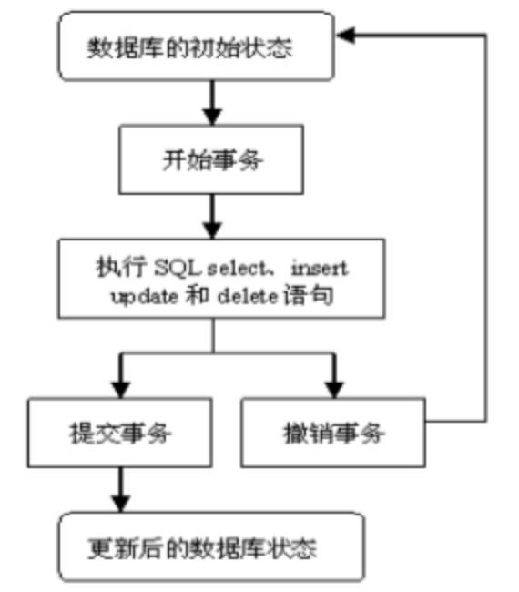
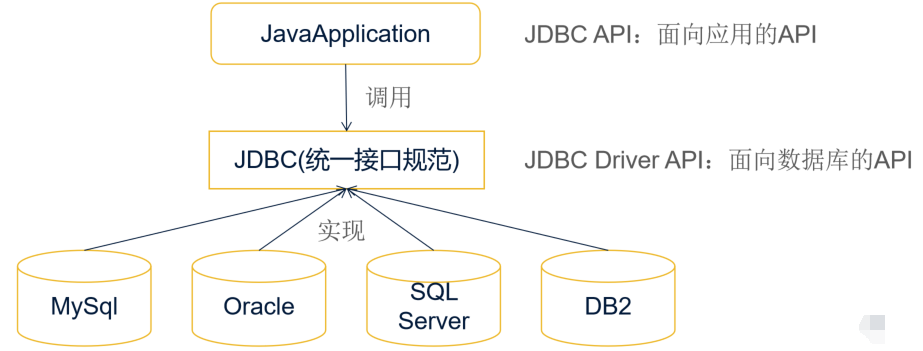
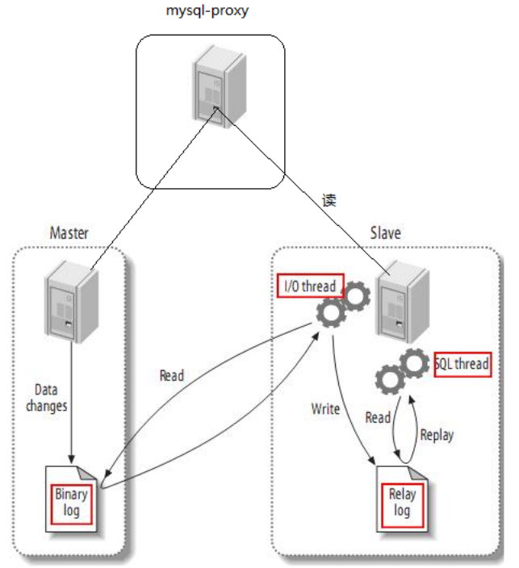

# [JAVA]-数据库知识点

[TOC]

## 数据库

### <1>数据库基础

#### 基础概念

##### 1>数据库的分类及常用的数据库

> <font color=red>数据库分为：关系型数据库和非关系型数据库</font>

关系型数据库：mysql、oracle、sqlserver等

非关系型数据库：redis、memcache、mogodb、hadoop等


##### 2>mysql数据库的默认的最大连接数？

​	100 ：为什么需要最大连接数？特定服务器上面的数据库只能支持一定数目同时连接，这时候我们一般都会设置最大连接数（最多同时服务多少连接）。在数据库安装时都会有一个默认的最大连接数为100

> 查看mysql的配置信息：

```xml
max_connections=100
```


##### 3>简述数据库的触发器的使用场景？

> <font color=red>触发器概念：被隐含执行的存储过程</font>

​	触发器：需要有触发条件，当条件满足以后做什么操作

​	触发器可以使用PL/SQL、JAVA、C等语言进行开发，当发生特定事件（例如修改表、建立对象、登录到数据库）时，Oracle会自动执行触发器的相应代码

​	<font color=blue>触发器是由触发事件、触发条件、触发操作三部分组成</font>


> <font color=red>触发器分类</font>

​	相对于外部程序、存储过程，触发器可以更快更高效的维护数据

​	BEFORE语句触发器、BEFORE行触发器、AFTER语句触发器、AFTER行触发器


> <font color=red>应用场景分析</font>

​	触发器应用场景：比如校内网、开心网、Facebook，发一个日志，自动通知好友，其实就是在增加日志时做一个后触发，再向通知表中写入条目。因为触发器效率高。而UCH没有用触发器，效率和数据处理能力都很低

​	每插入一个帖子，都希望将版面表中的最后发帖时间，帖子总数字段进行同步更新，用触发器做效率就很高（或者是指定员工在非工作时间不能进行相关操作）

```sql
create table board1(
    id int primary key auto_increment,
    name varchar(50),
    articleCount int
);

create table article1(
    id int primary key auto_increment,
    title varchar(50),
    bid int references board1(id)
);

delimiter |#把分割符;改成|
create trigger insertArticle_Trigger 
after insert on article1 for each row begin
    -> update board1 set articleCount=articleCount+1 where id= NEW.bid;
    -> end;
    -> |
delimiter ;

insert into board1 value (null,'test',0);
insert into article1 value(null,'test',1);
```


##### 4>存储过程和函数

> 存储过程

​	<font color=blue>存储过程用于执行特定操作。</font>如果在应用程序中经常需要执行特定的操作，可以基于这些操作建立一一个特定的过程。通过使用存储过程，不仅可以简化客户端应用程序的开发和维护，而且还可以提高应用程序的运行性能。

```sql
create or replace procedure proc_name
arg1 mode datatype,
arg2 mode datatype
is/as
pl/sql
```


> 函数

​	<font color=blue>函数用于返回特定数据。</font>如果在应用程序中经常需要通过执行SQL语句来返回特定数据，那么可以基于这些操作建立特定的函数。通过使用函数，不仅可以简化客户端应用程序的开发和维护。而且还可以提高应用程序的执行性能。建立函数的语法如下所示:

```sql
create or replace function fun_name
return datatype
is/as
pl/sql
```


> 应用场景分析

​	从参数的返回情况来看：如果返回多个参数值最好使用存储过程，如果只有一个返回值的话可以使用函数

​	从调用情况来看：如果在SQL语句(DML或SELECT)中调用的话一定是存储函数或存储的封装函数不可以是存储过程，但调用存储函数的时候还有好多限制以及函数的纯度等级的问题，如果是在过程化语句中调用的话，就要看你要实现什么样的功能。函数-般情况下是用来计算并返回一 个计算结果而存储过程一般是 用来完成特定的数据操作《比如修改、插入数据库表或执行某些DDL语句等等)。所以虽然他们的语法上很相似但用户在使用他们的时候所需要完成的功能大部分情况下是不同的


##### 5>简述数据库的存储过程的使用场景？

数据库存储过程具有如下优点：

​	存储过程只在创建时进行编译，以后每次执行存储过程都不需再重新编译，而一般 SQL 语句每执行一次就编译一次，因此使用存储过程可以大大提高数据库执行速度

​	通常，复杂的业务逻辑需要多条 SQL 语句。这些语句要分别地从客户机发送到服务器，当客户机和服务器之间的操作很多时，将产生大量的网络传输。如果将这些操作放在一个存储过程中，那么客户机和服务器之间的网络传输就会大大减少，降低了网络负载。（用以处理复杂业务逻辑，降低网络负载）

​	存储过程创建一次便可以重复使用，从而可以减少数据库开发人员的工作量

​	安全性高，存储过程可以屏蔽对底层数据库对象的直接访问，使用 EXECUTE 权限调用存储过程，无需拥有访问底层数据库对象的显式权限

​	正是由于存储过程的上述优点，目前常用的数据库都支持存储过程，例如 IBM DB2，Microsoft SQL Server，Oracle，Access 等，开源数据库系统 MySQL 也在 5.0 的时候实现了对存储过程的支持

> <font color=red>定义存储过程</font>

```sql
create procedure insert_Student (_name varchar(50),_age int ,out _id int)
begin
	insert into student value(null,_name,_age);
	select max(stuId) into _id from student;
end;

call insert_Student('wfz',23,@id);
select @id;
```


##### 5>Oracle数据库中的 BLOB 和 CLOB？ 

> <font color=red>基础概念</font>

​	BLOB（Binary Large Object-二进制大型对象）：用于存储数据库中的大型二进制对象，最大存储为 4G 字节 

​	CLOB（Character Large Object-字符大型对象）：与 LONG 数据类型类似，CLOB 用于存储数据库中的大型单字节字符数据块，不支持宽度不等的字符集，最大存储为 4G 字节 

> <font color=red>应用场景</font>

​	BLOB 和 CLOB 都是大字段类型，BLOB 是按二进制来存储的，而 CLOB 是可以直接存储文字。其实两个是可以互换的，或者可以直接用LOB字段代替这两个

​	为了更好的管理ORACLE 数据库，一般用BLOB字段来存储像图片、文件、音乐等信息，先将文件转为二进制再存储进去。用 CLOB 存储文章或者是较长的文字，对以后的查询更新、存储等操作都提供很大的方便


##### 6>什么是视图？

> <font color=red>视图的概念：</font>

​	<font color=blue>视图是一种虚表，是建立在已有表的基础上, 视图赖以建立的这些表称为基表</font>。向视图提供数据内容的语句为 SELECT 语句, 可以将视图理解为存储起来的 SELECT 语句。视图向用户提供基表数据的另一种表现形式通过一个视图透视一个数据，dba 的时候一条 sql 语句上千行，为了方便把查询的数据保存在视图中，下次直接从视图中查询数据 

> <font color=red>视图的优点： </font>简化复杂查询、限制数据访问、基表数据展示多样化

● 简单性

​	视图不仅可以简化用户对数据的理解，也可以简化他们的操作。那些被经常使 用的查询可以被定义为视图，从而使用户不必为以后的操作每次都指定全部的条件 

● 安全性

​	通过视图用户只能查询和修改他们所能见到的数据。数据库中的其他数据则既 看不见也取不到。数据库授权命令可以使每个用户对数据库的检索限制到特定的数据库对象 上，但不能授权到数据库特定行和特定的列上。通过视图，用户可以被限制在数据的不同子集上

● 逻辑数据独立性

​	视图可以使应用程序和数据库表在一定程度上独立。如果没有视图， 应用一定是建立在表上的。有了视图之后，程序可以建立在视图之上，从而程序与数据库表 被视图分割开来

> <font color=red>视图的缺点： </font>

● 性能

​	数据库必须把视图的查询转化成对基本表的查询，如果这个视图是由一个复杂的多表查询所定义，即使是视图的一个简单查询，数据库也把它变成一个复杂的结合体， 需要花费一定的时间

● 修改限制

​	当用户试图修改视图的某些行时，数据库必须把它转化为对基本表的某些行的修改。对于简单视图操作可行，但对于比较复杂的视图，修改操作存在相应限制


##### 7>什么是索引，怎样创建一个索引,索引使用的原则,有什么优点和缺点

> <font color=red>索引的概念和优势</font>

​	<font color=blue>索引是用来提高查询效率的数据库对象，使用索引可以快速定位数据，减少磁盘操作</font>

- 创建索引的时机（并不是索引越多越好，需根据具体业务情况建立合适的索引）

- 限制索引（在开发SQL中存在许多“陷阱”使得索引失效


​	一种独立于表模式的对象 可以存储在于表不同的磁盘表空间

​	索引被删除或者被破坏不会对表产生影响，只会影响查询速度

​	索引一旦创建完毕 oracle 管理系统会对其自动维护，而且 oracle 管理系统决定何时使 用什么索引，且用户不需要在查询语句中指定使用哪个索引

​	在删除一个表的时候所有基于该表的索引都会被自动删除

​	通过指针加速oracle服务器的查询速度

​	通过快速定位的方法检索磁盘 I/O 

 

> <font color=red>索引的分类</font>

a.唯一性索引和非唯一性索引 

​	按照索引字段是否允许出现重复

b.单字段索引和联合索引   

​	按照字段基于索引的数目 

c.普通索引和函数索引  

​	按照索引所基于的是普通字段还是复合表达式 

d.B树索引和位图索引  

​	按照索引的数据结构划分 B 树索引(B*Tree) 和位图索引(Bitmap) 

 

> <font color=red>索引创建原则</font>

​	表的主键、外键必须有索引； 

​	数据量超过 300 的表应该有索引； 

​	经常与其他表进行连接的表,在连接字段上应该建立索引； 

​	经常出现在 Where 子句中的字段,特别是大表的字段,应该建立索引； 

​	索引应该建在选择性高的字段上； 

​	索引应该建在小字段上,对于大的文本字段甚至超长字段,不要建索引；

​	复合索引的建立需要进行仔细分析；尽量考虑用单字段索引代替：   

​		正确选择复合索引中的主列字段,一般是选择性较好的字段；   

​		复合索引的几个字段是否经常同时以 AND 方式出现在 Where 子句中?单字段查询是否极少甚至没有?如果是,则可以建立复合索引；否则考虑单字段索引；  

​		如果复合索引中包含的字段经常单独出现在 Where 子句中,则分解为多个单字段索引；

​		如果复合索引所包含的字段超过 3 个,那么仔细考虑其必要性,考虑减少复合的字段；   

​	如果既有单字段索引,又有这几个字段上的复合索引,一般可以删除复合索引； 8、频繁进行数据操作的表,不要建立太多的索引； 

​	删除无用的索引,避免对执行计划造成负面影响； 


##### 8>数据库中BLOB和CLOB概念

​	BLOB （Binary Large Object：二进制大型对象)。它用于存储数据库中的大型二进制对象。可存储的最大大小为 4G 字节

​	CLOB （Character Large Object：字符大型对象)。它与 LONG 数据类型类似，只不过 CLOB 用于存储数据库中的大型单字节字符数据块，不支持宽度不等的字符集。可存储的最大大小为 4G 字节

​	BLOB 和 CLOB 都是大字段类型，BLOB 是按二进制来存储的，而 CLOB 是可以直接存储文字的。其实两个是可以互换的的，或者可以直接用 LOB 字段代替这两个。

​	一般情况下为了更好的管理 ORACLE 数据库，通常用 BLOB 字段来存储图片、文件、音乐等信息，先将文件转为二进制再存储进去。用 CLOB 存储文章或者是较长的文字（varchar2 最大4000），对后续的查询更新存储等操作都提供很大的方便


#### SQL相关

##### 1>SQL语言分类

> <font color=red>SQL 语言共分为四大类</font>

DML（数据操纵语言）语句：insert、update、delete、select  

DDL（数据定义语言）语句：create、alter、drop 

TCL（事物控制语言）语句：commit、savepoint 、roallback 

DCL（数据控制语言）语句：grant、revoke 


##### 2>如何判断数据库中某个字段是空值

> <font color=red>用“is null”进行判断</font>

```sql
-- 查找员工表employee中manager_id为null的员工id与姓名
select e.employee_id,e.employee_name
from employee e
where e.manager_id is null;
```


##### 3>SQL注入攻击概念

```sql
-- 常见users表进行SQL测试
create table users(
	id number(10) primary key,
    username varchar2(20) not null,
    password varchar2(20) not null
);
insert into users values(1,'haha','haha');
```

> <font color=red>Statement、PreparedStatement处理</font>

```java
public class SqlInjectionTest {
	public static void main(String[] args) throws Throwable {
		/**
		 * 输入错误的用户名、密码进行测试
		 */
		String username = "a ' or password= ";
		String password = " or '1'='1";
		//非法测试
		illegalLogin(username, password);//通过（错误）
		//合法测试
		normalLogin(username, password);//失败（正确）
	}
	/**
	 * sql注入攻击问题 
	 * 用户登录问题： 
	 * 用户输入错误的用户名或密码也能够登录成功
	 * @throws Exception
	 */
	public static void illegalLogin(String username, String password)
			throws Exception {
		/**
		 * 问题分析： 
		 * 使用Statement对象执行sql语句 sql语句是通过拼接随后再执行的，
		 * 因此数据库可能会辨识出不同的内容，从而导致二义性，即便是不存在的
		 * 用户名或密码也能够成功通过 检测，得到错误的信息
		 */
		// 编写sql语句
		String sql = "select * from users where username='" + username
				+ "' and password='" + password + "'";
		System.out.println(sql);
		// 获取数据库连接
		Connection conn = JDBCUtils.getConnection();
		// 创建Statement对象并执行sql语句
		Statement st = conn.createStatement();
		// 创建ResultSet接受结果集
		ResultSet rs = st.executeQuery(sql);
		// 判断结果是否存在
		if (rs.next()) {
			System.out.println(rs.getInt(1)+rs.getString(2)+rs.getString(3));
			System.out.println("登录成功...");
		} else {
			
			System.out.println("登录失败...");
		}
		//关闭连接
		JDBCUtils.freeAll(conn, st, rs);
	}

	public static void normalLogin(String username, String password) throws Exception {
		/**
		 * 问题解决： 
         * 使用PreparedStatement进行优化 PreparedStatement会对sql语句进行预编译
		 * 因此传入的username、password是直接作为整个内容传入， 
         * 而非通过拼接进行操作，因此不会具有二义性
		 */
		// 编写sql语句
		String sql = "select * from users where username=? and password=?";
		// 获取数据库连接
		Connection conn = JDBCUtils.getConnection();
		// 创建Statement对象并执行sql语句,传入相应的参数
		PreparedStatement ps = conn.prepareStatement(sql);
		ps.setString(1, username);
		ps.setString(2, password);
		// 创建ResultSet接受结果集
		ResultSet rs = ps.executeQuery();
		// 判断结果是否存在
		if(rs.next()) {
			System.out.println("登录成功...");
		} else {
			System.out.println("登录失败...");
		}
		//关闭连接
		JDBCUtils.freeAll(conn, ps, rs);
	}
}
```


##### 4>having、where、group by 的正确执行顺序是？

```sql
-- 根据部门分组，且最大工资大于 10000 的部门
select e.department_id,max(e.salary) 
from employees e 
where [cond]
group by e.department_id  
having max(e.salary)>10000 
```


##### 5>列级别的约束和表级别的约束

列级约束：列级约束是行定义的一部分，只能应用于一列上

表级约束：表级约束是独立于列的定义，可以应用在一个表中的多列上 

一张表只能建立一个主键约束，not null  只能在列级定义；其它 4 种既可以在列级定义，也可以在表级定义； 

复合主键约束只能在表级定义

```sql
create table table1(xx int,no int,name varchar2(10) primary key) 
create table table2(xx int,no int,name varchar2(10) ,primary key (no,name)) 
```


##### 6>count(*)、count(指定列)的区别

```sql
-- 统计所有数据记录:关心的是总记录数
select count(*) from tbName;

-- 统计指定字段记录数:关心的是该字段当中有多少个非空记录
select count(fieldName) from tbName;
```


##### 7>根据指定需求建表

​	创建 CUSTOMERS 表，字段为：ID：（非空，主键）bigint，NAME：（非空）varchar， AGE：int 类型；创建 ORDERS 表，字段为：ID：（非空，主键，）bigint，ORDER_NUMBER： （非空）varchar，PRICE：double，CUSTOMER_ID ：（外键）bigint，设置级连删除；

```sql
-- 创建customers表
create table CUSTOMBERS(   
	ID bigint not null,   
	NAME varchar(15),   
	AGE int,   
	primary key (ID)   
	); 
-- 创建orders表
create table ORDERS( 
	ID bigint not null, 
	ORDER_NUMBER varchar(15) not nulll, 
	PRICE double precision,
	CUSTOMER_ID bigint,         
	primary key(ID)
	); 
 -- 创建外键	
alter table ORDERS add constraint FK_CUSTOMER 
	  foreign key (CUSTOMER_ID) references CUSTOMERS(ID) 
	  on delete cascade;
```


##### 8>delete from table、truncate table table、drop table 的区别

truncate（DDL）：对整张表进行操作，删除后不可以进行回滚； 

delete（DML）：只是将被删除的记录标志为不可用，可以选择性地删除表中的记录，删除后可以回滚

drop table（DDL）：用途是将表从数据库中删除，删除之后不可以恢复


##### 常用SQL语句、语法概念


#### 数据库事务

##### 1>事务相关的四个重要的基础概念

###### 什么是事务？

​	数据库事务(Database Transaction) ，是指作为单个逻辑工作单元执行的一系列操作，要么完全地执行，要么完全地不执行。事务的完成由若干个DML语句组成的。

​	在数据库中,所谓事务是指一组逻辑操作单元,使数据从一种状态变换到另一种状态

​	为确保数据库中数据的一致性,数据的操纵应当是离散的成组的逻辑单元:当它全部完成时,数据的一致性可以保持,而当这个单元中的一部分操作失败,整个事务应全部视为错误,所有从起始点以后的操作应全部回退到开始状态

​	事务的操作:先定义开始一个事务,然后对数据作修改操作,这时如果提交(COMMIT),这些修改就永久地保存下来,如果回退(ROLLBACK),数据库管理系统将放弃所作的所有修改而回到开始事务时的状态


###### 事务四大特性（ACID）

​	<font color=red>事务是并发控制的单位，是用户定义的一个操作序列。这些操作要么都做，要么都不做，是一个不可分割的工作单位</font>

> <font color=blue>原子性(Atomicity)</font>

​	指事务在逻辑上是不可分割的操作单元，所有的语句要么都执行成功，要么都执行失败并进行撤销。

> <font color=blue>一致性(Consistency)</font>

​	从一个状态转换为另外一个状态

​	事务应确保数据库的状态从一个一致状态转变为另一个一致状态。一致状态的含义是数据库中的数据应满足完整性约束

> <font color=blue>隔离性(Isolation)</font>

​	隔离性是针对并发而言。所谓的并发是指数据库服务器同时执行多个事务，如果在执行的过程中不采取有效的专门控制机制，并发事务之间会发生相互干扰

隔离性就是隔离并发运行的多个事务避免产生相互影响

> <font color=blue>持久性(Durability)</font>

​	事务一旦提交对数据的修改就是持久性的，数据已经从内存转移到了外部服务器上，并执行了固化的步骤


eg：一个转账必须 A账号扣钱成功，B账号加钱成功，才算正真的转账成功

事务必须满足四大特征:原子性、一致性、隔离性、持久性/持续性

- 原子性：表示事务内操作不可分割。要么都成功、要么都是失败

- 一致性：要么都成功、要么都是失败.后面的失败了要对前面的操作进行回滚

- 隔离性：一个事务开始后，不能后其他事务干扰

- 持久性/持续性：表示事务开始了，就不能终止


###### 在数据库中由并发导致的各种问题包含哪些?

> 由于数据库的隔离性导致的并发问题包括以下内容

​	对于同时运行的多个事务，当这些事务访问数据库中相同的数据，如果没有采取必要的隔离机制将会导致各种并发问题。

> <font color=blue>脏读</font> 

​	对于两个事务T1,T2 。 T1读取了已经被T2更新但是还没有提交的字段之后，如果T2发生了回滚，T1读取的内容就是无效的。

> <font color=blue>不可重复读</font>

​	对于两个事务T1，T2。T1读了一个字段，然后T2更新了该字段之后，T1再次读取同一个字段，两次读取的值就是不同的。

> <font color=blue>幻读(虚读)</font>

​	对于两个事务T1,T2  T1从一个表中读取一个字段，然后T2在该表中插入一个新的行之后，如果T1再次读取这个表发现数据行数变多。

> <font color=blue>丢失更新</font>

​	是第一次提取的内容被第二次提交的内容进行了覆盖


###### 为了解决以上问题设计了哪些隔离级别详细解释?

​	为了解决并发问题 数据库定义了四种隔离级别。隔离级别越高效率越慢，根据业务选择一个合适的隔离级别，在性能和安全上做平衡。

> <font color=blue>read_uncommitted：读未提交的数据</font>

​	允许事务读取未被其他事务提交的变更，脏读，不可重复读，（虚读）幻读问题都会出现

> <font color=blue>read_commited：读已提交的数据</font>

​	只允许事务读取已经被其他事务提交的变更，可以避免脏读，但是不可重复读和幻读依然存在

> <font color=blue>Repeatableread：可重复读</font>

​	确保事务可以多次从一个字段中读取相同的值，这个事务存在期间，禁止其他事务对这个字段进行更新，可以避免脏读，不可重复读但是幻读依然存在

> <font color=blue>Serializable：串行化</font> 

​	确保可以从一个表中读取相同的行，这个事务存在期间禁止其他事务对该表进行插入、更新和删除操作。所有的并发问题都可以避免，但是性能十分低下


​	丢失更新：主要是使用乐观锁和悲观锁解决丢失更新。

<font color=red>并不是所有的数据库都支持这四种隔离级别</font>

​	Oracle支持两种隔离级别 `read_commited` 、`Serializable`,默认的隔离级别是`read_commited`

​	Mysql支持四种隔离级别 mysql的默认隔离级别是`repeatableread`


##### 2>简述数据库事务的生命周期




##### 3>如何理解数据库事务？

​	在数据库中,所谓事务是指一组逻辑操作单元,使数据从一种状态变换到另一种状态

​	为确保数据库中数据的一致性,数据的操纵应当是离散的成组的逻辑单元：当它全部完成时,数据的一致性可以保持,而当这个单元中的一部分操作失败,整个事务应全部视为错误,所有从起始点以后的操作应全部回退到开始状态

​	事务的操作：先定义开始一个事务,然后对数据作修改操作,这时如果提交(COMMIT),这些修改就永久地保存下来,如果回退(ROLLBACK),数据库管理系统将放弃所作的所有修改而回到开始事务时的状态。


#### 分页技术

##### 1>数据分页实现

​	分页：是一种将所有数据分段展示给用户的技术

> <font color=red>mysql分页：</font>

```sql
java实现：
select * from tbName order by id limit [pageSize*(pageNumber-1)],[pageSize];
```


> <font color=red>oracle分页：伪列概念（rownum）</font>

```sql
select * 
from (select *,rownum rid 
      from (select * from tbName order by postime desc) 
      where rid<=[pagesize*pagenumber])as t 
	 where t>[pageSize*(pageNumber-1)];
	 
	 
select targetTb.*
from (
	select rownum rid,tb.*
	from (过滤后的数据集合) tb
)targetTb
where targetTb.rid > 1 
```


##### 2>大数据量下的分页解决方法

​	利用 sql 语句进行分页，这样每次查询出的结果集中就只包含某页的数据内容。在sql 语句无法实现分页的情况下，可以考虑对大的结果集通过游标定位方式来获取某页的数据


#### JDBC概念

##### 1>对JDBC的理解

​	<font color=red>JDBC(Java Database Connectivity)是一个独立于特定数据库管理系统、通用的SQL数据库存取和操作的公共接口（一组API）</font>，定义了用来访问数据库的标准Java类库，使用这个类库可以以一种标准的方法、方便地访问数据库资源。JDBC为访问不同的数据库提供了一种统一的途径，使得Java程序员使用JDBC可以连接任何提供了JDBC驱动程序的数据库系统，从而简化学习过程，加快开发过程




​	JDBC驱动提供了特定厂商对`JDBC API`接口类的实现，其需提供java.sql包下面这些类的实现：`Connection`、`Statement`、`PreparedStatement`、`CallableStatement`、`ResultSet`、`Driver`


##### 2>JDBC连接数据库

```properties
Oracle实现：
加载驱动：com.mysql.jdbc.Driver,oracle.jdbc.driver.OracleDriver
	通过Class.forName()载入跟数据库建立连接的驱动
获取连接：DriverManager.getConnection(url,usernam,passord)
设置参数：Statement PreparedStatement 
        cstmt.setXXX(index, value);
执行操作：executeQuery executeUpdate
释放连接(是否连接要从小到大，必须放到finally)
```

> <font color=red>1.加载JDBC驱动程序：</font>

​	在连接数据库之前，首先要加载想要连接的数据库的驱动到 JVM（Java 虚拟机），这通过 `java.lang.Class` 类的静态方法 `forName(String  className)`实现。成功加载后，会将 Driver 类的实例注册到 DriverManager 类中

> <font color=red>2.提供 JDBC 连接的 URL</font>

连接 URL 定义了连接数据库时的协议、子协议、数据源标识：<font color=blue>书写形式：协议：子协议：数据源标识</font>

​	协议：在 JDBC 中总是以 jdbc 开始     

​	子协议：是桥连接的驱动程序或是数据库管理系统名称

​	数据源标识：标记找到数据库来源的地址与连接端口

> <font color=red>3.创建数据库的连接</font>

​	要连接数据库，需要向`java.sql.DriverManager`请求并获得Connection 对象（数据库连接对象）	

​	使用 `DriverManager` 的 `getConnection(String url , String username , String password )`方法传入指定的欲连接的数据库的路径、数据库的用户名和密码来获得

> <font color=red>4.创建一个 Statement</font>

​	要执行 SQL 语句，必须获得 java.sql.Statement 实例，Statement 实例分为以下 3 种类型：      

​	<font color=blue>Statement 实例：执行静态 SQL 语句</font>

```java
Statement stmt = con.createStatement() ; 
```

​	<font color=blue>PreparedStatement 实例：执行动态 SQL 语句</font>

```
PreparedStatement pstmt = con.prepareStatement(sql) ;    
```

​	<font color=blue>CallableStatement 实例：执行数据库存储过程</font>

```
CallableStatement cstmt =  con.prepareCall("{CALL demoSp(? , ?)}") ; 
```

> <font color=red>5.执行 SQL 语句</font>     

​	Statement 接口提供了三种执行 SQL 语句的方法：`executeQuery` 、`executeUpdate` 、`execute`

| 语句                                       | 说明                                                         |
| ------------------------------------------ | ------------------------------------------------------------ |
| `ResultSet executeQuery(String sqlString)` | 执行查询数据库的 SQL 语句，返回一个结果集（ResultSet）对象   |
| `int executeUpdate(String sqlString)`      | 用于执行insert、update、delete及DDL 语句<br />如：create table 和 drop table 等 |
| `execute(sqlString)`                       | 用于执行返回多个结果集、多个更新计数或二者组合的       语句  |

​	具体实现的代码： 

```java
ResultSet rs = stmt.executeQuery("SELECT * FROM ...") ;        
int rows = stmt.executeUpdate("INSERT INTO ...") ;        
boolean flag = stmt.execute(String sql) ; 
```

> <font color=red>6.处理结果</font>    

两种情况：     

​	执行更新返回的是本次操作影响到的记录数    

​	执行查询返回的结果是一个 ResultSet 对象 

ResultSet 包含符合 SQL 语句中条件的所有行，并且它通过一套 get 方法提供了对这些行中数据的访问  

```java
// 使用结果集（ResultSet）对象的访问方法获取数据：
while(rs.next()){            
 	String name = rs.getString("name") ;        
	String pass = rs.getString(1) ; // 此方法比较高效         
}  
// 列是从左到右编号的，并且从列1开始
```

> <font color=red>7.关闭 JDBC 对象</font>     

​	操作完成以后要把所有使用的 JDBC 对象全都关闭，以释放 JDBC 资源，关闭顺序和声明顺序相反：    

```properties
a.关闭记录集
b.关闭声明  
c.关闭连接对象
```

 

##### 3>JDBC中的PreparedStatement相比Statement的好处

使用PreparedStatement代替Statement

- PreparedStatement是预编译的，比Statement速度快 

- 代码的可读性和可维护性
- 安全性：SQL注入攻击概念

```java
stmt.executeUpdate("insert into tb_name (col1,col2,col2,col4) values ('"+var1+"','"+var2+"',"+var3+",'"+var4+"')"); 
perstmt = con.prepareStatement("insert into tb_name (col1,col2,col2,col4) values (?,?,?,?)");
perstmt.setString(1,var1);
perstmt.setString(2,var2);
perstmt.setString(3,var3);
perstmt.setString(4,var4);
perstmt.executeUpdate();
```

​	PreparedStatement可以防止SQL注入攻击，而Statement却不能，分析如下

```sql
String sql = "select * from tb_name where name= '"+varname+"' and passwd='"+varpasswd+"'";
```

​	varname：参数随意，varpasswd：`[' or '1' = '1]`，生成sql

```sql
select * from tb_name = '随意' and passwd = '' or '1' = '1';
```

​	分析上述语句，如果后台没有作相应控制，上述语句可通过验证，如果将`[';drop table tb_name;]`作为varpasswd传入进来，生成sql可能会对数据库造成攻击

```sql
select * from tb_name = '随意' and passwd = '';drop table tb_name;
```


​	如果使用预编译语句传入的任何内容就不会和原来的语句发生任何匹配的关系，而如果使用普通的statement,有可能要对drop等操作作过滤


##### 4>用jdbc怎么调用存储过程？

```properties
Jdbc连接数据库步骤
- 加载驱动、获取连接、设置参数、执行、释放连接
```

```java
public class JdbcTest {
	public static void main(String[] args) {
		Connection cn = null;
		CallableStatement cstmt = null;		
		try {
			// 设定数据库驱动
			Class.forName("com.mysql.jdbc.Driver");
			// 创建数据库连接
			//cn = ds.getConnection();			
			cn = DriverManager.getConnection("jdbc:mysql:///test","root","root");
			cstmt = cn.prepareCall("{call insert_Student(?,?,?)}");
			cstmt.registerOutParameter(3,Types.INTEGER);
			cstmt.setString(1, "wangwu");
			cstmt.setInt(2, 25);
			cstmt.execute();
			// get第几个，不同的数据库不一样，建议不写
			System.out.println(cstmt.getString(3));
		} catch (Exception e) {
			// TODO Auto-generated catch block
			e.printStackTrace();
		}
		finally
		{

			/*try{cstmt.close();}catch(Exception e){}
			try{cn.close();}catch(Exception e){}*/
			try {
				if(cstmt != null)
					cstmt.close();
				if(cn != null)				
					cn.close();
			} catch (SQLException e) {
				// TODO Auto-generated catch block
				e.printStackTrace();
			}
		}
	}
}
```


##### 5>JDBC批量插入几百万数据

> <font color=red>实现思路</font>

将多次提交设为一次

使用批量操作

亦可考虑借助存储过程实现数据操作


#### RMI概念

##### 1>什么是RMI？

​	Java远程方法调用(Java RMI)是Java API对远程过程调用(RPC)提供的面向对象的等价形式，支持直接传输序列化的Java对象和分布式垃圾回收。远程方法调用可以看做是激活远程正在运行的对象上的方法的步骤。RMI对调用者是位置透明的，因为调用者感觉方法是执行在本地运行的对象上的。


##### 2>RMI体系结构的基本原则是什么？

​	RMI体系结构是基于一个非常重要的行为定义和行为实现相分离的原则。RMI允许定义行为的代码和实现行为的代码相分离，并且运行在不同的JVM上。


##### 3>RMI体系结构分哪几层？

​	RMI体系结构分以下几层：

​	存根和骨架层(Stub and Skeleton layer)：这一层对程序员是透明的，它主要负责拦截客户端发出的方法调用请求，然后把请求重定向给远程的RMI服务。

​	远程引用层(Remote Reference Layer)：RMI体系结构的第二层用来解析客户端对服务端远程对象的引用。这一层解析并管理客户端对服务端远程对象的引用。连接是点到点的。

​	传输层(Transport layer)：这一层负责连接参与服务的两个JVM。这一层是建立在网络上机器间的TCP/IP连接之上的。它提供了基本的连接服务，还有一些防火墙穿透策略。


##### 4>RMI中的远程接口(Remote Interface)扮演了什么样的角色？

​	远程接口用来标识哪些方法是可以被非本地虚拟机调用的接口。远程对象必须要直接或者是间接实现远程接口。实现了远程接口的类应该声明被实现的远程接口，给每一个远程对象定义构造函数，给所有远程接口的方法提供实现。


##### 5>java.rmi.Naming类扮演了什么样的角色？

java.rmi.Naming类用来存储和获取在远程对象注册表里面的远程对象的引用。Naming类的每一个方法接收一个URL格式的String对象作为它的参数。


##### 6>RMI的绑定(Binding)是什么意思？

绑定是为了查询找远程对象而给远程对象关联或者是注册以后会用到的名称的过程。远程对象可以使用Naming类的bind()或者rebind()方法跟名称相关联。


##### 7>Naming类的bind()和rebind()方法有什么区别？

bind()方法负责把指定名称绑定给远程对象，rebind()方法负责把指定名称重新绑定到一个新的远程对象。如果那个名称已经绑定过了，先前的绑定会被替换掉。


##### 8>让RMI程序能正确运行有哪些步骤？

为了让RMI程序能正确运行必须要包含以下几个步骤：

ü 编译所有的源文件

ü 使用rmic生成stub

ü 启动rmiregistry

ü 启动RMI服务器

ü 运行客户端程序


##### 9>RMI的stub扮演了什么样的角色？

​	远程对象的stub扮演了远程对象的代表或者代理的角色。调用者在本地stub上调用方法，它负责在远程对象上执行方法。当stub的方法被调用的时候，会经历以下几个步骤：

ü 初始化到包含了远程对象的JVM的连接

ü 序列化参数到远程的JVM

ü 等待方法调用和执行的结果

ü 反序列化返回的值或者是方法没有执行成功情况下的异常

ü 把值返回给调用者


##### 10>什么是分布式垃圾回收(DGC)？它是如何工作的？

​	DGC叫做分布式垃圾回收。RMI使用DGC来做自动垃圾回收。因为RMI包含了跨虚拟机的远程对象的引用，垃圾回收是很困难的。DGC使用引用计数算法来给远程对象提供自动内存管理。


##### 11>RMI中使用RMI安全管理器(RMISecurityManager)的目的是什么？

​	RMISecurityManager使用下载好的代码提供可被RMI应用程序使用的安全管理器。如果没有设置安全管理器，RMI的类加载器就不会从远程下载任何的类。


##### 12>解释下Marshalling和demarshalling

​	当应用程序希望把内存对象跨网络传递到另一台主机或者是持久化到存储的时候，就必须要把对象在内存里面的表示转化成合适的格式。这个过程就叫做Marshalling，反之就是demarshalling。


##### 13>解释下Serialization和Deserialization

​	Java提供了一种叫做对象序列化的机制，他把对象表示成一连串的字节，里面包含了对象的数据，对象的类型信息，对象内部的数据的类型信息等等。因此，序列化可以看成是为了把对象存储在磁盘上或者是从磁盘上读出来并重建对象而把对象扁平化的一种方式。反序列化是把对象从扁平状态转化成活动对象的相反的步骤


#### 数据库连接池相关

##### 1>数据库连接池概念

​	像打开关闭数据库连接这种和数据库的交互可能是很费时的，尤其是当客户端数量增加的时候，会消耗大量的资源，成本是非常高的。可以在应用服务器启动的时候建立很多个数据库连接并维护在一个池中。连接请求由池中的连接提供。在连接使用完毕以后，把连接归还到池中，以用于满足将来更多的请求。

​	远程方法调用(RMI)


##### 2>数据库连接池的实现及原理

> <font color=red>数据库连接池：</font>

​	为解决传统开发中的数据库连接问题，可以采用数据库连接池技术

​	<font color=blue>数据库连接池的基本思想就是为数据库连接建立一个“缓冲池”</font>。预先在缓冲池中放入一定数量的连接，当需要建立数据库连接时，只需从“缓冲池”中取出一个，使用完毕之后再放回去

​	<font color=blue>数据库连接池负责分配、管理和释放数据库连接</font>，它允许应用程序重复使用一个现 有的数据库连接，而不是重新建立一个

​	数据库连接池在初始化时将创建一定数量的数据库连接放到连接池中，这些数据库连接的数量是由最小数据库连接数来设定的。无论这些数据库连接是否被使用，连接池都将一直保证至少拥有这么多的连接数量。连接池的最大数据库连接数量限定了这个连接池能占有的最大连接数，当应用程序向连接池请求的连接数超过最大连接数量时，这些请求将被加入到等待队列中


> <font color=red>数据库连接池作用</font>

​	优势：连接复用。通过建立一个数据库连接池以及一套连接使用管理策略，使得一个数据库连接可以得到高效、安全的复用，避免了数据库连接频繁建立、关闭的开销。连接池技术尽可能多地重用了消耗内存地资源，大大节省了内存，提高了服务器地服务效率，能够支持更多的客户服务。通过使用连接池，将大大提高程序运行效率，同时，我们可以通过其自身的管理机制来监视数据库连接的数量、使用情况等 

- <font color=blue>资源重用： </font>

​	由于数据库连接得以重用，避免了频繁创建，释放连接引起的大量性能开销。 在减少系统消耗的基础上，另一方面也增加了系统运行环境的平稳性

- <font color=blue>更快的系统反应速度：</font>

​	数据库连接池在初始化过程中，往往已经创建了若干数据库连接置于连接池 中备用。此时连接的初始化工作均已完成。对于业务请求处理而言，直接利 用现有可用连接，避免了数据库连接初始化和释放过程的时间开销，从而减少了系统的响应时间

- <font color=blue>新的资源分配手段 ：</font>

​	对于多应用共享同一数据库的系统而言，可在应用层通过数据库连接池的配 置，实现某一应用最大可用数据库连接数的限制，避免某一应用独占所有的 数据库资源

- <font color=blue>统一的连接管理，避免数据库连接泄露：</font>

​	在较为完善的数据库连接池实现中，可根据预先的占用超时设定，强制回收 被占用连接，从而避免了常规数据库连接操作中可能出现的资源泄露


##### 数据库连接池作用

```
1、限定数据库的个数，不会导致由于数据库连接过多导致系统运行缓慢或崩溃
2、数据库连接不需要每次都去创建或销毁，节约了资源
3、数据库连接不需要每次都去创建，响应时间更快。
```


### <2>数据库分类

#### MySQL

##### 1>说一下数据库的事务隔离？

##### 2>说一下 mysql 常用的引擎？

##### 3>说一下 mysql 的行锁和表锁？

##### 4>说一下乐观锁和悲观锁？

##### 5>mysql 问题排查都有哪些手段？

##### 6>如何做 mysql 的性能优化？

##### 7>怎么验证 mysql 的索引是否满足需求？

##### 8>数据库的三范式是什么？

##### 9>说一下 ACID 是什么？

##### 10>如何获取当前数据库版本？


#### Oracle


### <3>数据库应用

#### 数据库设计

##### 1>项目中如何设计数据库？需要考虑哪些情况？

> <font color=red>数据库的设计步骤：</font>

​	需求分析：了解用户的数据需求、处理需求、安全性及完整性要求； 

​	概念设计：通过数据抽象,设计系统概念模型,一般为 E-R 模型； 

​	逻辑结构设计：设计系统的模式和外模式,对于关系模型主要是基本表和视图； 

​	物理结构设计：设计数据的存储结构和存取方法,如索引的设计； 

​	系统实施：组织数据入库、编制应用程序、试运行； 

​	运行维护：系统投入运行,长期的维护工作；

 

> <font color=red>设计时应注意的问题和考虑的情况： </font>

- <font color=blue>规范命名</font>

​	所有的库名、表名、域名必须遵循统一的命名规则,并进行必要说明,以方便设 计、维护、查询

- <font color=blue>控制字段的引用</font>

​	在设计时,可以选择适当的数据库设计管理工具,以方便开发人员的分布 式设计和数据小组的集中审核管理

- <font color=blue>考虑到效率和优化问题</font>

​	一开始就要分析哪些表会存储较多的数据量，对于数据量较大的表的设计往往是粗粒 度的，也会冗余一些必要的字段，已达到尽量用最少的表、最弱的表关系去存储海量的数据。 并且在设计表时，一般都会对主键建立聚集索引，含有大数据量的表更是要建立索引以提供 查询性能。对于含有计算、数据交互、统计这类需求时，还要考虑是否有必要采用存储过程

- <font color=blue>添加必要的（冗余）字段 </font>

​	像“创建时间”、“修改时间”、“备注”、“操作用户 IP”和一些用于其他需求（如统计）在每张表中必须都要有，不是说只有系统中用到的数据才会存到数据库中，一些冗余字段是为了便于日后维护、分析、拓展而添加的 

- <font color=blue>设计合理的表关联</font>

​	若多张表之间的关系复杂，建议采用第三张映射表来关联维护两张表之间的关系，以降 低表之间的直接耦合度。若多张表涉及到大数据量的问题，表结构尽量简单，关联也要尽可能避免 

- <font color=blue>选择合适的主键生成策略</font>

​	结合实际项目应用选择合适的主键生成策略


#### 数据库优化

##### 1>数据库优化方面的经验

​	用 PreparedStatement一般来说比 Statement 性能高：一个 sql 发给服务器去执行，涉及步骤：语法检查、语义分析，编译，缓存

​	有外键约束会影响插入和删除性能，如果程序能够保证数据的完整性，那在设计数据库时就去掉外键

​	表中允许适当冗余（外键数据冗余则需要考虑数据的同步性） 

​	使用子查询代替关联查询, 下面子查询语句要比第二条关联查询的效率高

```sql
-- 语句1
select e.name,e.salary
where e.managerid=(select id from employee where name='xxxx'); 

-- 语句2
select e.name,e.salary,m.name,m.salary 
from employees e,employees m 
where e.managerid = m.id and m.name='xxxx';  
```

​	sql 语句全部大写，特别是列名和表名都大写。特别是 sql 命令的缓存功能，更加需要统 一大小写。 

​	合理建立索引改善查询性能。ORACLE 使用了一个复杂的自平衡 B-tree 结构. 通常,通过索 引查询数据比全表扫描要快. 当 ORACLE 找出执行查询和 Update 语句的最佳路径时, ORACLE 优化器将使用索引 


a) 创建索引:创建合适的索引，我们就可以现在索引中查询，查询到以后直接找对应的记录。

b) 分表  ：当一张表的数据比较多或者一张表的某些字段的值比较多并且很少使用时，采用水平分表和垂直分表来优化

c) 读写分离：当一台服务器不能满足需求时，采用读写分离的方式进行集群。

d) 缓存:使用redis来进行缓存

e) 一些常用优化技巧


##### 2>数据库优化之遵循范式？

范式就是规范，就是关系型数据库在设计表时，要遵循的三个规范

<font color=red>要想满足第二范式必须先满足第一范式，要满足第三范式必须先满足第二范式</font>

​	<font color=red>列数据的不可分割</font>：第一范式（1NF）是指数据库表的每一列都是不可分割的基本数据项，同一列中不能有多个值，即实体中的某个属性不能有多个值或者不能有重复的属性

​	<font color=red>主键</font>：第二范式（2NF）要求数据库表中的每个行必须可以被唯一地区分。为实现区分通常需要为表加上一个列，以存储各个实例的唯一标识

 	<font color=red>外键</font>：满足第三范式（3NF）必须先满足第二范式（2NF）。简而言之，第三范式（3NF）要求一个数据库表中不包含已在其它表中已包含的非主关键字信息

​	反三范式：有时候为了提高运行效率，可适当保留冗余数据，<font color=red>设置重复或者可以推导出的字段</font>（订单（总价）和订单项（单价））（降低范式：增加字段，允许冗余）


##### 3>数据库优化之选择合适的存储引擎

在开发中，经常使用的存储引擎 myisam / innodb/ memory

MyISAM存储引擎

​	如果表对事务要求不高，同时是以查询和添加为主的，我们考虑使用myisam存储引擎. 比如 bbs 中的 发帖表，回复表

INNODB存储引擎

​	对事务要求高，保存的数据都是重要数据，我们建议使用INNODB,比如订单表，账号表

Memory 存储

​	我们数据变化频繁，不需要入库，同时又频繁的查询和修改，考虑使用memory, 速度极快


问 MyISAM 和 INNODB的区别(主要)

\1. 事务安全 myisam不支持事务而innodb支持

\2. 查询和添加速度 myisam不用支持事务就不用考虑同步锁，查找和添加和添加的速度快

\3. 支持全文索引 myisam支持innodb不支持

\4. 锁机制 myisam支持表锁而innodb支持行锁(事务)

\5. 外键 MyISAM 不支持外键， INNODB支持外键. (通常不设置外键，通常是在程序中保证数据的一致)


##### 4>数据库优化之创建合适的索引?

​	索引（Index）是帮助DBMS高效获取数据的数据结构

> 分类：普通索引/唯一索引/主键索引/全文索引

​	普通索引:允许重复的值出现

​	唯一索引:除了不能有重复的记录外，其它和普通索引一样(用户名、用户身份证、email,tel)

​	主键索引：是随着设定主键而创建的，也就是把某个列设为主键的时候，数据库就会給改列创建索引。这就是主键索引.唯一且没有null值

​	全文索引:用来对表中的文本域(char，varchar，text)进行索引， 全文索引针对MyIsam

```sql
explain select * from articles where match(title,body) against(‘database’);[会使用全文索引]
```


###### 索引使用小技巧

> <font color=red>索引弊端</font>

占用磁盘空间

对DML(插入、修改、删除)操作有影响

> <font color=red>使用场景：</font>

肯定在where条件经常使用，如果不做查询就没有意义

该字段的内容不是唯一的几个值(sex) 

字段内容不是频繁变化

> <font color=red>具体技巧：</font>

​	<font color=blue>对于创建的多列索引（复合索引），不是使用的第一部分就不会使用索引</font>

```sql
alter table dept add index my_ind (dname,loc); // dname 左边的列,loc就是右边的列
explain select * from dept where dname='aaa'// 会使用到索引
explain select * from dept where loc='aaa'// 就不会使用到索引
```


​	<font color=blue>对于使用like的查询，查询如果是’%aaa’不会使用到索引而‘aaa%’会使用到索引</font>

```sql
explain select * from dept where dname like '%aaa' // 不能使用索引
explain select * from dept where dname like 'aaa%' // 使用索引
```

​	所以在like查询时，‘关键字’的最前面不能使用 % 或者 _这样的字符.，如果一定要前面有变化的值，则考虑使用 全文索引->sphinx

​	如果条件中有or，有条件没有使用索引,即使其中有条件带索引也不会使用。换言之，就是要求使用的所有字段,都必须单独使用时能使用索引


​	<font color=blue>如果列类型是字符串，那一定要在条件中将数据使用引号引用起来，否则不使用索引</font>

```sql
expain select * from dept where dname=’111’;
expain select * from dept where dname=111;（数值自动转字符串）
expain select * from dept where dname=qqq;报错
```

​	也就是，如果列是字符串类型，无论是不是字符串数字就一定要用 ‘’ 把它包括起来


​	<font color=blue>如果mysql估计使用全表扫描要比使用索引快，则不使用索引</font>

 	表里面只有一条记录


##### 5>数据库优化之分表

> <font color=red>分表分为水平(按行)分表和垂直(按列)分表</font>

​	mysql表数据一般达到百万级别，查询效率会很低，容易造成表锁，甚至堆积很多连接，直接挂掉；水平分表能够很大程度较少这些压力

> 按行数据进行分表

​	如果一张表中某个字段值非常多(长文本、二进制等)，而且只有在很少的情况下会查询。这时候就可以把字段多个单独放到一个表，通过外键关联起来

​	eg：考试详情，一般我们只关注分数，不关注详情

> 水平分表策略：

- 按时间分表

​	这种分表方式有一定的局限性，当数据有较强的实效性，如微博发送记录、微信消息记录等，这种数据很少有用户会查询几个月前的数据，如就可以按月分表

- 按区间范围分表

​	一般在有严格的自增id需求上，如按照user_id水平分表：

```
table_1  user_id从1~100w 
table_2  user_id从101~200w 
table_3  user_id从201~300w 
```

- hash分表

​	通过一个原始目标的ID或者名称通过一定的hash算法计算出数据存储表的表名，然后访问相应的表


##### 6>数据库优化之读写分离

​	一台数据库支持的最大并发连接数是有限的，如果用户并发访问太多。一台服务器满足不要要求是就可以集群处理。Mysql的集群处理技术最常用的就是读写分离



> <font color=red>主从同步</font>

​	数据库最终会把数据持久化到磁盘，如果集群必须确保每个数据库服务器的数据是一致的。能改变数据库数据的操作都往主数据库去写，而其他的数据库从主数据库上同步数据

> <font color=red>读写分离</font>

  使用负载均衡来实现写的操作都往主数据去，而读的操作往从服务器去


##### 7>数据库优化之缓存

​	在持久层(dao)和数据库(db)之间添加一个缓存层，将指定数据进行缓存，在用户访问时直接可以从缓存中获取，而减少频繁访问数据库的操作，以减少数据库服务器压力和访问时间

> Java中常用的缓存

ORM框架的二级缓存概念：hibernate、mybatis

Google提供的开源框架：guava

使用redis(memcahe等)来作为中央缓存，对缓存的数据进行集中处理


##### 8>数据库优化之语句优化

> <font color=red>DDL优化</font>

​	通过禁用索引来提供导入数据性能 。 这个操作主要针对有数据库的表，追加数据

```sql
// 去除键
alter table test3 DISABLE keys;
// 批量插入数据
insert into test3 select * from test;
// 恢复键
alter table test3 ENABLE keys;
```

 

​	关闭唯一校验

```sql
set unique_checks=0  关闭
set unique_checks=1  开启
```

 

​	修改事务提交方式(导入)（变多次提交为一次）

```sql
set autocommit=0  关闭
// 批量插入
set autocommit=1  开启
```


> <font color=red>DML优化（变多次提交为一次）</font>	

```sql
insert into test values(1,2);
insert into test values(1,3);
insert into test values(1,4);
//合并多条为一条
insert into test values(1,2),(1,3),(1,4)
```


> <font color=red>DQL优化</font>

- <font color=blue>order by优化</font>

​	多用索引排序

​	普通结果排序（非索引排序）Filesort

- <font color=blue>group by优化</font>

​	是使用order by null,取消默认排序

- <font color=blue>子查询优化</font>

```sql
// 在客户列表找到不在“支付列表”的客户 , 查询没买过东西的客户
-- 基于func外链
explain
select * from customer where customer_id not in (select DISTINCT customer_id from payment); 

-- 这种是基于“索引”外链
explain 
select * from customer c left join payment p on(c.customer_id=p.customer_id) where p.customer_id is null  
```

- <font color=blue>or优化</font>

​	在两个独立索引上使用or的性能优于or两边都是用索引字段做判断，性能好

​	or两边，有一边不用索引，性能差

​	如果employee表的name和email这两列是一个复合索引，则 `name='A' OR email='B'` 不会用到索引

- <font color=blue>limit优化</font>

```sql
select film_id,description from film order by title limit 50,5;

select a.film_id,a.description 
from film a inner join (
    select film_id from film order by title limit 50,5
)b on a.film_id=b.film_id
```

 